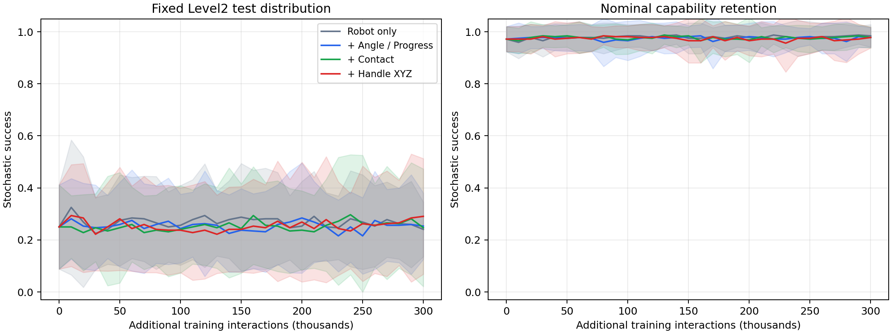
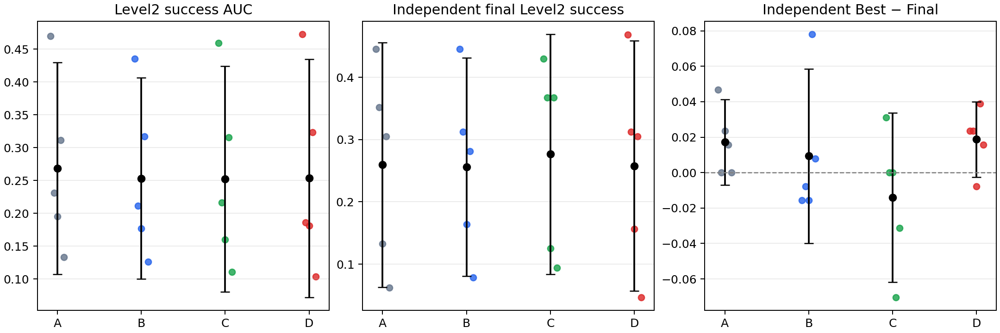
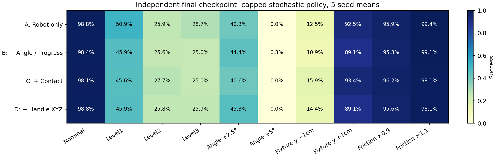
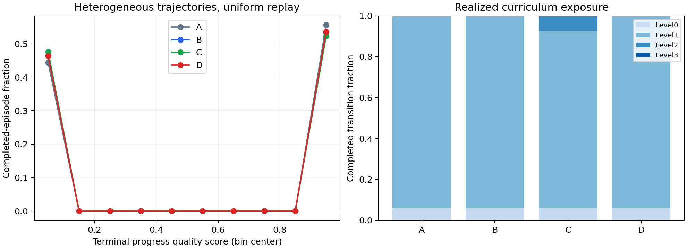

# Phase 11：环境参数输入与随机工位泛化

更新时间：2026-10-01T12:32:15.020134+08:00

## 1. 完成情况与结论

完成4组×5 seeds×300,000新增训练交互，共6,000,000；正式在线更新每run 37,500次。独立测试25个任务、60,480 episodes。所有训练/测试真实执行；原Phase1–10数据保留。

D相对A的随机Level2 Final平均差为-0.16个百分点，配对t95%CI [-3.4743, 3.1618]，精确配对p=1.0000。D固定工位Final=98.75%。

**Phase11全部成功门槛尚未通过。不能声称环境参数已建立可靠泛化，也不进入完整LWD/DIVL。**

下面的“输入参数”是假设未来工装能测得的编码器角度、接触与校准位姿。本阶段没有真机实验；handle orientation不默认使用。

## 2. 对照与初始化

| 组 | Actor状态 | Actor维度 | Critic状态 |
| --- | --- | --- | --- |
| A | Robot only | 26 | 同Actor状态 +7维action |
| B | + angle/target/progress | 29 | 同Actor状态 +7维action |
| C | + contact | 31 | 同Actor状态 +7维action |
| D | + handle XYZ | 34 | 同Actor状态 +7维action |

每seed继承对应Phase9 C最终300k checkpoint，保持actor/critic/target、Adam矩、alpha和熵目标。新输入列及其Adam矩为零；20个初始化在预检中验证初始动作与Q一致。冻结Anchor仍是原Phase8 B best，不会因增加参数而重新训练或替换。

固定Progress Reward（每交互有符号20×Δangle，保留reach/grasp/success）、SAC、Expert Replay 50/50、持续BC λ=10、有效高斯KL λ=1、pre-tanh std≤0.01、每约10k transactional progress guard。机器人控制、success>1rad、10秒episode、原资产和reward源文件均未改。

32并行环境、batch256、4 updates/vector step、lr3e-4。吞吐通过多个独立run共享GPU增加，不改变4/32的更新比。Actor和Critic均使用同一测量向量，不存在单独Privileged Critic。

原专家1000条、固定工位数据只读；按旧Progress Reward重标记并补齐测量特征。没有随机工位新增专家或新BC预训练。因此专家约束和冻结anchor是否足以支持新状态是本实验的限制。

只读专家覆盖审计：271,562 transitions，1000条初角均为0rad；初始handle XYZ只有约1微米数值浮动，episode长度268–276。开门过程角度/pose的边际覆盖不等于“home robot state +非零初角/工装偏移”的联合覆盖。左右接触在全数据各约77%，初态均为0。详见expert_coverage.json。

## 3. 状态与物理随机化

`get_environment_state()`返回door_angle、door_angular_velocity、target_angle、progress、remaining_angle、左右contact_state、handle_position、wxyz handle_orientation。角度rad，位置robot workspace metre；position按只读专家初始均值居中并除0.1m。progress=(angle−episode_start)/(target−episode_start)，截断0–1。角速度/remaining/orientation仅接口提供，不加入核心组。

| Level | 初角 | 工装XYZ独立平移 | 柜体摩擦 |
| --- | --- | --- | --- |
| 0 | 0° | 0 | 不变 |
| 1 | U(0,2.5°) | 各±5mm | 不变 |
| 2 | U(0,5°) | 各±10mm | 不变 |
| 3 | U(0,5°) | 各±10mm | 静/动×U(0.9,1.1) |

把手扰动通过刚体平移整个柜体实现，不是仅修改handle数值或独立改形。原铰链下限0°，不测试不可实现的−5°。每次reset断言实际关节、cabinet根位姿和PhysX材质读回等于抽样值。独立测试逐episode保存真实初角、初/末把手位置、工装位移、摩擦scale与验证过的static/dynamic摩擦均值。在线HDF5保存每步11维物理状态，含完整handle quaternion。

随机流按seed和clone独立；匹配的是episode编号参数流，策略长度不同会使global step的暴露不同。reset前保存终止机器人/测量/参数快照，bootstrap next state不会误用新episode。

## 4. 课程与学习过程

直接Level2 D seed0 pilot 10,016steps随机成功率=39.06%，发生拒绝，按预设规则启用课程。四组规则相同：Level0→1→2→3，当前level两组不重叠64episode测试均≥80%才能晋级。晋级只用于后续reset。

固定Level2曲线始终评价相同的联合随机分布，不因课程level改变而降低测试难度。课程是自适应干预：组间实际训练难度占比可不同，结果反映“测量输入+同一课程控制器”的整体效果，不能宣称固定训练分布下的纯网络因果效应。

| 组 | 结束Level均值 | Level0/1/2/3完成交互占比 | 拒绝平均次数 | 额外专家BC样本/run |
| --- | --- | --- | --- | --- |
| A | 1.00 | 6.2%/93.8%/0.0%/0.0% | 21.60 | 9,600,000 |
| B | 1.00 | 6.2%/93.8%/0.0%/0.0% | 18.00 | 9,600,000 |
| C | 1.20 | 6.2%/86.6%/7.3%/0.0% | 15.80 | 9,600,000 |
| D | 1.00 | 6.2%/93.8%/0.0%/0.0% | 17.00 | 9,600,000 |

## 5. 五seed主要结果

以下是std≤0.01的真实随机策略执行。AUC是额外0–300k交互固定Level2成功率的归一化梯形面积；继承的专家/Phase9成本不隐藏为从零训练。Best按训练验证Level2成功率选择，随后独立复测，因此独立Best可能低于Final。

| 组 | Level2 AUC [95%CI] | 随机Final [95%CI] | 随机Best | Best−Final pp | 标称Final | 标称Best | 随机Final seed SD |
| --- | --- | --- | --- | --- | --- | --- | --- |
| A | 0.2683 [0.1072, 0.4293] | 25.94% [6.3147, 45.5603] | 27.66% | 1.72 | 98.75% | 98.75% | 15.80pp |
| B | 0.2534 [0.1002, 0.4066] | 25.63% [8.0915, 43.1585] | 26.56% | 0.94 | 98.44% | 98.13% | 14.12pp |
| C | 0.2526 [0.0807, 0.4244] | 27.66% [8.3940, 46.9185] | 26.25% | -1.41 | 98.13% | 96.25% | 15.51pp |
| D | 0.2536 [0.0725, 0.4347] | 25.78% [5.7127, 45.8498] | 27.66% | 1.88 | 98.75% | 98.13% | 16.16pp |

| 组 | 在线成功/完成episodes | 成功率（5seed等权均值） | 末100k成功数 | 质量score SD均值 | score≈1比例 |
| --- | --- | --- | --- | --- | --- |
| A | 2022/3474 | 55.63% | 604 | 0.4486 | 50.73% |
| B | 1903/3399 | 53.41% | 569 | 0.4504 | 47.54% |
| C | 1844/3377 | 52.40% | 476 | 0.4572 | 45.57% |
| D | 1910/3404 | 53.65% | 580 | 0.4508 | 48.03% |

上表成功率给各seed等权，不等于合计成功/合计episode；汇总比例另见复核表。在线比例的分母仅是完成episodes；成功episode可能更短，预算结束时仍有未完成轨迹。HDF5/audit显式给出pending transitions，不能把完成比例当作无偏独立测试成功率。

## 6. 配对统计

统计单位是5个seed，CI不裁剪到[0,1]。给出模型依赖的配对tCI、两侧exact sign-flip及四个预设对比Holm校正；5个非零配对的精确两侧p最小0.0625，不能用更多episode伪造seed样本量。

| 对比 | AUC差 [95%CI] | AUC精确p/Holm | Final差pp [95%CI] | Final精确p/Holm | Final paired-t p/Holm |
| --- | --- | --- | --- | --- | --- |
| B-A | -0.0149 [-0.0336, 0.0038] | 0.1250/0.5000 | -0.31 [-3.8502, 3.2252] | 0.8750/1.0000 | 0.8183/1.0000 |
| C-B | -0.0008 [-0.0217, 0.0200] | 0.9375/1.0000 | +2.03 [-4.2778, 8.3403] | 0.5000/1.0000 | 0.4219/1.0000 |
| D-C | +0.0010 [-0.0244, 0.0264] | 0.9375/1.0000 | -1.88 [-8.0331, 4.2831] | 0.4375/1.0000 | 0.4455/1.0000 |
| D-A | -0.0147 [-0.0435, 0.0141] | 0.3125/0.9375 | -0.16 [-3.4743, 3.1618] | 1.0000/1.0000 | 0.9023/1.0000 |

## 7. 条件泛化与同一冻结策略参照

所有条件独立Best/Final复测，新固定seed。各条件通常64episodes/seed；联合Level2随机策略128episodes/seed。此处也重新评估完全未续训的Phase9 C，避免把旧不同测试抽样值视为配对baseline。deterministic结果、每seed值和所有CI见summary.json；主表只显示随机执行。

| 条件 | 冻结Phase9 C | A Final | B Final | C Final | D Final |
| --- | --- | --- | --- | --- | --- |
| nominal | 99.06% | 98.75% | 98.44% | 98.13% | 98.75% |
| level1 | 49.38% | 50.94% | 45.94% | 45.63% | 45.94% |
| level2 | 27.34% | 25.94% | 25.63% | 27.66% | 25.78% |
| level3 | 23.13% | 28.75% | 25.00% | 25.00% | 25.94% |
| angle_0_1 | 77.19% | 77.19% | 73.13% | 77.19% | 75.63% |
| angle_1_2p5 | 39.06% | 27.19% | 29.38% | 28.75% | 30.94% |
| angle_2p5_5 | 20.94% | 16.25% | 18.75% | 17.19% | 20.31% |
| angle_2p5 | 46.88% | 40.31% | 44.38% | 40.63% | 45.31% |
| angle_5 | 0.00% | 0.00% | 0.31% | 0.00% | 0.00% |
| offset_0p005 | 64.38% | 66.25% | 66.56% | 63.75% | 66.56% |
| offset_0p01 | 48.75% | 48.75% | 51.88% | 50.63% | 49.69% |
| offset_shell_0_0p25cm | 41.25% | 35.00% | 31.88% | 37.50% | 34.38% |
| offset_shell_0p25_0p5cm | 37.19% | 35.63% | 33.13% | 35.00% | 32.81% |
| offset_shell_0p5_1cm | 29.38% | 26.88% | 24.69% | 25.31% | 28.44% |
| offset_y_minus_0p01 | 15.00% | 12.50% | 10.94% | 15.94% | 14.38% |
| offset_y_plus_0p01 | 90.31% | 92.50% | 89.06% | 93.44% | 89.06% |
| friction_0p9 | 95.94% | 95.94% | 95.31% | 96.25% | 95.63% |
| friction_1p1 | 98.13% | 99.38% | 99.06% | 98.13% | 98.13% |

### 联合Level2条件切片

初角与工装L∞位移分箱仍随机化其它因素；单独扰动/强制位移壳层测试与这些条件切片分开。XYZ均匀小立方体下，最小L∞位移bin概率仅约1.56%，出现少数或零episode时不作强统计解释，另外三个offset_shell条件为相应范围提供每seed64独立episodes。

| 组 | 切片 | 有效seed数 | episodes | seed均值success [95%CI] |
| --- | --- | --- | --- | --- |
| A | initial_angle_deg_0.0_1.0 | 5 | 138 | 42.98% [12.2176, 73.7464] |
| A | initial_angle_deg_1.0_2.5 | 5 | 193 | 33.87% [5.6457, 62.0963] |
| A | initial_angle_deg_2.5_5.00001 | 5 | 309 | 13.59% [4.6134, 22.5709] |
| A | offset_linf_cm_0.0_0.25 | 4 | 10 | 31.25% [-44.0534, 106.5534] |
| A | offset_linf_cm_0.25_0.5 | 5 | 59 | 28.04% [6.6887, 49.3952] |
| A | offset_linf_cm_0.5_1.00001 | 5 | 571 | 25.69% [5.2858, 46.0923] |
| B | initial_angle_deg_0.0_1.0 | 5 | 138 | 45.28% [17.4843, 73.0790] |
| B | initial_angle_deg_1.0_2.5 | 5 | 193 | 31.64% [10.4790, 52.8056] |
| B | initial_angle_deg_2.5_5.00001 | 5 | 309 | 13.64% [1.8904, 25.3858] |
| B | offset_linf_cm_0.0_0.25 | 4 | 10 | 12.50% [-27.2806, 52.2806] |
| B | offset_linf_cm_0.25_0.5 | 5 | 59 | 18.71% [5.0720, 32.3406] |
| B | offset_linf_cm_0.5_1.00001 | 5 | 571 | 26.38% [7.9055, 44.8636] |
| C | initial_angle_deg_0.0_1.0 | 5 | 138 | 47.08% [17.7384, 76.4141] |
| C | initial_angle_deg_1.0_2.5 | 5 | 193 | 37.05% [7.0751, 67.0170] |
| C | initial_angle_deg_2.5_5.00001 | 5 | 309 | 13.37% [4.9874, 21.7526] |
| C | offset_linf_cm_0.0_0.25 | 4 | 10 | 12.50% [-27.2806, 52.2806] |
| C | offset_linf_cm_0.25_0.5 | 5 | 59 | 26.50% [10.4571, 42.5499] |
| C | offset_linf_cm_0.5_1.00001 | 5 | 571 | 27.78% [7.6220, 47.9422] |
| D | initial_angle_deg_0.0_1.0 | 5 | 138 | 43.73% [14.9084, 72.5470] |
| D | initial_angle_deg_1.0_2.5 | 5 | 193 | 35.23% [3.3579, 67.1051] |
| D | initial_angle_deg_2.5_5.00001 | 5 | 309 | 11.94% [3.4962, 20.3867] |
| D | offset_linf_cm_0.0_0.25 | 4 | 10 | 12.50% [-10.4673, 35.4673] |
| D | offset_linf_cm_0.25_0.5 | 5 | 59 | 31.68% [12.8107, 50.5460] |
| D | offset_linf_cm_0.5_1.00001 | 5 | 571 | 25.13% [4.2682, 45.9915] |

## 8. 参数是否被使用与约束诊断

同一robot observation，仅改angle0/2.5/5°、contact或handle XYZ±1cm，保存action mean。另有coherent reset角度+progress=0干预。angle-only探针可能违反angle/pose/progress一致性；反应不等于合理控制。handle同轴action投影只作局部线索，不能替代完整接触成功率。

| 组 | Final新增Actor列norm均值 | Angle-only最大RMS均值 | Handle±1cm最大RMS均值 | RL/BC/KL梯度norm均值 |
| --- | --- | --- | --- | --- |
| A | 0.000000 | 0.000000 | 0.000000 | 4.905/0.706/703.603 |
| B | 0.354710 | 0.000475 | 0.000000 | 6.622/0.723/709.008 |
| C | 0.409523 | 0.000574 | 0.000000 | 5.947/0.731/636.112 |
| D | 0.591993 | 0.000876 | 0.000584 | 6.162/0.734/830.503 |

Anchor被冻结为原固定工位策略，新状态列为0。有效std≤0.01使均值差KL曲率至少约10,000（不同维度std可能更小）；KL权重仍为1。新状态下即使正确动作应不同，也会被同一个robot-only anchor约束。梯度norm是固定endpoint batch上的局部诊断；尚未进行Anchor作用范围/强度的因果消融，不能单凭norm确认唯一原因。持续BC仅覆盖原工位，低std也限制新状态探索。这些都应作为未适应的候选机制，而非无证据断言“环境参数无用”。

## 9. 条件传感噪声与参数遮蔽

Deferred: D did not meet prespecified randomized improvement and nominal preservation gate

条件门槛为D−A随机Final配对tCI下界>0、至少4/5方向为正且D标称均值≥90%。只有通过才用新的evaluation seed进行遮蔽与angle±0.5°、position±2mm、contact2%误判/一控制步延迟；sensor noise不改变物理状态、reward或训练参数。progress由同一噪声angle派生，避免干净冗余通道泄漏。

## 10. 轨迹异质性与后续经验利用

所有replay仍uniform 50/50：每run SAC专家抽样4,800,000、在线抽样4,800,000，另有9,600,000 expert BC样本。在线样本含成功/失败/未完成transition，不进行质量筛选。

质量沿用Phase10终局score：0.55success+0.20final progress+0.15net progress+0.10运动后双指contact stability。success是输入之一，因此排名AUC不证明前瞻预测。这里仅检查分布是否从近乎全1展开；异质性本身不证明Quality Replay会提升策略。

## 11. 数据审计、预算与复现

数据审计：20个正式HDF5、13,654完成episodes；总成功7,679；终止快照、每clone连续分段、reward和success标签、added angle字段一致性通过。历史56,229文件size/mtime/小源文件SHA一致；训练源码snapshot无变化。

训练新增6,000,000交互；in-training评价交互126,098,464；独立测试交互32,705,664。Pilot额外10,016训练交互、246,304评价交互；physics/function preflight额外64交互。评价不进入训练replay，成本单独报告。既有expert/Phase9成本不计入新增AUC横轴。

源码：environment_state/、randomized_env/、curriculum/、experiments/phase11_parameter_generalization/、evaluation/stratified_generalization.py与parameter_sensitivity.py。结果CSV/JSON/图：results/phase11_parameter_generalization；完整checkpoint：checkpoints/phase11_parameter_generalization；HDF5：datasets/phase11_parameter_generalization；TensorBoard：logs/phase11_parameter_generalization。历史任务文件只读，Phase11工装reset适配器为新子类。

## 12. 回答九个问题

1. **Door angle/progress是否提高不同初态成功率**：B-A联合随机Final差-0.31pp，95%CI[-3.8502, 3.2252]。是否解决特定角度/位移由第7节条件结果判断；总平均不能代替切片。

2. **Contact是否进一步提高接触控制能力**：C-B联合随机Final差+2.03pp，95%CI[-4.2778, 8.3403]。是否解决特定角度/位移由第7节条件结果判断；总平均不能代替切片。

3. **Handle position是否解决工位变化**：D-C联合随机Final差-1.88pp，95%CI[-8.0331, 4.2831]。是否解决特定角度/位移由第7节条件结果判断；总平均不能代替切片。

4. **参数+Progress Reward是否优于只用Progress Reward**：D-A联合随机Final差-0.16pp，95%CI[-3.4743, 3.1618]。是否解决特定角度/位移由第7节条件结果判断；总平均不能代替切片。

5. **策略是否根据参数改变动作**：第8节和parameter_diagnosis.json保存60个endpoint的action mean/敏感度；新增权重和非零RMS只能证明响应，合理性必须看相应物理条件下成功率。

6. **传感噪声是否影响方案**：Deferred: D did not meet prespecified randomized improvement and nominal preservation gate。未执行时不推测鲁棒性。

7. **能否复制到Drawer**：接口可将angle/velocity替换为distance/velocity、保留contact/handle；Door以外任务尚未训练或验证，不宣称跨任务效果。

8. **随机化后质量是否分层**：第5/10节给出terminal score各seed SD与全1比例；与Phase10约98.5%全1比较时注意课程/任务分布变化，不能据此直接证明筛选算法有效。

9. **是否具备重新测试LWD/DIVL条件**：门槛未全部通过。即使出现异质经验，也应先解决可测状态能否稳定转化为正确条件动作的问题。

## 13. 当前决定

保持原Phase9 C用于固定工位。Phase11测量接口和随机化框架可复用；当前应优先检查固定工位Anchor是否阻止条件动作修正，以及是否需要匹配随机工位的示范覆盖。没有满足门槛前不扩展训练规模、不实施完整LWD/DIVL，也不声称已验证Drawer迁移。

## 14. 复核补充：分母、保护机制与证据限制

### 额外置信区间

| 组 | 随机Best 95%CI（%） | 标称Best 95%CI（%） | 标称Final 95%CI（%） | Best−Final 95%CI（pp） |
| --- | --- | --- | --- | --- |
| A | [6.6641, 48.6484] | [95.2794, 102.2206] | [96.2204, 101.2796] | [-0.6967, 4.1342] |
| B | [8.6494, 44.4756] | [92.9192, 103.3308] | [94.0993, 102.7757] | [-3.9802, 5.8552] |
| C | [5.6196, 46.8804] | [85.8383, 106.6617] | [92.9192, 103.3308] | [-6.1783, 3.3658] |
| D | [6.4412, 48.8713] | [92.9192, 103.3308] | [96.2204, 101.2796] | [-0.2503, 4.0003] |

### 在线比例的两个统计口径

| 组 | 合计成功/完成 | 汇总比例 | 5seed比例均值 | score<0.1 | score在[0.1,0.9) | score≥0.9 |
| --- | --- | --- | --- | --- | --- | --- |
| A | 2022/3474 | 58.20% | 55.63% | 41.80% | 0.00% | 58.20% |
| B | 1903/3399 | 55.99% | 53.41% | 44.01% | 0.00% | 55.99% |
| C | 1844/3377 | 54.60% | 52.40% | 45.37% | 0.03% | 54.60% |
| D | 1910/3404 | 56.11% | 53.65% | 43.89% | 0.00% | 56.11% |

随机化让score≈1的seed均值占比降至约45.6%–50.7%，但分布主要是“近0失败”和“≥0.9成功”两峰，不是丰富连续进度层级。13,654条完成轨迹中仅1条score位于[0.1,0.9)。简单筛选仍接近成功/失败分类；必须防止仅优先easy success、排除困难状态的学习经验。

### 更新拒绝来自哪些条件

| 组 | 拒绝blocks | 拒绝比例 | 仅标称触发 | 仅课程触发 | 两者均触发 | 被拒候选课程success≥80% |
| --- | --- | --- | --- | --- | --- | --- |
| A | 108/150 | 72.00% | 1 | 101 | 6 | 0 |
| B | 90/150 | 60.00% | 11 | 71 | 8 | 4 |
| C | 79/150 | 52.67% | 7 | 69 | 3 | 1 |
| D | 85/150 | 56.67% | 13 | 64 | 8 | 4 |

大部分拒绝由课程条件下降或regression触发；少数候选课程成功≥80%时仍被保护机制拒绝。不能把所有拒绝都归因于标称保护，也不能把拒绝次数直接当作Anchor因果效应。

D的KL梯度norm均值830.503、RL梯度6.162，二者均值之比约135。参数列已学习非零权重，但angle/handle探针对归一化action的RMS响应只有约0.000876/0.000584。有参数响应，却没有足够的条件控制收益。证据支持进一步诊断约束与适应冲突；尚不能证明解除Anchor一定改善。

19/20 runs最终仍在Level1；只有C seed0达到Level2，没有Level3训练暴露。因此不把+5°失败解释为充分Level2训练后环境参数必然无效。固定工位能力通过，但随机增益失败，传感噪声/输入遮蔽按预设条件暂缓。

复核验证800个Best/Final与冻结baseline的物理条件计划完全匹配：每seed/clone/episode的初角、XYZ位移、摩擦相同。NumPy1.26的AUC接口修复仅在后处理中采用同一梯形公式np.trapz；没有重跑训练或复测，首次失败日志保留。

### 下一轮建议（尚未执行）

用小规模严格配对消融分别检查“仅标称状态施加Anchor/有界环境参数残差”和“随机工位示范覆盖”，避免同时改两者。原Phase9 C继续用于固定工位；没有泛化证据前不进入完整LWD/DIVL、不宣称Drawer迁移效果。
