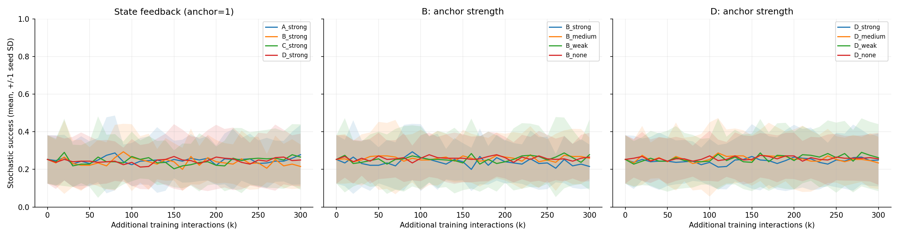
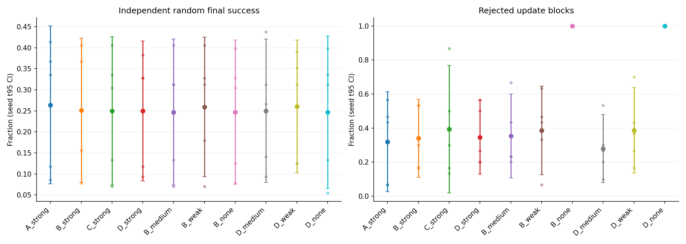
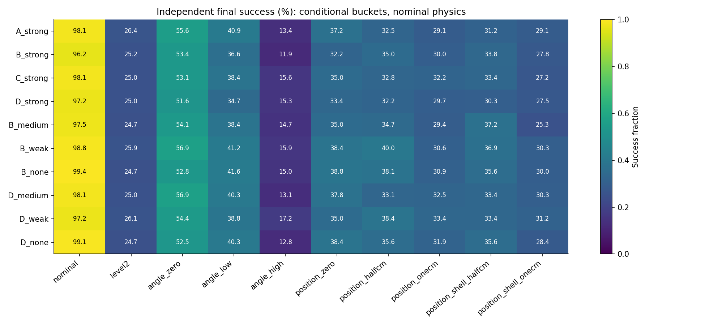
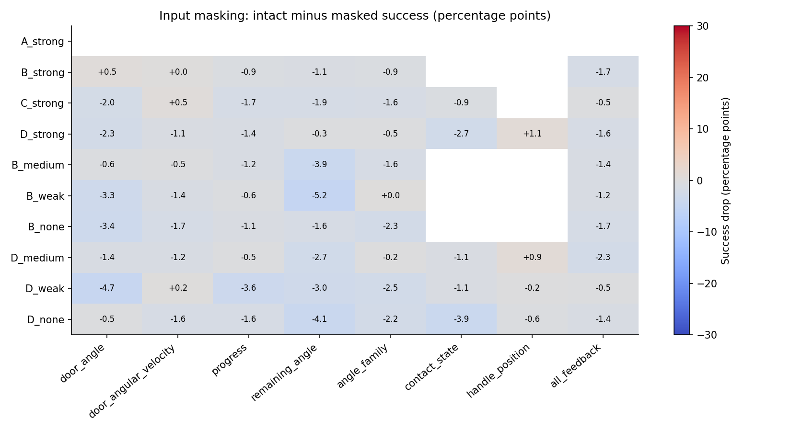

# Phase 12：Environment State Feedback

生成时间（UTC）：2026-10-01T15:34:56.013226+00:00

## 1. 范围与结果摘要

本阶段验证部署时可读取的环境状态反馈；Actor 与 Critic 使用相同的状态向量。没有重新使用训练专用 Privileged Critic，没有 LWD/DIVL/QAM/Quality Replay。

50 次正式训练均完成 300,000 新增交互，共 15,000,000。5 个匹配 seed 是统计单位。独立复测 163,840 episodes；复测交互 94,973,824。
按随机 Final 均值，描述性最高组为 **A_strong：26.41%**；这不是新的独立确认试验。
环境反馈相对 A 的 8 个候选比较中，Final 配对 t95 CI 下界大于零的数量：0。是否允许扩至500k：**False**。

## 2. 固定配方、观测接口与随机化

| 项目 | 设置 |
|---|---|
| 仿真/任务 | 既有 Isaac Lab / Panda Door；同一 USD、控制与成功阈值（门角 >1 rad） |
| 初始化 | 同 seed Phase9 C final，完整网络、target、Adam、alpha；新增输入权重/Adam列置零，初始动作与Q保持一致 |
| Anchor | 原 Phase8 B best，冻结；强1、中0.1、弱0.01、无0 |
| 训练 | 32环境，256 batch，每vector step4次update，LR3e-4；每run37,500 updates |
| 经验/BC | 原1000条expert、271,562 transitions只读；uniform expert/online各50%，另256条expert BC，BC系数10 |
| std/保护 | 全流程std≤0.01；每10k固定nominal与完整随机分布、原threshold0.10 SafeUpdate；拒绝恢复全部学习状态，buffer保留 |
| 训练分布 | 从首个reset起 door angle U(0°,5°)，工装XYZ各U(-1,+1 cm)，摩擦不变；没有课程升级门槛 |
| 测试分布 | 独立种子；主测试同完整随机分布，Best/Final随机各128 episodes/seed；桶测试每64 episodes/seed |
| AUC/Best | 每10k独立于训练rollout的64episode固定validation曲线，AUC归一化到[0,300k]；Best据validation选，另独立复测 |
| 成本 | 300k是新增训练交互；不含继承的expert/Phase9学习成本，也不含评测交互 |

| 组 | 维数 | Actor/Critic同一输入 |
|---|---:|---|
| A | 26 | 原robot observation：q9、qd9、EE XYZ3、quat4、episode clock1，含夹爪关节 |
| B | 31 | A + angle(rad)、angular velocity(rad/s)、target(rad)、progress[0,1]、remaining(rad) |
| C | 33 | B + 左/右手指contact二值（过滤接触力>0.5N） |
| D | 36 | C + handle workspace XYZ，(XYZ-expert初始均值)/0.1m；未加orientation |

进度=(angle-episode初角)/(target-episode初角)，截断[0,1]；remaining=target-angle。工装位置变化是整柜刚体平移，不是改把手形状。把手XYZ部署测量能力仍需真机确认；D可作为可测上限。A保留原26D以免同时更改机器人观测。

Phase11不是纯固定训练：有随机课程，但19/20组停在Level1（0–2.5°、±0.5cm），只有1组到Level2；本阶段所有训练episode均处于完整Level2。与Phase11比较同时含训练曝光和新增velocity/remaining变化，不能把历史差异全部归因于单个输入。

## 3. 全部方案与五seed统计

| 方案 | AUC | Independent Best | Independent Final [t95 CI] | Best−Final | nominal Final | 在线成功/完整episode | 拒绝更新均值/30 | Final seed SD | std |
|---|---:|---:|---|---:|---:|---:|---:|---:|---:|
| A_strong | 0.2484 | 27.19% | 26.41% [7.62%, 45.20%] | +0.78 pp | 98.13% | 778/2823 | 9.6 | 15.13 pp | 0.010000 |
| B_strong | 0.2394 | 25.63% | 25.16% [7.99%, 42.32%] | +0.47 pp | 96.25% | 753/2812 | 10.2 | 13.83 pp | 0.010000 |
| C_strong | 0.2445 | 26.09% | 25.00% [7.35%, 42.65%] | +1.09 pp | 98.13% | 749/2815 | 11.8 | 14.21 pp | 0.010000 |
| D_strong | 0.2448 | 25.00% | 25.00% [8.35%, 41.65%] | +0.00 pp | 97.19% | 796/2835 | 10.4 | 13.41 pp | 0.010000 |
| B_medium | 0.2580 | 27.19% | 24.69% [7.33%, 42.05%] | +2.50 pp | 97.50% | 820/2855 | 10.6 | 13.98 pp | 0.010000 |
| B_weak | 0.2544 | 26.09% | 25.94% [9.37%, 42.51%] | +0.16 pp | 98.75% | 830/2874 | 11.6 | 13.34 pp | 0.010000 |
| B_none | 0.2581 | 25.31% | 24.69% [7.54%, 41.83%] | +0.62 pp | 99.38% | 789/2828 | 30.0 | 13.81 pp | 0.010000 |
| D_medium | 0.2566 | 26.41% | 25.00% [7.92%, 42.08%] | +1.41 pp | 98.13% | 804/2848 | 8.4 | 13.76 pp | 0.010000 |
| D_weak | 0.2589 | 27.03% | 26.09% [10.31%, 41.88%] | +0.94 pp | 97.19% | 835/2881 | 11.6 | 12.71 pp | 0.010000 |
| D_none | 0.2582 | 25.31% | 24.69% [6.57%, 42.80%] | +0.62 pp | 99.06% | 789/2828 | 30.0 | 14.59 pp | 0.010000 |

### 与Phase11的历史比较

| 组（强Anchor） | Phase11随机Final | Phase12随机Final | 均值变化 |
|---|---:|---:|---:|
| A | 25.94% | 26.41% | +0.47 pp |
| B | 25.63% | 25.16% | -0.47 pp |
| C | 27.66% | 25.00% | -2.66 pp |
| D | 25.78% | 25.00% | -0.78 pp |

历史比较同时改变了完整随机训练曝光和B/C/D的velocity/remaining输入，不能用它单独识别输入效益；本阶段内部配对比较才隔离新增反馈组合。

在线成功比例有两种汇总：表中的总成功/总episode是pooled计数；CSV还提供先计算每seed比例再平均的统计。Best由validation选择，独立Best可能低于独立Final，因此gap允许负值。CI不裁剪[0,1]，小样本t假设需谨慎。

### 配对比较

| 比较 | Final差值 t95 CI | Holm t-p | exact sign-flip p | AUC差值 t95 CI |
|---|---|---:|---:|---|
| B_strong-A_strong (core_contrasts) | -1.25 pp [-6.89, +4.39] | 1.0000 | 0.6250 | -0.0091 [-0.0294,+0.0113] |
| C_strong-B_strong (core_contrasts) | -0.16 pp [-4.35, +4.04] | 1.0000 | 1.0000 | +0.0051 [-0.0193,+0.0295] |
| D_strong-C_strong (core_contrasts) | +0.00 pp [-2.74, +2.74] | 1.0000 | 1.0000 | +0.0004 [-0.0083,+0.0090] |
| D_strong-A_strong (core_contrasts) | -1.41 pp [-3.92, +1.10] | 0.7797 | 0.3750 | -0.0036 [-0.0175,+0.0103] |
| B_medium-B_strong (anchor_contrasts) | -0.47 pp [-5.81, +4.87] | 1.0000 | 0.8750 | +0.0186 [-0.0020,+0.0393] |
| B_weak-B_strong (anchor_contrasts) | +0.78 pp [-3.92, +5.48] | 1.0000 | 0.7500 | +0.0150 [-0.0214,+0.0514] |
| B_none-B_strong (anchor_contrasts) | -0.47 pp [-5.05, +4.11] | 1.0000 | 0.8750 | +0.0187 [-0.0247,+0.0622] |
| D_medium-D_strong (anchor_contrasts) | +0.00 pp [-5.44, +5.44] | 1.0000 | 1.0000 | +0.0117 [+0.0006,+0.0229] |
| D_weak-D_strong (anchor_contrasts) | +1.09 pp [-1.14, +3.33] | 1.0000 | 0.3125 | +0.0141 [-0.0281,+0.0563] |
| D_none-D_strong (anchor_contrasts) | -0.31 pp [-3.27, +2.65] | 1.0000 | 0.9375 | +0.0133 [-0.0340,+0.0607] |
| B_strong-A_strong (efficacy_contrasts) | -1.25 pp [-6.89, +4.39] | 1.0000 | 0.6250 | -0.0091 [-0.0294,+0.0113] |
| B_medium-A_strong (efficacy_contrasts) | -1.72 pp [-4.89, +1.45] | 1.0000 | 0.2500 | +0.0096 [-0.0107,+0.0299] |
| B_weak-A_strong (efficacy_contrasts) | -0.47 pp [-5.35, +4.41] | 1.0000 | 0.8750 | +0.0059 [-0.0299,+0.0418] |
| B_none-A_strong (efficacy_contrasts) | -1.72 pp [-4.03, +0.60] | 0.8671 | 0.1875 | +0.0097 [-0.0354,+0.0548] |
| D_strong-A_strong (efficacy_contrasts) | -1.41 pp [-3.92, +1.10] | 1.0000 | 0.3750 | -0.0036 [-0.0175,+0.0103] |
| D_medium-A_strong (efficacy_contrasts) | -1.41 pp [-7.00, +4.18] | 1.0000 | 0.5625 | +0.0081 [-0.0105,+0.0267] |
| D_weak-A_strong (efficacy_contrasts) | -0.31 pp [-4.84, +4.22] | 1.0000 | 0.9375 | +0.0105 [-0.0329,+0.0538] |
| D_none-A_strong (efficacy_contrasts) | -1.72 pp [-5.11, +1.67] | 1.0000 | 0.3750 | +0.0097 [-0.0320,+0.0514] |

五seed的双侧exact sign-flip最小p=0.0625，无法在0.05水平作非参数显著性确认。Holm按预设core、anchor、efficacy三个比较族分别校正；500k门槛是明确标注的模型假设下探索性门槛。episode数量不能替代seed数量。

## 4. 随机环境分桶

表中每项均为独立Final的5seed均值。angle分桶固定/限定初角、仍随机XYZ；position分桶固定/限定XYZ、仍随机0–5°初角。nominal同时为零。±0.5/±1cm是三个坐标各自均匀范围（嵌套立方体），另给L∞壳层避免把范围误当单一固定偏移。

| 方案 | 角0° | 角0–2.5° | 角2.5–5° | 位置0 | XYZ±0.5cm | XYZ±1cm | L∞0.25–0.5cm | L∞0.5–1cm |
|---|---:|---:|---:|---:|---:|---:|---:|---:|
| A_strong | 55.63% | 40.94% | 13.44% | 37.19% | 32.50% | 29.06% | 31.25% | 29.06% |
| B_strong | 53.44% | 36.56% | 11.88% | 32.19% | 35.00% | 30.00% | 33.75% | 27.81% |
| C_strong | 53.13% | 38.44% | 15.63% | 35.00% | 32.81% | 32.19% | 33.44% | 27.19% |
| D_strong | 51.56% | 34.69% | 15.31% | 33.44% | 32.19% | 29.69% | 30.31% | 27.50% |
| B_medium | 54.06% | 38.44% | 14.69% | 35.00% | 34.69% | 29.38% | 37.19% | 25.31% |
| B_weak | 56.88% | 41.25% | 15.94% | 38.44% | 40.00% | 30.63% | 36.88% | 30.31% |
| B_none | 52.81% | 41.56% | 15.00% | 38.75% | 38.13% | 30.94% | 35.63% | 30.00% |
| D_medium | 56.88% | 40.31% | 13.13% | 37.81% | 33.13% | 32.50% | 33.44% | 30.31% |
| D_weak | 54.38% | 38.75% | 17.19% | 35.00% | 38.44% | 33.44% | 33.44% | 31.25% |
| D_none | 52.50% | 40.31% | 12.81% | 38.44% | 35.63% | 31.88% | 35.63% | 28.44% |

Best的所有分桶、每seed结果及CI保存在summary.json/generalization；没有用分桶复测重新选择checkpoint。

## 5. 参数利用：动作敏感性与隐藏输入

固定1024条按预设transition索引采样的robot state，改变门角0°→5°，分别做angle-only与关联progress/remaining/velocity一致的reset标量干预；记录归一化动作L2差值。不同方法的在线访问状态可能不同；该统计不能证明动作变化正确。

| 方案 | angle-only L2均值 | coherent-reset L2均值 | 新输入权重norm均值 |
|---|---:|---:|---:|
| A_strong | 0 | 0 | 0 |
| B_strong | 0.00117623 | 0.00122601 | 0.508598 |
| C_strong | 0.00134728 | 0.00148629 | 0.54639 |
| D_strong | 0.00103727 | 0.00116919 | 0.649587 |
| B_medium | 0.00140707 | 0.00146394 | 0.529871 |
| B_weak | 0.00296625 | 0.00326031 | 0.78669 |
| B_none | 0 | 0 | 0 |
| D_medium | 0.00112349 | 0.0011954 | 0.628711 |
| D_weak | 0.0021602 | 0.00234431 | 0.960217 |
| D_none | 0 | 0 | 0 |

所有反馈组的Best/Final均实际执行输入隐藏复测；不以D是否显著为前置条件。下表正值=隐藏后成功率下降，负值=隐藏后改善。每个干预与intact使用同seed/clone/episode随机计划。

| 方案 | 隐藏输入 | masked Final | intact−masked t95 CI |
|---|---|---:|---|
| B_strong | all_feedback | 26.88% | -1.72 pp [-4.97, +1.53] |
| B_strong | angle_family | 26.09% | -0.94 pp [-2.38, +0.50] |
| B_strong | door_angle | 24.69% | +0.47 pp [-1.54, +2.48] |
| B_strong | door_angular_velocity | 25.16% | +0.00 pp [-2.38, +2.38] |
| B_strong | progress | 26.09% | -0.94 pp [-6.22, +4.35] |
| B_strong | remaining_angle | 26.25% | -1.09 pp [-7.66, +5.47] |
| C_strong | all_feedback | 25.47% | -0.47 pp [-4.07, +3.13] |
| C_strong | angle_family | 26.56% | -1.56 pp [-4.78, +1.65] |
| C_strong | contact_state | 25.94% | -0.94 pp [-4.26, +2.38] |
| C_strong | door_angle | 27.03% | -2.03 pp [-6.12, +2.06] |
| C_strong | door_angular_velocity | 24.53% | +0.47 pp [-2.79, +3.73] |
| C_strong | progress | 26.72% | -1.72 pp [-4.23, +0.79] |
| C_strong | remaining_angle | 26.88% | -1.88 pp [-6.85, +3.10] |
| D_strong | all_feedback | 26.56% | -1.56 pp [-5.06, +1.94] |
| D_strong | angle_family | 25.47% | -0.47 pp [-4.14, +3.20] |
| D_strong | contact_state | 27.66% | -2.66 pp [-7.91, +2.59] |
| D_strong | door_angle | 27.34% | -2.34 pp [-8.04, +3.35] |
| D_strong | door_angular_velocity | 26.09% | -1.09 pp [-3.89, +1.70] |
| D_strong | handle_position | 23.91% | +1.09 pp [-2.09, +4.28] |
| D_strong | progress | 26.41% | -1.41 pp [-3.14, +0.33] |
| D_strong | remaining_angle | 25.31% | -0.31 pp [-6.55, +5.92] |
| B_medium | all_feedback | 26.09% | -1.41 pp [-4.35, +1.54] |
| B_medium | angle_family | 26.25% | -1.56 pp [-4.39, +1.27] |
| B_medium | door_angle | 25.31% | -0.62 pp [-4.59, +3.34] |
| B_medium | door_angular_velocity | 25.16% | -0.47 pp [-3.58, +2.64] |
| B_medium | progress | 25.94% | -1.25 pp [-3.26, +0.76] |
| B_medium | remaining_angle | 28.59% | -3.91 pp [-7.73, -0.09] |
| B_weak | all_feedback | 27.19% | -1.25 pp [-5.62, +3.12] |
| B_weak | angle_family | 25.94% | +0.00 pp [-1.53, +1.53] |
| B_weak | door_angle | 29.22% | -3.28 pp [-8.10, +1.54] |
| B_weak | door_angular_velocity | 27.34% | -1.41 pp [-5.06, +2.25] |
| B_weak | progress | 26.56% | -0.62 pp [-2.84, +1.59] |
| B_weak | remaining_angle | 31.09% | -5.16 pp [-11.31, +1.00] |
| B_none | all_feedback | 26.41% | -1.72 pp [-4.89, +1.45] |
| B_none | angle_family | 27.03% | -2.34 pp [-5.97, +1.29] |
| B_none | door_angle | 28.13% | -3.44 pp [-8.36, +1.49] |
| B_none | door_angular_velocity | 26.41% | -1.72 pp [-5.80, +2.36] |
| B_none | progress | 25.78% | -1.09 pp [-5.30, +3.11] |
| B_none | remaining_angle | 26.25% | -1.56 pp [-5.19, +2.07] |
| D_medium | all_feedback | 27.34% | -2.34 pp [-5.63, +0.95] |
| D_medium | angle_family | 25.16% | -0.16 pp [-2.14, +1.83] |
| D_medium | contact_state | 26.09% | -1.09 pp [-4.63, +2.44] |
| D_medium | door_angle | 26.41% | -1.41 pp [-3.72, +0.91] |
| D_medium | door_angular_velocity | 26.25% | -1.25 pp [-3.48, +0.98] |
| D_medium | handle_position | 24.06% | +0.94 pp [-0.80, +2.67] |
| D_medium | progress | 25.47% | -0.47 pp [-3.35, +2.41] |
| D_medium | remaining_angle | 27.66% | -2.66 pp [-6.81, +1.49] |
| D_weak | all_feedback | 26.56% | -0.47 pp [-5.15, +4.21] |
| D_weak | angle_family | 28.59% | -2.50 pp [-6.40, +1.40] |
| D_weak | contact_state | 27.19% | -1.09 pp [-4.35, +2.17] |
| D_weak | door_angle | 30.78% | -4.69 pp [-8.51, -0.87] |
| D_weak | door_angular_velocity | 25.94% | +0.16 pp [-3.30, +3.61] |
| D_weak | handle_position | 26.25% | -0.16 pp [-6.71, +6.40] |
| D_weak | progress | 29.69% | -3.59 pp [-9.60, +2.41] |
| D_weak | remaining_angle | 29.06% | -2.97 pp [-8.96, +3.03] |
| D_none | all_feedback | 26.09% | -1.41 pp [-4.65, +1.84] |
| D_none | angle_family | 26.88% | -2.19 pp [-5.13, +0.75] |
| D_none | contact_state | 28.59% | -3.91 pp [-8.51, +0.70] |
| D_none | door_angle | 25.16% | -0.47 pp [-4.84, +3.90] |
| D_none | door_angular_velocity | 26.25% | -1.56 pp [-3.50, +0.38] |
| D_none | handle_position | 25.31% | -0.62 pp [-1.06, -0.19] |
| D_none | progress | 26.25% | -1.56 pp [-6.92, +3.79] |
| D_none | remaining_angle | 28.75% | -4.06 pp [-8.98, +0.86] |

注意：遮罩区间为探索性的未校正配对t95 CI，不据多项遮罩的单独正区间宣布显著。它们是测试时输入干预，没有额外重训“去掉通道”模型。angle、progress、remaining互相编码相关状态，单通道无下降不能证明未使用；angle-family遮罩同时设angle/velocity/progress=0、remaining=target。all-feedback另把contact=0和handle设expert均值。遮罩可能产生训练分布外输入，下降证明依赖的证据强于证明该传感器必不可少；要独立因果分辨需随后做预注册重训消融。target恒定，本阶段无法验证不同target的条件控制。

## 6. 六个交付问题

### 1）环境状态反馈是否提升泛化？

在本次预设配方与预算下，未获得Final配对t95 CI下界为正的反馈优势；不能声称状态反馈已改善随机泛化。这不证明传感器在其他学习配方下无效。

### 2）哪些参数最有效？

B−A、C−B、D−C分别检验进度状态组合、接触增量、把手位置增量。动作敏感性与mask表给出实际依赖；单项冗余输入的遮罩不等同于重训增量效益。只在成功率增益、稳定性与依赖诊断一致时才推荐部署输入，不依据权重非零宣称有效。

### 3）为什么Phase11输入无效？

已确认的限制是完整随机训练曝光不足，原expert只覆盖标称初态，且低std下强Anchor可能把反馈条件动作拉回固定工位策略。Phase12消除了课程卡住，新增angular velocity/remaining并直接测试Anchor强度。历史差异不能唯一归因于观测不足；结合本阶段完整随机A与各反馈组才能区分曝光、约束和状态利用。

### 4）Anchor是否限制适应？

相对强Anchor，减弱/取消Anchor的6个Final配对比较中，有 0 个t95 CI下界大于零。应结合nominal保持、随机AUC和拒绝率；被guard频繁拒绝时，最终接近原策略并不证明弱Anchor学习本身稳定。

### 5）策略是否真正利用输入？

动作0°/5°对比、单项及关联遮罩均已执行。非零动作变化证明局部函数依赖；隐藏后下降进一步支持执行依赖。两者都不能单独证明适当闭环调整。若反馈组没有独立成功增益，即便输入权重/动作差异非零，也不能宣称学会了有效环境适应。

### 6）是否满足进入LWD/DIVL？

仅当反馈相对robot-only有效、完整随机分布持续产生成功/失败经验、轨迹差异可用、动作依状态调整且少量rollback便可保持Final≈Best时才应进入。大量rollback保护得到小gap，属于更新被拒绝，不等价于稳定在线改进；成功/失败两个峰也不自动证明quality replay有效。当前门槛与证据见extension_gate.json；不以固定工位98%替代随机泛化。

## 7. 成本、保护与完整性

训练中评测交互合计 202,086,400；独立评测 94,973,824；物理预检64。评测不进入训练buffer。各组random/nominal candidate、拒绝理由、KL与std在updates CSV；raw被拒绝checkpoint亦保留。
历史文件审计 61,637 项，变更列表 []；训练源码变更 []。50个HDF5完成轨迹/terminal/观测通道审计通过；已完成episode 28,399，成功 7,943。
训练初态流逐episode匹配 27,776 项；独立复测条件计划匹配 1,200 次。保存pending未完成轨迹，不能把其状态伪装成完整成功/失败。
Python/Isaac/GPU与依赖沿用既有报告和configs/runtime_env.sh；精确代码hash和原expert/source/anchor hash在protocol、training_source_manifest和baseline_inventory。GPU队列只对本项目的PID负责，其他项目未停止或修改。

## 8. 图与可复查产物

- results/phase12_environment_state_feedback/per_seed.csv：全部50run指标；summary.json：全部CI、配对检验、分桶、遮罩、敏感性。
- checkpoints/phase12_environment_state_feedback/：Best、每10k accepted/raw、完整学习状态。
- datasets/phase12_environment_state_feedback/：50个HDF5，实际随机参数、transition、terminal state、episode索引。
- logs/phase12_environment_state_feedback/：训练、持久评测进程日志、TensorBoard；results中另有queue、source与历史审计。

## 9. 吞吐诊断与调度调整

前24次训练的评测时间占比中位数86.42%；训练7.2M交互时额外评测95,038,400交互。
GPU utilization表示采样期间有kernel运行的时间比例，不能解释为SM/Tensor Core算力占用比例。小环境batch和大量评测/同步构成当前主要开销。
最后两个训练改为立即运行，最多4训练作业/GPU。训练32环境、256batch、4updates、学习率、随机种子、模型、任务、reward、BC/Anchor/std/guard和评测次数均保持原设置。
独立复测最多6进程/GPU，每个进程仍执行冻结的heldout.py及原32环境evaluator。4个独立32环境进程的测量：{"workers": 4, "parallel_envs_per_worker": 32, "physical_interactions": 76800, "active_seconds": 72.43322073994204, "wall_including_startup": 95.71045900415629, "aggregate_env_steps_per_second": 1060.2869679885707, "wall_env_steps_per_second": 802.4201409029384, "reference_env_steps_per_second": 458.96748208194145, "active_throughput_ratio": 2.31015705770474, "caveat": "Concurrent background training and warmup differ; this is a bounded operational estimate, not a policy comparison.", "passed": true}。并发背景训练变化与Kit启动开销使该测量不能作为总实验加速保证。
256环境微测试吞吐约为32环境的6.4倍，但合并不同测试组未通过结果兼容性预检，未用于正式复测；原始32环境布局、RNG流、动作采样和episode预算保留。
拒绝的合并预检：[{"condition": "nominal", "parameters_exact_match": true, "success_delta": 0.0, "serial_success": 1.0, "batched_success": 1.0}, {"condition": "level2", "parameters_exact_match": true, "success_delta": 0.125, "serial_success": 0.453125, "batched_success": 0.578125}]。这说明增加环境数可能影响接触仿真的数值路径，不能只依据速度替换评测。
已记录吞吐与兼容性测试额外物理交互498,528，全部排除于训练buffer、方法排名和训练交互预算。另两次失败的实验性预检初始化在第一tick之前终止，未产生完整计数；保留日志，未把它们计为零成本。
原冻结源码hash无变更。追加调度实现另存hash清单。throughput目录保留完整原始测量；不同环境batch的success仅作运行检查，不作为方法收益。

### 9.1 完成任务提前独立复测

20:32发现4张GPU空闲、39次训练已完成后，允许完成的单个run提前独立复测。只根据completed标记及checkpoint/HDF5是否已落盘调度，不根据success或其他结果选择先后。GPU上存在任何其他compute进程（包括未完成训练）时不准入。冻结heldout.py、metrics.py、测试seed、32环境物理布局、Best/Final、mask、episode次数和采样协议均不变，训练作业未被迁移或重启。统计分析仍等待所有50次训练与50次完整复测结束，并执行原数据/旧结果/源码审计。该调整仅消除末批训练造成的空闲等待。

## 10. 最终图表核对与遮罩解释补充

遮罩热图的单元格数值、色标和标签统一使用百分点；原先色标采用比例单位，已修正呈现，统计数据保持原值。

B_none/D_none的30个更新块全部被拒绝，新增Actor输入权重和动作敏感性为零；这些部署checkpoint在数学上未采用新增反馈通道。然而其重复遮罩复测仍有小幅成功率差异。这是重要的负对照：相同reset参数计划和动作随机种子不能保证接触仿真的重复执行完全一致，残余差异可能涉及数值路径或reset历史，当前尚未定位。不能把这种差异归因为新增通道的效果，也不能据单个未经校正的遮罩区间宣称传感器收益。

本阶段主结论保持：在当前固定配方与预算下，未观察到新增环境反馈相对robot-only的可靠提升。非零输入权重或局部动作变化仅支持函数依赖；要进一步确认执行依赖，需先通过无作用遮罩负对照及fresh-process重复测试，再开展预注册重训消融。本次不追加RL训练。
