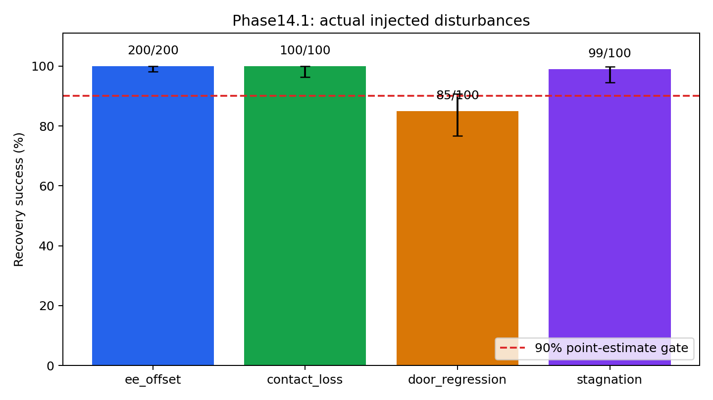
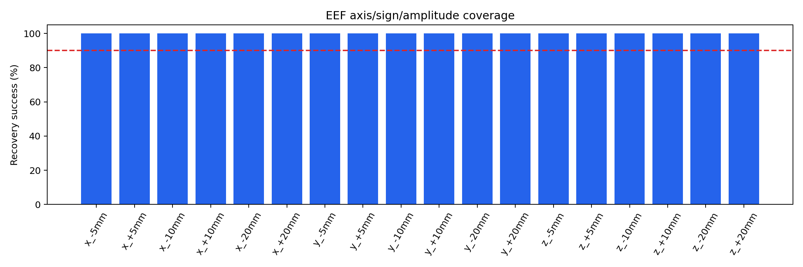

# Phase14.1 自动恢复专家生成报告

运行：formal_v1；阶段：formal。

## 协议

当前冻结 Phase13 BC+GT 策略执行到预指定阶段，主动注入扰动，GT专家使用原 Cartesian/DLS 接口接管。机器人无瞬移、接管无reset、时钟不重置、原10秒episode与reward不变。门角回退是明确标记的30°→20°门关节状态注入，不作为恢复控制动作，也不混入专家标签。

末端XYZ各±5/10/20mm，按18个桶平衡配额；报告目标与实际偏移。接触丢失为实际打开夹爪；停滞通过原接口持续非零旋转指令制造，并验证门角连续24步变化<0.002rad。未达到注入条件的尝试单独存储，不能作为成功恢复。

## 实际结果

|类型|有效恢复成功/尝试|成功率|Wilson95% CI|无效/未触达尝试|
|---|---:|---:|---|---:|
|ee_offset|200/200|100.00%|98.12%–100.00%|12|
|contact_loss|100/100|100.00%|96.30%–100.00%|62|
|door_regression|85/100|85.00%|76.72%–90.69%|35|
|stagnation|99/100|99.00%|94.55%–99.82%|49|

总体：**484/500=96.80%**。专家门槛（总体与末端偏离均>90%）：**True**。

## 末端偏离分桶

|方向与幅度|成功/尝试|
|---|---:|
|x_-5mm|12/12|
|x_+5mm|12/12|
|x_-10mm|11/11|
|x_+10mm|11/11|
|x_-20mm|11/11|
|x_+20mm|11/11|
|y_-5mm|11/11|
|y_+5mm|11/11|
|y_-10mm|11/11|
|y_+10mm|11/11|
|y_-20mm|11/11|
|y_+20mm|11/11|
|z_-5mm|11/11|
|z_+5mm|11/11|
|z_-10mm|11/11|
|z_+10mm|11/11|
|z_-20mm|11/11|
|z_+20mm|11/11|

## 数据与后续资格

有效成功恢复标签131766条，失败恢复标签4670条，无效注入后专家标签0条；审计问题0。只有有效成功组可用于后续成功纠正BC，无效组不能冒充成功恢复。成功与失败HDF5分开，策略/注入前缀独立保存；原始action、next_state、done与reset参数可追溯。

Phase14.2资格：**True**。本阶段BC/RL均未训练。

## 结论与限制

最难恢复类型以本轮分层结果判定。末端偏离负例通过真实抓取、目标误差、关节余量、阶段耗时分解。局部IK追踪失败不证明全局不可达；原传感器不能直接确认全机械臂碰撞，碰撞原因不虚构。

本结果只验证规定扰动和当前策略触达的状态。人工5–20mm偏移不能替代Phase14自然偏离测试。已有门驱动使初始门角回到关闭附近，不能宣称持续初角泛化。

失败详见 `docs/recovery_failure_analysis.md` 与本运行failure_analysis.json。所有历史结果保留。

## 复核与资源

历史源文件480个、此前结果69152个、Phase13产物530个；检测到变化0。

每进程32环境，至多4进程并发，各4 CPU线程，nice10，与其他项目共享GPU，无抢占。全部计入的是仿真数据生成交互；BC/RL优化步数均为0。

## 独立自然偏离交叉验证

保持同一冻结策略、原自然失败检测器和真实接管，32 clones每clone两次触发接管；无主动注入，无状态写入，无时钟reset。seed141301，64次自然恢复，与主动扰动正式集分别统计，不能合并成同一恢复分布。

自然恢复：**49/64=76.56%**，Wilson95% CI 64.87%–85.25%。

|自然触发类型|成功/尝试|
|---|---:|
|joint_limit_risk|11/11|
|contact_loss|26/35|
|angle_regression|6/6|
|stagnation|6/7|
|ee_offset|0/5|

**5–20mm人工末端偏离200/200，并不等于严重自然偏离已解决：自然末端偏离0/5。** 新专家可为当前规定扰动自动提供成功纠正数据；整个自然访问状态分布的恢复能力未过90%。

历史Phase14 138/160与本轮自然49/64使用不同测试种子和clone配额，不能据此宣称新专家因果退化。

## 扰动生成率及真实幅度

|类型|有效/全部尝试|未开始扰动|已开始但无效|
|---|---:|---:|---:|
|ee_offset|200/212|12|0|
|contact_loss|100/162|62|0|
|door_regression|100/135|35|0|
|stagnation|100/149|49|0|

末端有效条件：实测三维偏移距目标≤max(目标幅度×25%,1.5mm)；不是声称实际偏移精确等于标称值。

|标称幅度|实测目标轴绝对偏移均值mm|最小–最大mm|
|---|---:|---:|
|5|4.37|3.55–6.47|
|10|8.06|7.52–9.52|
|20|15.35|15.03–15.81|

## 修复过程与因果边界

|预检版本|末端|接触丢失|门角回退|停滞|
|---|---:|---:|---:|---:|
|pilot_v2|35/36|11/16|0/16|13/16|
|pilot_v3|36/36|16/16|0/16|15/16|
|pilot_v4|36/36|16/16|0/16|16/16|
|pilot_v5|36/36|16/16|16/16|16/16|

v3缩短近把手状态的重复退让，并恢复原开门动作幅度；v4仅在专家指令中补偿已验证的工具Jacobian映射，原环境IK不变；v5把门角回退后的退让和姿态调整分开，先离开门板附近再转姿态。开发预检复用种子，不能作为独立统计提升证据。正式不同种子下门角回退85/100，仍是主动扰动最困难类型。

机器人全臂碰撞未被原传感器直接测量。靠近门板时位置/姿态追踪受阻与分阶段退让的结果支持接近路径问题这一诊断方向，但不证明所有失败由碰撞或Jacobian单独造成。

## 最终五个问题

1. **哪些失败最难恢复？** 指定主动扰动中为门角回退85%；自然偏离中为末端偏离0/5（小样本）。
2. **为什么末端偏离曾失败？** 自然偏离包含与轻微笛卡尔扰动不同的完整关节姿态、接触历史和时间预算；现有局部恢复未解决这些状态。原工具映射误差已有几何证据，但补偿不能单独解释或解决全部失败。根因未完全确证。
3. **GT专家能否自动生成数据？** 能，无人工遥操作，正式500有效尝试得到484成功纠正轨迹，所有16失败也保留。补充自然验证49成功/15失败分别存储。
4. **数据是否达到BC要求？** 指定扰动正式总体96.8%、末端100%，数据连续性审计通过。只使用有效成功组作为成功纠正标签；无效注入、失败和前缀不能混入成功标签。自然状态覆盖仍不足。
5. **能否进入Phase14.2？** 可以开展限定数据分布的Robot-only/Robot+GT受控BC验证；不能宣称已有全分布恢复Anchor。把自然负例保留为独立压力测试，本阶段未训练BC/RL。

总体Wilson95% CI：94.87%–98.02%。本报告是专家执行成功的episode统计，并非五个训练seed的策略提升统计。

## 自然末端偏离的进一步证据

5个自然末端负例接管时EEF到把手距离为0.168–0.173m，均剩余431个控制步（约7.18秒），均停在CLEAR阶段且没有进入OPEN。记录的URDF硬限位最小余量为0.137–0.220rad。

人工末端扰动是在距把手4.5–11.5cm的接近阶段注入±5/10/20mm；这是不同于上述自然偏离的状态分布。当前证据不能把自然失败笼统归因于接管太晚、硬限位或GT无效；需要检查局部路径、姿态约束与真实接触阻塞。

## 运行版本

Python3.11.15、PyTorch2.7.0+cu128、IsaacLab0.47.2、IsaacSim5.1.0.0、NumPy1.26.0、h5py3.16.0、SciPy1.15.3、Pinocchio2.7.0；8×NVIDIA B300，driver580.82.07。完整版本见runtime_environment.json。

正式主动扰动671104次仿真交互，补充自然复测124736次；均为数据生成/专家验证，BC和RL优化步数为0。各case初始化之外的最长运行约567秒，四case并行；开发预检与正式预算分别记录。
