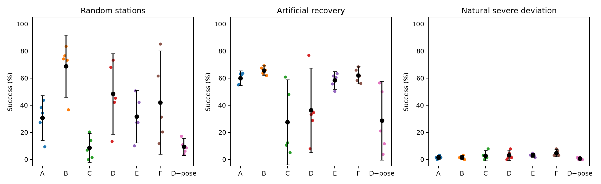

# Phase14.2：恢复数据与参数条件 BC

## 结论

主方案 D 随机工位成功率为 **48.44% [18.72, 78.15]**（5个训练seed，Student-t95%CI）。
D−B=-20.47 pp [-55.05, +14.11]；D−F=+6.41 pp [-10.23, +23.04]；D−C=+39.84 pp [+15.96, +63.72]。pp表示百分点。
**按固定20k最终权重，D=61.88%、B=41.72%，D−B=+20.16 pp [+10.33, +29.99]。这一终点有正向配对证据，但收益不跨选模协议稳定，也未证明优于普通增量数据。不能笼统宣称恢复数据完全无用。**
本轮不训练RL；SAC/Residual/KL RL/LWD/DIVL更新数均为0。
**未通过可靠随机工位Anchor门槛，因此不进入Phase14.3，不进入LWD/DIVL。保留全部模型作为候选和诊断产物。**

## 数据、来源与划分

|来源|成功轨迹|train轨迹/transition|validation轨迹/transition|test轨迹/transition|
|---|---:|---:|---:|---:|
|S：Phase13原随机成功|300|200/65198|50/16466|50/16124|
|R：Phase14.1正式人工恢复成功|484|338/92215|71/19254|75/20297|
|N：普通随机成功增量|484|338/113477|72/24098|74/24960|

N从正常Level2初态开始，使用与R完全相同的Phase14.1恢复专家类和动作补偿，采集成功 **484/491=98.57%**，保存484成功轨迹；失败尝试保留在attempts.csv。没有主动失败注入、策略前缀或人工遥操作。

S原始文件不修改，沿用原200/50/50整轨迹划分。R按四类扰动分层、整轨迹划分；N独立整轨迹划分。R含全部484条正式成功恢复轨迹，16失败恢复不参与BC。各源test轨迹均不训练。

R只取专家接管后的顶层纠正transition，不读取嵌套policy_and_injection_prefix。Phase14旧自然数据与Phase14.1自然crosscheck均不参与训练或本轮最终压力测试。

继承任务的限制：reset门角为0–5°，但原门关节驱动的目标为0、stiffness=10、damping=2.5，在接近过程中会使初始门角趋向关闭；把手XYZ随机偏移持续存在。因此完整随机成绩主要证明该既有工位随机协议下的适应，不能解释为持续多门角状态的泛化。此轮未改变门驱动、reward、reset或机器人配置。

### 等采样预算与重复使用

每组20000更新、batch512，总10240000样本抽取。A/B全部抽S；C/D与E/F均每batch256S+256新增源，新增源各抽5120000次。N与R采用用户允许的训练采样量匹配，而非声称原始transition数完全相同。

|组|S抽取数|新增源抽取数|S平均重复次数|新增源平均重复次数|
|---|---:|---:|---:|---:|
|A|10240000|0|157.06|0.00|
|B|10240000|0|157.06|0.00|
|C|5120000|5120000|78.53|55.52|
|D|5120000|5120000|78.53|55.52|
|E|5120000|5120000|78.53|45.12|
|F|5120000|5120000|78.53|45.12|
|D_no_handle|5120000|5120000|78.53|55.52|

## 输入、模型与公平性

复用Phase13的Policy：39→256→256→7，ReLU/tanh，连续动作MSE、Adam3e−4；77838总参数（含7个冻结log_std）。所有组容量、训练seed0–4、更新次数、优化器、动作接口均一致。7组按arm维向量化执行，独立权重与Adam状态；初始化前校验向量化forward与原Policy相同。相同GT对照共用S与新增源抽样索引。

输入为robot26与13个有效GT特征：门角、门角速度、进度、剩余角、两指接触、把手XYZ+四元数。任务目标角始终1rad：作为显式配置常量保存，亦可从门角+剩余角恢复。将原恒定目标角槽用于角速度，保持原网络结构和容量；本接口不用于变化目标角任务。

归一化沿用原train-S统计，仅速度槽用train-S原始物理速度重新拟合；所有组共享。Robot-only在归一化后屏蔽全部GT；D_no_handle只屏蔽把手7个通道。没有planner阶段/专家内部计时/未来动作输入。完整GT是假设工装能稳定提供标定位姿的条件结果；实际硬件位姿传感尚未验证，另列去位姿结果，不能将完整GT直接视为部署已解决。

每1000更新，以三源validation的等权动作MSE选择best，所有组使用同一评估集合与选择规则，不以测试成功率选模。这个共同验证目标同时覆盖恢复与普通状态，与Phase13仅S验证不完全相同。因此另列所有A–F最终20k权重的随机成功率，检查选模敏感性；历史9.06/47.34/63.28%仅作背景，不能作本轮配对对照。

## 五seed闭环结果

数值为均值%，方括号为训练seed95%CI；人工恢复列为四类型等权平均。CI可超出0–100，是未截断的Student-t区间。

|组|数据/输入|固定|完整随机（95%CI）|人工恢复（95%CI）|自然严重偏离（95%CI）|随机seed SD|
|---|---|---:|---:|---:|---:|---:|
|A|S/robot|35.62%|30.63% [14.11, 47.14]|60.00% [54.61, 65.39]|1.56% [0.19, 2.93]|13.30%|
|B|S/GT|86.25%|68.91% [46.02, 91.79]|65.70% [62.17, 69.24]|1.56% [0.19, 2.93]|18.43%|
|C|S+R/robot|5.62%|8.59% [-2.03, 19.22]|27.42% [-3.96, 58.81]|2.81% [-0.92, 6.54]|8.56%|
|D|S+R/GT|44.69%|48.44% [18.72, 78.15]|36.33% [5.10, 67.56]|3.12% [-0.76, 7.01]|23.93%|
|E|S+N/robot|53.44%|31.56% [12.17, 50.96]|58.36% [51.85, 64.87]|3.12% [1.75, 4.50]|15.62%|
|F|S+N/GT|51.88%|42.03% [3.99, 80.07]|62.11% [55.78, 68.44]|4.69% [1.94, 7.43]|30.64%|
|D_no_handle|S+R/GT去把手pose|2.19%|9.38% [3.05, 15.70]|28.67% [-0.42, 57.76]|0.62% [-0.44, 1.69]|5.09%|

### 随机工位seed明细与最终20k敏感性

|组|best-validation seed0–4（%）|final20k seed0–4（%）|final20k均值与95%CI|
|---|---|---|---|
|A|27.34 / 38.28 / 34.38 / 43.75 / 9.38|2.34 / 2.34 / 0.00 / 0.78 / 1.56|1.41% [0.14, 2.67]|
|B|74.22 / 76.56 / 83.59 / 73.44 / 36.72|61.72 / 14.84 / 51.56 / 64.84 / 15.62|41.72% [11.08, 72.35]|
|C|7.03 / 0.00 / 20.31 / 14.06 / 1.56|3.12 / 0.78 / 21.09 / 24.22 / 1.56|10.16% [-4.12, 24.43]|
|D|67.97 / 13.28 / 73.44 / 42.19 / 45.31|76.56 / 39.84 / 69.53 / 76.56 / 46.88|61.88% [40.36, 83.39]|
|E|10.16 / 50.78 / 27.34 / 27.34 / 42.19|3.91 / 23.44 / 1.56 / 0.78 / 13.28|8.59% [-3.42, 20.61]|
|F|61.72 / 11.72 / 85.16 / 31.25 / 20.31|28.12 / 36.72 / 17.19 / 41.41 / 77.34|40.16% [11.92, 68.39]|
|D_no_handle|17.19 / 10.94 / 3.91 / 6.25 / 8.59|未追加此敏感性对照|—|

### 固定20k最终权重的配对敏感性

|比较|随机差值pp（95%CI）|paired t p|敏感性家族Holm p|exact signflip p|
|---|---:|---:|---:|---:|
|D-B|+20.16 pp [+10.33, +29.99]|0.0047035|0.014111|0.0625|
|D-F|+21.72 pp [-21.75, +65.18]|0.23763|0.47527|0.1875|
|D-C|+51.72 pp [+35.48, +67.96]|0.00090276|0.003611|0.0625|
|F-B|-1.56 pp [-54.00, +50.88]|0.93804|0.93804|0.9375|

D的最低验证MSE权重比最终20k权重的闭环成绩更低，B也有选模与最终性能差距。共同动作MSE不等同于多步任务可靠性。未来需要独立closed-loop validation选择checkpoint，当前不得用本轮测试集再挑高分权重作为Anchor。

### 预设核心配对比较

|比较|随机成功差值pp（95%CI）|正向seed数|paired t p|Holm p|exact signflip p|
|---|---:|---:|---:|---:|---:|
|D-B|-20.47 pp [-55.05, +14.11]|1/5|0.17563|0.35126|0.1875|
|D-F|+6.41 pp [-10.23, +23.04]|4/5|0.34529|0.35126|0.375|
|D-C|+39.84 pp [+15.96, +63.72]|5/5|0.0097886|0.039154|0.0625|
|F-B|-26.88 pp [-59.73, +5.98]|1/5|0.085639|0.25692|0.125|

统计单位为训练seed；不能把同一策略的数百episode当作数百独立训练seed。所有组采用同一未见过的reset序列。n=5的精确双侧signflip最小p=0.0625，因此即使t检验显著，也明确报告精确检验限制；四个主比较同时报告Holm校正。

## 恢复阶段与独立压力测试

每模型固定64、随机128 episodes；人工四类型各64；自然严重偏离64。共享新测试seed生成的物理失败状态，参考前缀来自冻结Phase13候选，并非恢复专家。自然状态从未主动注入扰动的参考策略rollout在tick169筛选，末端距把手0.10–0.20m；不是旧0/5状态或训练R状态。

压力测试采用同样32-clone物理布局并打包状态：重放真实动作历史，恢复记录的robot q/qdot及门q/qdot，保持1tick重建真实接触测量，再在策略接管边界恢复一次记录的位置和速度。自然失败速度较大，单保持步可移动数厘米，因此这一步重建是测试初始化；学习策略接管后没有状态修正或专家动作。保持tick计入原600tick时限。接触输入来自真实保持步的测量，PhysX内部求解器历史不能完整序列化；不声称所有内部物理变量比特级相同。每个模型实际初始化robot26/GT11都保存并检查，此轮35模型的可观察初始化状态与接触标签完全一致。

阶段定义：进入把手6cm内连续6tick；双指接触连续3tick；有效抓取代理=双指接触+6cm内+夹爪关闭动作+夹爪宽0.5–7.9cm连续3tick（并非完整力闭合证明）；门角高于接管时0.05rad连续30tick；最终门角>1rad。阶段只统计策略动作后的观测，不将初始化保持动作当作学习策略恢复动作。

|测试/组|重新接近|重新接触|抓取代理|持续进度恢复|最终成功|
|---|---:|---:|---:|---:|---:|
|ee_offset/B|72.19%|78.44%|68.75%|69.38%|67.50%|
|ee_offset/C|79.06%|55.94%|51.56%|45.31%|24.06%|
|ee_offset/D|90.00%|85.31%|80.00%|53.75%|39.69%|
|ee_offset/F|71.88%|70.00%|59.69%|63.75%|57.19%|
|ee_offset/D_no_handle|74.38%|52.81%|44.06%|35.00%|13.12%|
|contact_loss/B|100.00%|100.00%|100.00%|96.88%|95.00%|
|contact_loss/C|100.00%|98.75%|97.81%|63.44%|45.00%|
|contact_loss/D|100.00%|100.00%|99.69%|56.25%|39.69%|
|contact_loss/F|100.00%|100.00%|100.00%|96.88%|93.12%|
|contact_loss/D_no_handle|100.00%|99.69%|98.75%|65.94%|48.12%|
|door_regression/B|18.44%|1.56%|1.56%|3.44%|1.56%|
|door_regression/C|43.44%|13.75%|10.31%|7.19%|2.81%|
|door_regression/D|92.19%|81.25%|68.44%|38.44%|23.12%|
|door_regression/F|18.44%|1.88%|1.56%|1.56%|1.25%|
|door_regression/D_no_handle|57.81%|22.19%|16.25%|8.44%|5.00%|
|stagnation/B|100.00%|100.00%|100.00%|100.00%|98.75%|
|stagnation/C|100.00%|97.50%|91.88%|56.88%|37.81%|
|stagnation/D|100.00%|99.38%|99.38%|61.88%|42.81%|
|stagnation/F|100.00%|100.00%|100.00%|100.00%|96.88%|
|stagnation/D_no_handle|100.00%|97.19%|94.38%|60.31%|48.44%|
|natural_severe/B|4.38%|3.75%|2.81%|27.50%|1.56%|
|natural_severe/C|5.94%|2.81%|2.19%|28.75%|2.81%|
|natural_severe/D|16.25%|9.38%|6.88%|46.25%|3.12%|
|natural_severe/F|3.12%|3.12%|1.56%|23.44%|4.69%|
|natural_severe/D_no_handle|8.75%|3.12%|2.50%|45.00%|0.62%|

已在邻域/已有接触的状态可能使阶段总比例较高；每episode CSV保留initially_near/initial_contact，JSON另给when_needed条件率。自然严重偏离全部来源于自然前缀，但压力测试是冻结状态分布上的条件恢复，不等同于各策略自然rollout的失败频率或端到端总体恢复。

### 实际压力状态匹配审计

|测试|max EEF组间跨度mm|max handle跨度mm|max q跨度rad|接触标签完全一致比例|
|---|---:|---:|---:|---:|
|ee_offset|0.0000|0.0000|0.00000|100.00%|
|contact_loss|0.0000|0.0000|0.00000|100.00%|
|door_regression|0.0000|0.0000|0.00000|100.00%|
|stagnation|0.0000|0.0000|0.00000|100.00%|
|natural_severe|0.0000|0.0000|0.00000|100.00%|

## 同原专家的数据量补充对照

原六组N与R使用相同Phase14.1专家，能控制新增专家版本；该专家与S的Phase13专家存在正常接近路径/阶段时序差异。因此F−B同时含“更多普通数据”和“专家风格混合”，不能直接称为纯数量效应。发现这个方法风险后，在读取同原专家新数据的结果之前，追加一个有记录的协议修正：再生成484正常成功轨迹N_sameS，用完全不修改的Phase13 staged_free专家。S/R及原N不改、不替换、不择优删除。

新增E_S/F_S为S+N_sameS，五个相同seed、相同网络、20k更新、512batch、50/50源采样。选模仍用原冻结共同S/R/N_v5验证集，避免改变已声明的选择目标；新N的独立validation额外保留。两组均测固定/随机，最终20k再测随机，提供普通数据规模的严格源风格对照。

N_sameS采集484/498=97.19%，484条成功轨迹按338/72/74整轨迹划分；采集174304次仿真交互。原始文件哈希和抽样预算写入`datasets/phase14_2/quantity_control_v1/manifest.json`。补充量对照和主对照一起完整保留。

|补充组|固定best|随机best（95%CI）|随机final20k（95%CI）|
|---|---:|---:|---:|
|E_S|75.94%|44.38% [29.19, 59.56]|1.09% [-0.01, 2.20]|
|F_S|62.19%|54.37% [9.26, 99.49]|42.97% [-0.87, 86.81]|

|补充比较|随机差值pp（95%CI）|paired t p|补充家族Holm p|exact signflip p|
|---|---:|---:|---:|---:|
|F_S-B|-14.53 pp [-43.65, +14.59]|0.23819|0.71456|0.3125|
|D-F_S|-5.94 pp [-52.45, +40.58]|0.74093|0.84775|0.6875|
|F_S-F|+12.34 pp [-26.17, +50.86]|0.42388|0.84775|0.5|

F_S−B控制原专家风格，用于判断只增加普通成功数据的效果；D−F_S与D−F同时报告，分别对应原专家数量对照与新增专家版本对照。补充比较是诊断性协议修正，不能替代预设主比较来宣布D通过Anchor门槛。

## 专家标签、MSE与失败诊断

恢复训练占50%，并不属于恢复数据权重过低的设置。动作MSE与实际闭环成功分开报告：bc_seed*_summary.json提供三源未见轨迹的transition/trajectory MSE；diagnosis.json按release/clear/orient/approach/align/grasp/open分解位置、旋转、夹爪误差与夹爪符号准确率。

下表为5seed的未见轨迹动作MSE均值，格式为transition等权 / trajectory等权；MSE基于归一化动作，不是实际末端跟踪位置误差。

|组|S test MSE|R test MSE|N test MSE|
|---|---:|---:|---:|
|A|0.005190 / 0.005857|0.040596 / 0.038722|0.006191 / 0.006144|
|B|0.005142 / 0.005787|0.026044 / 0.025857|0.006094 / 0.006050|
|C|0.003031 / 0.003803|0.003150 / 0.003010|0.003145 / 0.003136|
|D|0.002965 / 0.003680|0.002497 / 0.002435|0.002983 / 0.002976|
|E|0.005500 / 0.006343|0.024788 / 0.024208|0.003637 / 0.003625|
|F|0.005416 / 0.006181|0.017914 / 0.018211|0.003641 / 0.003630|
|D_no_handle|0.003063 / 0.003880|0.002988 / 0.002853|0.003098 / 0.003091|

R/N共用修复后的专家，S使用原Phase13专家，因此D−F控制了新增专家控制器变化；D−B同时涉及新增恢复覆盖和新增标签来源，不能仅凭这个差值归因恢复覆盖。最近邻动作分歧是近似状态比较，不是精确状态动作矛盾或动作多模态的因果证明。

|R训练阶段|transition|占R%|占整体batch%|每512batch期望样本|
|---|---:|---:|---:|---:|
|release|3380|3.67|1.83|9.38|
|clear|3011|3.27|1.63|8.36|
|approach|3610|3.91|1.96|10.02|
|align|10241|11.11|5.55|28.43|
|grasp|9126|9.90|4.95|25.33|
|open|61392|66.57|33.29|170.43|
|orient|1455|1.58|0.79|4.04|

R中open约66.6%，clear+approach+orient在整个batch合计约4.4%。恢复源占50%并不保证最关键重新接近/重定向状态占足够比重。阶段平衡抽样是待验证的假设，本轮没有更改主采样和loss。

下一步：先以独立闭环validation选模，保存完整checkpoint轨迹并核对阶段MSE与部署成功的关系；再单独对照恢复前段分层采样。若仍失败，检查专家阶段/阶段内计时的不可观察性、单步MSE对不同纠正动作的平均化、相对EEF–handle几何与短历史。现有近邻证据和专家路径差异不能单独证明这些因果解释。不要直接增加恢复数据或进入RL。

## Anchor门槛与八个交付问题

机器可读门槛：`{"random_over80": false, "all_required_paired_effects": false, "artificial_improved": false, "fixed_not_degraded": false, "seed_sd_below10": false, "candidate_qualified": false, "independent_retest_required": true, "rl_allowed_now": false, "lwd_divl_ready": false, "final_update_effect_direction": true}`。

1. **恢复数据是否提高随机BC？** 验证MSE选模D−B=-20.47 pp [-55.05, +14.11]；最终20k的D−B=+20.16 pp [+10.33, +29.99]。终点有正向证据，主选模比较没有稳定正向证据，不能把这两种口径混用。
2. **是否只是数据更多？** D−F=+6.41 pp [-10.23, +23.04]；同原专家数量对照D−F_S=-5.94 pp [-52.45, +40.58]、F_S−B=-14.53 pp [-43.65, +14.59]。未证明恢复覆盖稳定优于普通增量数据。
3. **GT在恢复学习中是否有效？** D−C=+39.84 pp [+15.96, +63.72]；GT条件输入仍有正向证据，但包含完整把手位姿，去位姿模型的主随机指标仅9.38%。
4. **是否学会完整纠正链？** D人工恢复=36.33% [5.10, 67.56]；自然恢复=3.12% [-0.76, 7.01]。必须结合上表逐阶段瓶颈，不能用接近率或专家成功率代替策略最终恢复率。
5. **新Anchor成功率？** 当前D五seed主指标=48.44% [18.72, 78.15]，最终20k=61.88% [40.36, 83.39]；没有通过门槛的新Anchor；已有历史候选保持原样。
6. **严重自然偏离的问题？** 自然压力测试逐阶段如上；D最终=3.12%。这一独立压力域不要求90%，也不与旧5例不同状态的专家结果作因果涨跌比较。
7. **是否进入14.3？** 不允许：可靠随机恢复Anchor的预设门槛未满足。
8. **是否进入LWD/DIVL？** 不满足：本轮只验证BC，还缺随机工位稳定在线成功经验及RL相对冻结Anchor的正向增益证据。

## 资源、完整性与复现

训练5seed×7主组与5seed×2补充组，共45模型，每模型20k更新；没有RL训练。主评估8进程×32环境；数量对照与补齐初版归档项各最多4进程，峰值16进程×32=512环境，单GPU最多2进程，各4 CPU线程、nice10，共享8×B300，无终止其他项目。全部最终有效评估24960 episodes。仿真版本、任务与runtime_env.sh沿用原项目。

历史保护检查70333个文件；变化0。源数据SHA256如下：

```json
{
  "datasets/random_door_expert/collection_v1/trajectories.h5": "9711e9504ca2b7daef9268885a3ab7abedab38ac92568daa4a2c955b82744adc",
  "datasets/recovery_expert/phase14_1/formal_v1/ee_offset/trajectories.h5": "6dc9cf77e58244b8db2d77b806a1ff728980b5d8157a2e4a88b21e685a7b1fc1",
  "datasets/recovery_expert/phase14_1/formal_v1/contact_loss/trajectories.h5": "c1a750e6ee6e7cd92d0eea646e1e4bc1c52d114184999f1259d427459fbc8ff5",
  "datasets/recovery_expert/phase14_1/formal_v1/door_regression/trajectories.h5": "0e061f34cfbf1e1ca5dc6c1169d28e359f84243d984643726e5a084d459de155",
  "datasets/recovery_expert/phase14_1/formal_v1/stagnation/trajectories.h5": "98f144dc50cb43ee4481bf1f7d6896f509dd7c5daabcb0a1fc53da348460f4b0",
  "datasets/phase14_2/success_size_matched/collection_v1/trajectories.h5": "49b2f4bb6bc4edbbc1e78491982fc6a9e1f155779adc8b15945e3755576cfd27"
}
```

结果：`results/phase14_2_recovery_bc/{summary.json,metrics.csv,diagnosis.json,evaluation/,evaluation_final/}`；权重和训练曲线：`checkpoints/phase14_2_recovery_bc/`；日志：`logs/phase14_2_recovery_bc/`；划分与归一化：`datasets/phase14_2/prepared_v1/manifest.json`。

复现入口：`source configs/runtime_env.sh; .venv/bin/python -m experiments.phase14_2_recovery_bc.run --eval-gpus 0,1,2,3,4,5,6,7`。保留完成项并检查全部预期结果，而非仅凭仿真进程退出码0判断完成。


