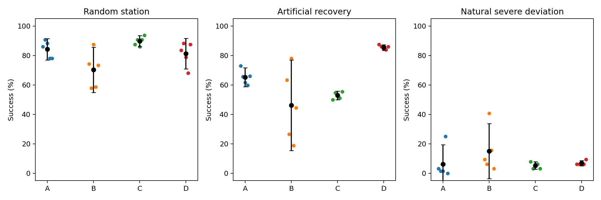
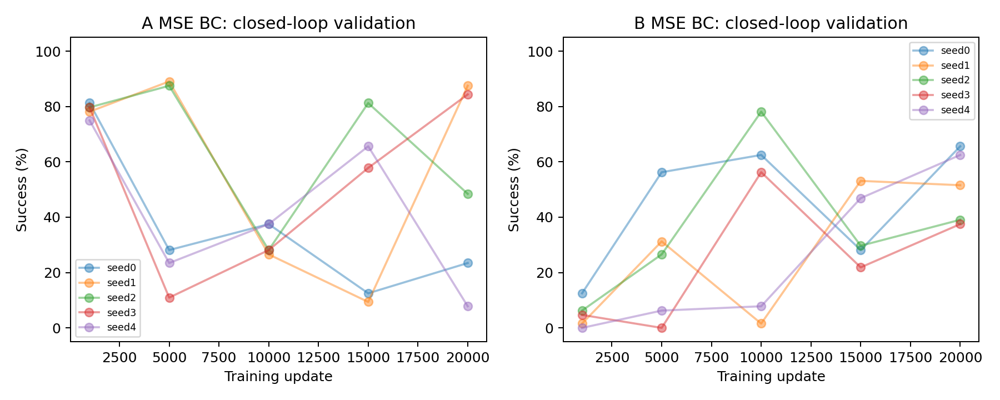

# Phase14.3：随机工位单步 BC 与 π0.5 对照实验

## 结论与决策

同一份 S/R 数据、相同 GT 和独立闭环选模后，D（π0.5 + S+R）的随机成功率为 **81.25%**，B（MSE BC + S+R）为 **70.31%**。D−B 为 **+10.94 个百分点**，95% CI [-6.37, 28.25]，Holm 校正 paired-t p=0.30855。
预先声明的随机 Anchor 综合门槛：**未通过**。本阶段 RL 更新数为 0；LWD/DIVL 条件尚未成立。
π0.5 若通过统计门槛，也只成为独立复测候选：还需验证真实时间推理与硬件控制接口。该实验不能单独证明收益源于多模态建模。

## 1. 固定协议、信息与数据

- 任务：原 Isaac Lab Panda Door Opening；原 Progress Reward、reset、物理、动作尺度、机器人配置全部保留。
- Level2：门 reset 角度 0–5°，工装 XYZ ±1cm。原门关节驱动保持 target=0、stiffness=10、damping=2.5，因此接近期间角度可能回到 0；本结果不能解释为持续保持不同初始角度的泛化。
- S：300 条随机成功专家轨迹，train/validation/test=200/50/50；transition=65,198/16,466/16,124。
- R：484 条成功恢复专家轨迹，train/validation/test=338/71/75；transition=92,215/19,254/20,297。复用 Phase14.2 的原始 split、归一化和 SHA256；失败恢复、自然 crosscheck、策略/注入前缀没有进入监督数据。
- 四组全部无 RGB：采用 π0.5 的 state-only 模态消融，不是完整视觉 VLA 对照。固定 prompt 为 `open the door`。
- 39 个有效输入：robot26（q9、qd9、EEF xyz/quaternion、episode clock）+ environment13（angle、angular velocity、progress、remaining、左右 contact、handle xyz/quaternion）。固定目标 1rad 保存在配置/checkpoint，且能从 angle+remaining 重建。与 Phase14.2 一致，原常量 target 输入槽用于真实角速度。
- 两类策略读取完全相同的物理量。MSE 使用冻结 train-S z score；π0.5 用显式 state adapter 将同一 z score 经 `2/pi*atan(z)` 映射到有界区间，再按官方 π0.5 格式离散到 256 bins、写入真实语言 prefix。200 token 上限，最长实际 167，未截断 GT。
- 四组统一原 7 维动作：相对 EEF xyz/轴角 + gripper；60Hz，平移尺度 .05、旋转尺度 .3，原 IK/夹爪接口。π0.5 预测 H=10，执行前 5 步后重规划、丢弃剩余 5 步。reset 和恢复接管时清空缓存并从当前状态重新生成。

### 策略与训练预算

| 组 | 数据 | 策略 | 优化器/步数/batch | 选模候选 |
| --- | --- | --- | --- | --- |
| A | S | 39→256→256→7，单步 MSE | Adam 3e−4 / 20k / 512 | 1k,5k,10k,15k,20k |
| B | 50% S + 50% R | 相同 MSE 网络 | 同 A | 同 A |
| C | S | 官方 OpenPI π0.5 base + rank16 LoRA | AdamW peak1e−4→1e−5 / 5k / 128 | 250,1250,2500,3750,5000 |
| D | 50% S + 50% R | 相同 π0.5 | 同 C | 同 C |

π0.5 在语言主干与 action expert 的 q/k/v/o 和 MLP 投影加入 rank16 LoRA；action/time 投影训练，视觉分支冻结且没有调用。全32维接受官方 flow-matching loss：前7维为真实动作，后25维为已知零padding。轨迹末端补齐时间步有mask，动作块不跨轨迹边界，使用10个Euler denoise step。
适配修复记录：原试跑仅监督前7维，但官方采样器积分全部32维，存在padding训练/采样约定不一致。此问题在任何正式π0.5闭环结果产生之前按源码发现，未依据测试表现调参；8个未完成试跑和旧pilot全部归档。修复后重新做单seed链路和同预算正式5seed实验，旧trial不混入主指标。原BC模型/数据/压力状态未改动，旧成本单独保留。
模型预训练、容量、优化器、预算、π0.5 离散 state 编码和动作块时序均是本对照的差异。A/B 每模型抽样 10.24m 单步，C/D 抽样 640k anchors（每 anchor 最多 10 个合法动作），预算并不相等。结论限于这两个公开记录的配方；不能隔离“容量”“预训练”“块预测”“流匹配”的独立贡献。

## 2. 验证与独立测试

- 训练 seeds：0–4，A/B 与 C/D 内部配对相同初始权重、同一采样 RNG。不同架构无法共享权重；所有方法共享评估 reset 与压力状态。
- 单 seed 50-update π0.5 试跑只验证输入、梯度、权重恢复、GT forward 敏感性与七项闭环链路，不作为性能结果。链路通过后才开始正式 π0.5 多 seed。
- 匹配训练进度 5/25/50/75/100% 的五个候选。早期 MSE 1k 权重按相同 RNG 精确重建；原 20k 权重和主训练日志未覆盖。
- 闭环 validation：固定32、随机64、每种压力32 episodes/checkpoint；100 checkpoints、700 项测试，共25,600 episodes。验证 reset seed=143501，压力 cohort seeds=143601…143605。
- 选模按随机成功率→人工恢复四类宏平均→自然严重偏离→固定成功率→更早 update。验证 MSE不用于选模，test不参与选模。
- 独立 test：固定64、随机128、每种压力64 episodes/model；20 models、140 项测试，共10,240 episodes。reset seed=143502，压力 cohort seeds=143701…143705。
- 人工压力：±5/10/20mm EEF（轴和方向均衡）、接触丢失、门角回退、停滞。自然压力使用新生成的 EEF–handle 距离10–20cm、复杂 q/qd/contact history 状态；不使用旧压力样本或训练恢复动作。
- 压力 test 重放合法 action history，然后恢复记录 q/qd 与 door q/qd；一个中立接触暖机 tick 计入原600 tick预算，边界再次恢复记录位姿/速度，此后只有学习策略动作。全部接管都有新 chunk。PhysX 内部历史未完整序列化，不能称为完整物理 bitwise 克隆。
- reapproach：距离<6cm持续6tick；recontact：双指接触持续3tick；regrasp：双接触+近距离+闭夹爪+宽度5–79mm持续3tick（是代理指标，不证明 force closure）；progress_resumed：门角比接管时增加>0.05rad持续30tick；最终 success：原episode结束 angle>1rad。

### 实际选中 update（仅 validation 决定）

| 组 | seed0 | seed1 | seed2 | seed3 | seed4 |
| --- | --- | --- | --- | --- | --- |
| A | 1000 | 5000 | 5000 | 20000 | 1000 |
| B | 20000 | 15000 | 10000 | 10000 | 20000 |
| C | 3750 | 3750 | 3750 | 5000 | 5000 |
| D | 2500 | 3750 | 2500 | 5000 | 5000 |

## 3. 四组独立测试主结果

所有单元格为五训练 seed的 **均值 ± seed SD；[Student-t 95% CI]**。CI未裁剪到[0,100]，反映小样本不确定性；episode不是独立训练seed。人工恢复是四类等权宏平均。

| 方案 | 随机工位 | 固定工位 | 人工恢复宏平均 | 自然严重偏离 |
| --- | --- | --- | --- | --- |
| MSE BC + S | 84.22% ± 5.80；[77.01, 91.43] | 100.00% ± 0.00；[100.00, 100.00] | 65.23% ± 5.10；[58.90, 71.57] | 6.25% ± 10.54；[-6.84, 19.34] |
| MSE BC + S+R | 70.31% ± 12.39；[54.93, 85.70] | 85.94% ± 28.90；[50.06, 121.82] | 46.25% ± 24.76；[15.50, 77.00] | 15.00% ± 15.05；[-3.69, 33.69] |
| π0.5 + S | 89.69% ± 3.05；[85.91, 93.47] | 100.00% ± 0.00；[100.00, 100.00] | 52.89% ± 2.30；[50.03, 55.75] | 5.31% ± 2.10；[2.71, 7.92] |
| π0.5 + S+R | 81.25% ± 8.30；[70.94, 91.56] | 94.06% ± 5.34；[87.43, 100.70] | 85.55% ± 1.41；[83.80, 87.30] | 6.88% ± 1.40；[5.14, 8.61] |

### 配对效应（百分点）

| 比较 | 随机 Δ；95%CI | 随机 paired-t / Holm / exact signflip | 人工恢复 Δ；95%CI | 自然恢复 Δ；95%CI |
| --- | --- | --- | --- | --- |
| D-B | +10.94；[-6.37,28.25] | 0.15427 / 0.30855 / 0.125 | +39.30；[8.88,69.71] | -8.12；[-27.64,11.39] |
| C-A | +5.47；[-4.52,15.46] | 0.20307 / 0.30855 / 0.375 | -12.34；[-19.89,-4.79] | -0.94；[-13.41,11.53] |
| D-C | -8.44；[-18.57,1.70] | 0.081943 / 0.28569 / 0.0625 | +32.66；[29.13,36.18] | +1.56；[-2.32,5.44] |
| B-A | -13.91；[-29.75,1.94] | 0.071423 / 0.28569 / 0.0625 | -18.98；[-48.32,10.35] | +8.75；[-13.65,31.15] |

四个预先指定随机主比较使用 Holm 校正。恢复指标为诊断性比较，未做全指标族显著性校正。n=5 时双侧 exact signflip p最小0.0625；不能把 paired-t p<0.05解读成所有非参数检验均显著。
模型×恢复数据交互（探索性）：(D−C)−(B−A)=+5.47pp，95%CI[-13.06,24.00]。这才直接比较两种模型的数据增益，未纳入四项主检验Holm族。
Phase14.2 的68.91%/48.44%来自不同权重选择和独立评估状态，不能与这里直接相减作为模型效果；本阶段 A/B 是同协议重训重评的实际对照。

## 4. 恢复阶段与 EEF 扰动幅度

| 状态/组 | 重新接近 | 重新接触 | 重新抓取代理 | 持续进度 | 最终成功 |
| --- | --- | --- | --- | --- | --- |
| EEF偏离/A | 70.94% | 82.19% | 67.81% | 65.31% | 62.81% |
| EEF偏离/B | 94.06% | 92.50% | 85.00% | 68.75% | 52.19% |
| EEF偏离/C | 69.69% | 46.56% | 43.44% | 35.62% | 26.56% |
| EEF偏离/D | 94.38% | 87.81% | 87.81% | 81.56% | 78.44% |
| 接触丢失/A | 100.00% | 100.00% | 100.00% | 100.00% | 99.06% |
| 接触丢失/B | 100.00% | 100.00% | 100.00% | 61.88% | 48.12% |
| 接触丢失/C | 100.00% | 100.00% | 100.00% | 98.12% | 91.88% |
| 接触丢失/D | 100.00% | 100.00% | 100.00% | 100.00% | 99.06% |
| 门角回退/A | 10.62% | 1.56% | 1.56% | 1.56% | 1.25% |
| 门角回退/B | 94.69% | 80.31% | 72.81% | 46.25% | 36.88% |
| 门角回退/C | 6.25% | 1.25% | 1.25% | 1.56% | 0.00% |
| 门角回退/D | 89.06% | 81.88% | 81.56% | 74.69% | 69.06% |
| 停滞/A | 100.00% | 100.00% | 100.00% | 100.00% | 97.81% |
| 停滞/B | 100.00% | 98.75% | 98.12% | 64.69% | 47.81% |
| 停滞/C | 100.00% | 100.00% | 100.00% | 100.00% | 93.12% |
| 停滞/D | 100.00% | 99.38% | 99.06% | 98.44% | 95.62% |
| 自然严重偏离/A | 4.06% | 2.19% | 1.88% | 37.50% | 6.25% |
| 自然严重偏离/B | 10.62% | 5.62% | 3.75% | 50.62% | 15.00% |
| 自然严重偏离/C | 2.19% | 1.56% | 1.25% | 19.38% | 5.31% |
| 自然严重偏离/D | 5.94% | 2.19% | 1.56% | 20.31% | 6.88% |

完整五seed/SD/CI见summary.json，以下幅度按生成器assignment分组（每seed分母约20–23，不能当成高精度独立实验）。

| 组 | 5mm成功 | 10mm成功 | 20mm成功 |
| --- | --- | --- | --- |
| A | 63.00% ± 27.06；[29.39, 96.61] | 66.09% ± 16.95；[45.04, 87.13] | 59.05% ± 20.92；[33.07, 85.02] |
| B | 57.00% ± 19.56；[32.72, 81.28] | 48.70% ± 11.67；[34.21, 63.18] | 51.43% ± 21.93；[24.20, 78.65] |
| C | 20.00% ± 10.00；[7.58, 32.42] | 30.43% ± 6.15；[22.80, 38.07] | 28.57% ± 12.60；[12.93, 44.21] |
| D | 85.00% ± 5.00；[78.79, 91.21] | 77.39% ± 5.67；[70.35, 84.43] | 73.33% ± 8.65；[62.59, 84.07] |

## 5. 动作平均诊断

从 R train中抽12,000状态，对 R validation中2,000状态做16近邻检索。预先设置状态RMS≤0.3、EEF/handle差≤15mm、q RMS≤.08rad、qd RMS≤.3、门角差≤.05rad、接触相同、动作RMS≥.25、位置方向cos<−.5。发现 **116** 个近邻反向标签对，选64个不同 query状态。每个 π0.5 模型在相同 query上生成16个 flow noise样本；不挑样本用于主闭环评估。

| 组 | 位于两标签中部区域比例 | 距最近标签L2 | 相对query标签MSE | 生成动作均值std |
| --- | --- | --- | --- | --- |
| A | 27.19% | 0.2872 | 0.09269 | 0.0000 |
| B | 0.00% | 0.0637 | 0.01767 | 0.0000 |
| C | 3.36% | 0.0723 | 0.09543 | 0.0593 |
| D | 0.21% | 0.0315 | 0.01693 | 0.0220 |

“中部区域”定义为两标签连线投影t∈[.25,.75]、垂直残差≤两标签距离的.25。近邻不是同一个物理状态，标签也可能受不同速度、expert内部阶段/计时、局部IK影响。该统计不能证明两个标签都是query状态的有效动作，更不能证明均值一定导致碰撞。π0.5生成两方向也不等于生成了两个成功模式。必须与第3–4节闭环结果一起解释。
另外在 S/R test各512个固定transition做首动作MSE诊断，π0.5使用一次普通flow采样，没有best-of-N选择；与主闭环test均无选模关系。

| 组 | S test首动作MSE | R test首动作MSE |
| --- | --- | --- |
| A | 0.003804 | 0.072920 |
| B | 0.003389 | 0.003481 |
| C | 0.003422 | 0.025385 |
| D | 0.004353 | 0.005685 |

本实验尚未完成同一完整状态下“左/右两条均成功”专家反事实重规划，因此**不能将MSE动作平均确认为主瓶颈**。若π0.5无提升，应优先检查短时历史/阶段可观测性、handle相对位姿表达、chunk接管时序以及严重偏离重新接近数据，而不再扩大模型/训练。

### checkpoint的动作误差与闭环错位

在 S/R validation各2,048个固定transition计算所有MSE checkpoint动作误差（A按S，B按S/R等权）。仅用于诊断，没有据此更改正式闭环选模。逐seed误差、成功率、相关性与若按MSE选模产生的验证成功率差值，保存在mse_checkpoint_diagnosis.json。

## 6. GT是否参与π0.5决策

输入字段实际写入prefix。预训练链路同noise前向改变GT会改变动作；训练后又做同noise遮挡敏感性。以下是 D五seed已选权重的独立随机测试：mask仅将指定模型输入置为train均值，物理和controller不变；mask后不重新选权重。

| D输入 | 随机成功率均值±SD；95%CI | 相对完整输入Δ；95%CI |
| --- | --- | --- |
| 完整GT | 81.25% ± 8.30；[70.94, 91.56] | — |
| all_gt | 18.12% ± 8.83；[7.16, 29.09] | -63.12pp；[-80.17,-46.08] |
| handle_pose | 24.22% ± 14.15；[6.65, 41.79] | -57.03pp；[-79.40,-34.67] |

遮挡降幅支持模型在此配方下使用相关参数；没有降幅则不支持其功能收益。全GT遮挡是分布外干预，不能等价替代重新训练的Robot-only对照；handle单独遮挡仍保留door/contact等信息。

这两项补充遮挡测试合计1,280 episodes，不进入选模或四项主显著性检验。

## 7. 训练成本、推理和action chunk

| 组 | 单seed训练均值/min | 五seed累计进程GPU-h | 总参数 | 可更新参数 | 抽样anchors/seed | batch1推理/ms | batch32推理/ms | 训练峰值GB |
| --- | --- | --- | --- | --- | --- | --- | --- | --- |
| A | 0.60 | 0.050 | 77838 | 77831 | 10240000 | 4.70 | 4.64 | 未测峰值 |
| B | 0.25 | 0.021 | 77838 | 77831 | 10240000 | 4.86 | 4.78 | 未测峰值 |
| C | 84.22 | 7.018 | 3643299600 | 28707872 | 640000 | 401.69 | 576.60 | 16.72 |
| D | 81.06 | 6.755 | 3643299600 | 28707872 | 640000 | 396.83 | 595.27 | 16.72 |

训练成本包含模型加载，GPU-h为共享GPU上的进程占用时长，非独占计算量，不含pilot/验证。MSE参数统计含冻结7维log_std；其实际梯度更新参数为77,831。π0.5总参数包含冻结且未调用的视觉分支。
另有padding修复前8个未完成trial，占用进程GPU-h至少9.356（截至最后日志，不含停机间隔）。它们保存在checkpoints/phase14_3_pi05_bc/active7_padding_v1和对应active7_v1日志，未计入主性能或正式训练表。工程链路成本不能隐藏为正式配方成本。
推理在同样共享服务器上测量：π0.5含tokenization、H=10/10-step flow、host/device传输，3次warmup后10次；MLP含归一化和GPU→CPU，3次warmup后50次。均不含RPC/physics。batch32是并行仿真吞吐，不是单机器人延迟。原controller60Hz不变，但仿真会等待输出，不能据此称真实时间部署。π0.5每5tick重规划的单机预算是83.33ms；MLP单步预算16.67ms。

闭环 chunk 统计（D，每一项先按seed×case等权汇总）：

| 组 | 输出clip比例 | 连续动作跳变L2 | 重规划边界跳变L2 | 恢复首次重规划数 | reset清空数 |
| --- | --- | --- | --- | --- | --- |
| C | 10.53% | 0.0455 | 0.1072 | 2148 | 2515 |
| D | 9.78% | 0.0505 | 0.1103 | 1901 | 2995 |

跳变是动作坐标统计，未单独等价成动力学稳定性；gripper符号切换可贡献L2。成功率、接触阶段与时间预算共同决定可用性。

## 8. Anchor门槛与下一步

| 预先声明门槛 | 状态 |
| --- | --- |
| random_over80 | True |
| paired_model_gain | False |
| seed_sd_below10 | True |
| artificial_improved | True |
| natural_substantial | False |
| fixed_retained | False |
| candidate_qualified | False |
| rl_trained | False |
| lwd_divl_ready | False |

判断逐项回答：

1. **MSE是否明显动作平均？** 有近邻标签冲突可用于诊断；当前证据不能确认同状态存在两个有效模式，也不能确认MSE平均是闭环失败主因。
2. **π0.5同数据是否提高随机成功？** D−B=+10.94pp，C−A=+5.47pp，以上配对CI/校正检验为准。
3. **π0.5是否更能使用恢复数据？** D−C=-8.44pp；MSE的B−A=-13.91pp。必须区分数据效应和模型效应，不能仅看D绝对分数。
4. **GT是否真正发挥作用？** forward数据路径已证实；训练后同noise动作敏感性与完整/遮挡闭环结果见第6节。敏感性不自动等于收益。
5. **自然严重偏离是否改善？** D=6.88%，D−B=-8.12pp；同时查看重新接近/接触阶段。
6. **能否作为Randomized Anchor？** 综合门槛未通过，不能升级为可靠Anchor。
7. **能否进入π0.5安全在线RL？** 本阶段没有做RL；仅在可靠Anchor、独立恢复测试与推理时限均满足后再做3seed/50–100k的预先登记微调，且必须证明超过冻结Anchor。
8. **是否具备LWD/DIVL前置条件？** 尚不具备：本阶段没有证明随机环境下在线RL持续提升与多质量在线经验闭环。

若门槛未通过，下一步保持数据规模不变，做小范围**历史/恢复阶段可观测性诊断**及**动作块时序与相对几何表达诊断**；先定位“重新接近失败”还是“接触后开门失败”，再选择一个变量。不要用新增训练量掩盖接口/覆盖问题。

## 9. 可复现文件与环境

Isaac Python：{'torch': '2.7.0+cu128', 'numpy': '1.26.0', 'transformers': '4.56.2', 'safetensors': '0.8.0', 'sentencepiece': None, 'h5py': '3.16.0', 'scipy': '1.15.3', 'isaacsim': '5.1.0.0', 'isaaclab': '0.47.2', 'jax': None, 'openpi': None}；π0.5 Python：{'torch': '2.14.0+cu130', 'numpy': '1.26.4', 'transformers': '4.57.6', 'safetensors': '0.8.0', 'sentencepiece': '0.2.2', 'h5py': '3.16.0', 'scipy': '1.17.1', 'isaacsim': None, 'isaaclab': None, 'jax': '0.5.3', 'openpi': None}。OpenPI commit `215abfb217dbac7d5f1273282331b9b1866c0479`。预训练base SHA256 `0eb11ca9587678c1d2ef8cf32807c29f8ce53a2bfdfc1aa4a4c96f16fca59b0f`。具体本地源代码改动与依赖源码SHA见`pi05_before_provenance.json`/`pi05_final_provenance.json`，前后依赖一致。
- protocol：experiments/phase14_3_pi05_bc/protocol.json；状态与动作adapter：pi05/state_adapter、pi05/action_adapter。
- checkpoint：checkpoints/phase14_3_pi05_bc/；选择索引results/phase14_3_pi05_bc/selection.json。π0.5只保存28.7m可更新参数，复现需同SHA预训练base。
- 数据：原Phase14.2数据不覆盖；派生chunk在datasets/phase14_3/pi05_chunks/；新压力cohort在results/phase14_3_pi05_bc/cohorts/。
- 指标：summary.json、additional_metrics.json、metrics.csv；逐episode CSV、初始状态NPZ、逐步训练CSV和完整stderr/stdout均保留。
- 动作诊断：action_pair_bank.npz/json、action_diagnosis/seed*.npz/json，保留所有sample，不只保留表现较好动作。
- 审计：preservation_before.json/after.json验证此前各阶段数据、baseline、任务代码未改动；physical_starts记录匹配误差与接触一致性。
- 官方实现参考：[OpenPI](https://github.com/Physical-Intelligence/openpi)、[π0.5 PyTorch实现](https://github.com/Physical-Intelligence/openpi/blob/main/src/openpi/models_pytorch/pi0_pytorch.py)。实际实验以固定commit与本地源码hash为准。
