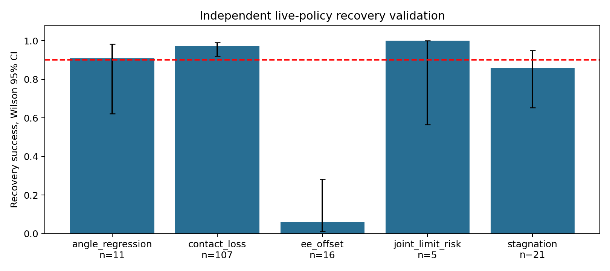

# Phase 14：失败状态恢复专家与 BC 增强

更新时间：2026-10-01T23:46:10.118048+00:00。服务器 b300-2，项目 `/home/xiaolong/privileged_rl_validation`。

## 当前阶段判断

恢复专家门槛尚未通过；BC、Anchor 选择和 RL 均未执行。不能把未执行实验写成零成功率，也不能声称恢复数据已改善 BC。

用户要求专家恢复成功率 >90% 后才进入 BC。正式验证要求至少 128 次触发接管，分母包括所有恢复失败，未触发且成功的策略 episode 不计入分母。

## 原有证据与本阶段假设

Phase 13 的随机初态专家成功率为 247/256（96.48%），Robot-only BC 五 seed 均值为 9.06%，BC+GT 为 47.34%。这些是历史结果，尚未在本阶段新测试种子上配对复测。

“从初始工位成功”不能推出“从策略访问到的任何偏离状态都能恢复”。恢复数据是否解决 BC 分布偏移是待验证假设，不是已证实原因。

## 环境与接管约束

- 原 Panda Door、Isaac Lab、Progress Reward、机器人、原 Cartesian/DLS 动作接口和 10 秒 episode 保持不变。
- 每进程 32 个并行环境；初始门角 0–5°，工位刚体 XYZ 各 ±1cm；摩擦保持原设定。
- 从当前物理状态接管，不重置 episode 时钟，不强制写入机器人/门关节状态，不附加抓取约束。
- 保存实际执行的 7 维动作，26 维机器人状态、13 维环境状态、11 维原 GT、reward、next_state、done、episode_tick；策略前缀单独保存，不当成专家标签。
- 成功与失败恢复均留存。BC 若通过门槛，仅用成功专家纠正标签，门槛分母仍包括失败。
- 继承的门关节驱动会使初始 0–5° 角度快速回到接近关闭；门角分桶描述重置参数，不能据此宣称持续门角泛化。

## 开发预检

| 版本 | 触发接管 | 成功恢复 | 成功率 | Wilson 95% CI |
|---|---:|---:|---:|---|
| recovery_pilot_v1 | 32 | 29 | 90.62% | 75.78%–96.76% |
| recovery_pilot_v2 | 64 | 51 | 79.69% | 68.29%–87.73% |
| recovery_pilot_v4 | 64 | 51 | 79.69% | 68.29%–87.73% |
| recovery_pilot_v5 | 64 | 51 | 79.69% | 68.29%–87.73% |
| recovery_pilot_v6 | 64 | 47 | 73.44% | 61.52%–82.70% |
| recovery_pilot_v7 | 64 | 48 | 75.00% | 63.18%–83.99% |
| recovery_pilot_v8 | 64 | 52 | 81.25% | 70.03%–88.94% |
| recovery_pilot_v9 | 64 | 49 | 76.56% | 64.87%–85.25% |
| recovery_pilot_v10 | 64 | 48 | 75.00% | 63.18%–83.99% |
| recovery_pilot_v11 | 64 | 49 | 76.56% | 64.87%–85.25% |
| recovery_pilot_v12 | 64 | 49 | 76.56% | 64.87%–85.25% |
| recovery_pilot_v13 | 64 | 51 | 79.69% | 68.29%–87.73% |
| recovery_pilot_v14 | 64 | 51 | 79.69% | 68.29%–87.73% |
| recovery_pilot_v17 | 64 | 50 | 78.12% | 66.57%–86.50% |
| recovery_pilot_v20 | 64 | 49 | 76.56% | 64.87%–85.25% |
| recovery_pilot_v21 | 64 | 47 | 73.44% | 61.52%–82.70% |

这些版本复用调试种子，且部分版本更改触发条件，不能合并为独立样本，不能做版本之间的配对因果检验。v1 的 29/32（90.63%）是早期小样本和不同触发规则，不构成正式通过门槛。未完成或几何校验失败的版本不列为完成实验。源代码 tar、原日志与负例保留。

## 独立正式恢复验证

种子 14101：138/160 = 86.25%，95% CI 80.06%–90.74%。环境交互 203296，不把 reset 后新 episode 冒充同一次恢复。

点估计未达到用户指定 >90% 门槛；该区间包含 90%，不能据此声称总体恢复率在统计意义上已显著低于 90%。按失败类型分解才揭示关键困难。

| 接管类型 | 尝试 | 成功 | 成功率 |
|---|---:|---:|---:|
| angle_regression | 11 | 10 | 90.91% |
| contact_loss | 107 | 104 | 97.20% |
| ee_offset | 16 | 1 | 6.25% |
| joint_limit_risk | 5 | 5 | 100.00% |
| stagnation | 21 | 18 | 85.71% |

| 重置参数分桶 | 条件恢复尝试 | 成功 | 成功率 | Wilson 95% CI |
|---|---:|---:|---:|---|
| initial_angle_deg 0–1 | 31 | 30 | 96.77% | 83.81%–99.43% |
| initial_angle_deg 1–2 | 23 | 20 | 86.96% | 67.87%–95.46% |
| initial_angle_deg 2–3 | 17 | 15 | 88.24% | 65.66%–96.71% |
| initial_angle_deg 3–4 | 26 | 25 | 96.15% | 81.11%–99.32% |
| initial_angle_deg 4–5.001 | 63 | 48 | 76.19% | 64.36%–85.01% |
| handle_linf_mm 0–5 | 26 | 25 | 96.15% | 81.11%–99.32% |
| handle_linf_mm 5–7.5 | 43 | 35 | 81.40% | 67.38%–90.26% |
| handle_linf_mm 7.5–10.001 | 91 | 78 | 85.71% | 77.08%–91.46% |

## 人为失败的物理测试

先用原初态专家执行，再通过原动作接口打开夹爪、移动末端或令门角回落；不直接修改状态。只有实测扰动达到条件才计入恢复测试，无效扰动尝试单独报告。

| 测试版本与类型 | 有效/总尝试 | 专家恢复成功率 | Wilson 95% CI |
|---|---:|---:|---|
| recovery_controlled_pilot_v4 (contact_loss) | 32/33 | 93.75% | 79.85%–98.27% |
| controlled_v13_door_regression (door_regression) | 64/68 | 0.00% | 0.00%–5.66% |
| controlled_v16_door_regression (door_regression) | 64/69 | 0.00% | 0.00%–5.66% |
| controlled_v17_ee_offset (ee_offset) | 64/72 | 95.31% | 87.10%–98.39% |
| controlled_v18_door_regression (door_regression) | 64/69 | 0.00% | 0.00%–5.66% |

既有 Phase13 BC+GT 候选（保持权重不变）的恢复复测：

| 类型 | 有效/总尝试 | 成功率 | Wilson 95% CI |
|---|---:|---:|---|
| contact_loss | 64/68 | 98.44% | 91.67%–99.72% |
| door_regression | 64/69 | 98.44% | 91.67%–99.72% |
| ee_offset | 64/82 | 0.00% | 0.00%–5.66% |

该复测说明已有策略的纠错能力因失败类型而异：简单接触丢失、门角回退已可恢复；5cm 向上末端扰动明显超出其当前能力。人工扰动与自然策略偏离的状态分布不同，不能把人工偏移专家的 95.31% 当成所有自然偏离都可恢复。开发专家与冻结策略不是五 seed 配对训练的 BC 比较。

原沿门法向的小幅扰动可能被门本身回落抵消，未实际造成 >2cm 末端偏移；这些预检被中止并保留记录。修正版先释放，再追踪向上 5cm 的目标，并验证实测距离变化。

## 规划器修复与诊断

1. 接触力不能独立证明有效抓取。继续开门要求双指接触、靠近把手，以及前一动作指令要求夹爪闭合；成功专家夹爪间距实测约 6.1–7.4cm，不误用 <4.5cm 的空夹阈值。
2. 非标称姿态下的末端 Jacobian 有明显偏移误差。URDF FK 与仿真位姿差约 1.4µm / 2µrad；计入 PhysX 质心到工具点的偏移后，Jacobian 与独立 URDF 导数最大差约 1.1×10⁻⁶，原映射的最大差约 0.153。这是几何校验证据，不能单独证明它造成 BC 泛化失败。
3. 开发版本 v20 测试兼容原动作接口的输入补偿，v21 测试释放旋转约束的位置 IK 与姿态先验 QP；成功率分别为 76.56% 和 73.44%，没有达到门槛。几何映射修正并不是解决恢复的充分条件。正式候选采用可复现的 v13 方案加抓取检查修复，源码独立冻结，未改历史策略的运行环境。
4. 关节限位、碰撞、抓取重建以及剩余 episode 时长均可能影响恢复。部分末端偏离负例在 CLEAR 或 OPEN 阶段停止推进。当前局部专家和关节路径不提供全局无碰撞保证。
5. 修改触发时机只改变接管分布，不能当成同一失败状态的控制器提升；无专家接管对照和独立正式验证用于检查过早触发偏差。
6. 另测试“GT 规划恢复抓取 + 冻结 BC+GT 控制头”的混合专家，并用训练集进度对齐其输入时钟。该预检实际完成 50 次接管，仅成功 5 次；即使剩余 14 次全部成功，也无法在预定 64 次中达到 >90%，因此提前中止，完整负例留存。它不是纯规划器实验，且没有重置物理 episode 时钟。这说明名义成功控制头未必能接手恢复后不同关节姿态；未证明输入时钟对齐有效。

## BC 比较协议（门槛通过后执行）

| 组别 | 数据 | 输入 | 当前结果 |
|---|---|---|---|
| A | 原随机成功专家 | Robot | 待门槛通过后的五 seed 实测 |
| B | 原随机成功专家 | Robot+GT | 同上 |
| C | 原数据+恢复专家 | Robot | 同上 |
| D | 原数据+恢复专家 | Robot+GT | 同上 |
| E | 原数据+等量新增普通成功专家 | Robot | 同上 |
| F | 原数据+等量新增普通成功专家 | Robot+GT | 同上 |

E/F 用于回答“恢复数据是否比普通成功数据更有效”，新增专家控制流程须与恢复专家一致，避免规划器差异成为混杂因素。五个配对训练 seed，初始权重、优化器、512 batch、20k 更新、网络容量、归一化、共同验证规则一致；GT 唯一差异通过输入掩码实现。新增数据按整轨迹分 140/30/30，并匹配实际新增训练标签数量，避免标签预算差异。

评估要求同种子同 32 环境：随机 128、固定 64、接触丢失/末端偏移/门角回退各 64 episodes。报告 action MSE、最大/最终门角、接触率、初态分桶、五 seed CI 和配对检验。五 seed 的双侧精确符号翻转检验最小 p=0.0625，不能仅凭 p<0.05 的参数检验声称稳健显著。

## 必须回答的问题

| 问题 | 当前可以支持的答案 |
|---|---|
| 失败状态覆盖是否解决泛化？ | 尚未验证。恢复专家门槛和 C/D 的配对闭环成功率是前置证据。 |
| 恢复数据是否提升 BC？是否优于更多成功数据？ | 尚未验证；需要 D−B、C−A，以及 D−F、C−E。 |
| GT 在恢复学习中是否价值更大？ | 尚未验证；需要 (D−C)−(B−A) 以及人为恢复测试。 |
| 是否得到随机环境稳定 Anchor？ | 尚未获得。不能把历史最佳单 seed 当成新的稳定 Anchor。 |
| 是否可进入 LWD/DIVL？ | 目前不能；随机 Anchor、恢复能力和稳定小规模更新尚未同时建立。 |

## 后续执行门槛

先将恢复专家在独立真实接管状态上的成功率提高到 >90%，再采集 200 成功恢复与 200 等预算普通成功轨迹，执行 A–F。若 D 的配对随机收益可信且独立 Anchor 随机与恢复表现达到 80% 以上，再执行 3 seed、50k–100k 的 Frozen / KL / Residual RL。

若专家继续失败，应优先做失败姿态的可恢复路径与接触控制验证，不能用筛掉困难状态、延长原 episode 或重置接管来宣称通过。本阶段不以扩大 RL 代替专家验证。

本轮已经完成独立失败接管验证、138 条成功恢复及 22 条失败恢复的存储和恢复对照，后续 BC/RL 因用户门槛未通过而暂停。Phase14 整体目标尚未实现。下一项应集中在正式负例中的末端偏离：检查真实关节限位/接触阻塞，规划可执行的全局退让路径，并验证它能在原 10 秒 episode 剩余时长内恢复。此前“当前瓶颈完全不是控制能力”的判断需缩小为初始工位专家能力，不能推广到失败状态。

## 保存与审计

恢复 HDF 审计：成功 138，失败 22；成功纠正标签 50080，失败标签 8720，连续性问题 0。这些是当前验证/预检证据，不冒充已完成的训练集。

历史审计：480 个源文件 hash、69152 个原结果文件和 530 个 Phase13 文件元数据检查；变更 0。

原始证据：`results/phase14_recovery_bc/expert_summary.json`、`expert_pilots.csv`、`expert_buckets.json`、`recovery_data_audit.json`、`preservation_audit.json` 和 `logs/phase14_recovery_bc/`。
