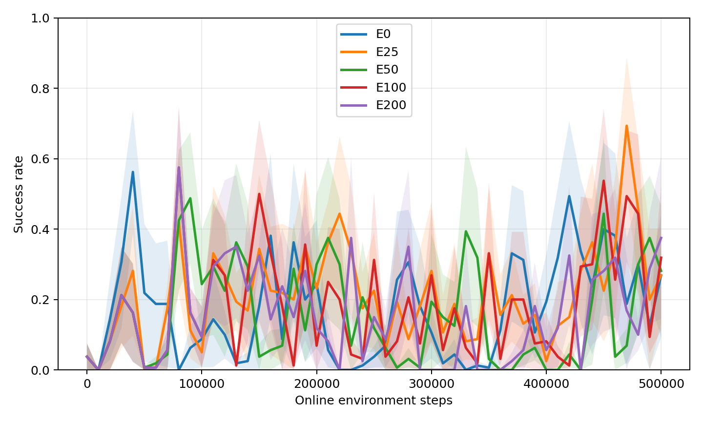
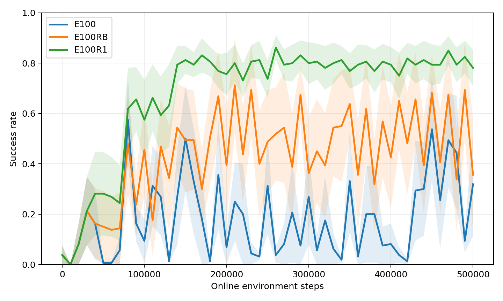
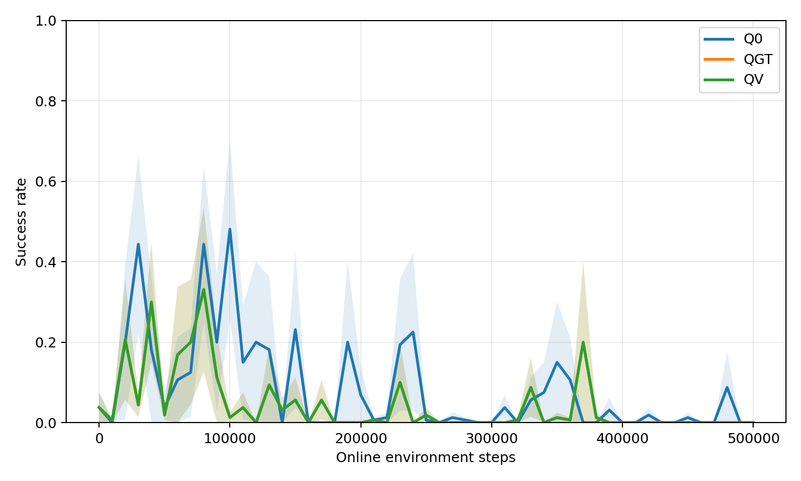

# Panda Door 第四阶段最终报告：GT 辅助、回退与价值排序

## 实验与审计

沿用既有 Isaac Lab Panda Door 环境、Panda 机器人、奖励、reset 和 1,000 条专家轨迹。第四阶段使用 32 个并行训练环境；每变体 seed 0–4，各运行 500,000 次在线训练交互，共 55 个运行、2,750 万次训练交互。每约 10k 步以**独立 Isaac Lab 进程**固定评估 32 回合；从训练验证曲线选择最佳 checkpoint，再以另一组 reset 各复测最佳和最终 checkpoint 64 回合。评估交互另计，不混入 500k 训练预算。先前同进程评估打断训练回合的无效批次保存在 `results/stable_privileged_rl_invalid_eval_reset_v1`，未纳入任何统计。

`results/stable_privileged_rl/verification.json` 确认 55 个完整训练运行、110 次独立 heldout、15 个完整轨迹 HDF5、55 项配对初始化检查，并核验 17 个既有输入与 baseline 哈希。每运行有 51 个验证点及 15,625 个向量步诊断记录。曲线 AUC 为 0–500k **训练**交互上成功率的梯形积分均值。括号是 seed 层级 20,000 次 bootstrap 95% 区间；配对差另用五 seed 精确双侧符号翻转检验。五 seed 时最小双侧 p 值为 0.0625，以下均为探索性证据。

## 1. GT 辅助持续时间

E0 与 E25/E50/E100/E200 使用同一 robot-only Actor/Critic 架构与配对初始化，GT 只监督门角度及双指接触预测头，分别在前 0/25k/50k/100k/200k 步启用。所有部署 Actor 只读 26 维 robot observation。

| 变体 | 训练成功率 AUC [95% CI] | 最佳 heldout 成功率 [95% CI] | 500k heldout 成功率 [95% CI] | 验证最佳−最终 | 达到/保持 80% 的 seed |
|---|---:|---:|---:|---:|---:|
| E0 | 0.172 [0.151, 0.199] | 0.994 [0.981, 1.000] | 0.328 [0.000, 0.709] | 0.731 | 5/1 |
| E25 | 0.213 [0.132, 0.309] | 0.975 [0.969, 0.981] | 0.250 [0.019, 0.600] | 0.681 | 5/0 |
| E50 | 0.157 [0.085, 0.241] | 0.938 [0.856, 1.000] | 0.231 [0.000, 0.556] | 0.688 | 5/1 |
| E100 | 0.181 [0.101, 0.268] | 0.903 [0.841, 0.966] | 0.266 [0.009, 0.638] | 0.644 | 5/1 |
| E200 | 0.153 [0.118, 0.188] | 0.919 [0.816, 0.981] | 0.400 [0.000, 0.800] | 0.575 | 4/2 |

E25 的 AUC 数值最高，但相对 E0 的五 seed 配对差仅 **+0.041**，95% CI [−0.041, +0.143]、精确 p=0.6875；E100 差 +0.009，p=0.875。没有证据确定一个能稳定提高在线样本效率的 GT 辅助窗口。五组最佳 checkpoint 都能达到很高的独立成功率，500k 终点却普遍退化。E100 的最佳 heldout 比 E0 低 0.091（配对 p=0.125）。因此第三阶段 E2 在旧评估协议下的 +0.108 AUC 不能直接延用为第四阶段的结论。

在与第三阶段相同的独立环境实例状态上，500k frozen encoder 的门角度线性探针 MAE：E0 为 0.0183 rad，E25/E50/E100 分别为 0.0169/0.0164/0.0165 rad。GT 标签提高了部分状态可解码性，但未转化为可靠的控制收益。将门角度与接触分成独立 head 的 E100M，AUC 为 0.135 [0.074, 0.195]，最终 heldout 为 0.088 [0, 0.225]；相对 E100 的 AUC 配对差 −0.046，p=0.3125。

## 2. Checkpoint 选择与在线回退

E100RB：历史验证最佳≥0.5 且连续两次低于最佳超过 0.25 时恢复完整 SAC 参数与优化器，保留 replay。E100R1 是看到原规则初步表现后追加的**事后探索**：单次下降超过 0.125 即回退。回退后的策略重新评估；CSV 同时保留触发前原始成功率。下表的训练 AUC 是回退后可部署策略曲线；“原始 AUC”是回退前模型的曲线，衡量在线更新本身。

| 变体 | 回退后 AUC [95% CI] | 回退前原始 AUC | 500k heldout [95% CI] | 平均回退次数 | 平均固定验证交互 |
|---|---:|---:|---:|---:|---:|
| E100，无回退 | 0.181 [0.101, 0.268] | 0.181 | 0.266 [0.009, 0.638] | 0 | 0.959M |
| E100RB | 0.434 [0.402, 0.467] | 0.161 | 0.363 [0.016, 0.722] | 18.0 | 1.292M |
| E100R1，事后追加 | 0.684 [0.621, 0.741] | 0.140 | 0.816 [0.747, 0.866] | 40.4 | 1.715M |

E100R1 − E100 的回退后 AUC 配对差 +0.503 [0.376, 0.610]，精确 p=0.0625；最终 heldout 差 +0.550 [0.209, 0.822]，p=0.125。E100RB 的 AUC 差 +0.253 [0.165, 0.328]，p=0.0625，但最终 heldout 差 +0.097，p=0.75。E100R1 在 5 seed 中有 3 个把 ≥80% 验证成功率保持到终点；E100 为 1 个。

**回退保护交付策略，却没有改善当前在线更新方向。** E100R1 回退前 AUC 0.140，低于 E100 的 0.181；其最佳 heldout 0.806，也低于 E100 的 0.903 和 E0 的 0.994。R1 平均每 seed 比无回退多约 **0.756M** 次固定验证交互；总训练加固定验证约 2.215M 次/seed。以总交互横轴计算的曲线及达标步数见 `thresholds.csv`，不能把只按训练步计算的 AUC 当作真实工装总交互成本。当前总交互 AUC 会受到大量成功的回退后评估回合影响，不能单独作为“更省样本”的证据。反复使用同一固定验证 reset 还可能过拟合验证序列；独立 heldout 降低了这一风险，但没有消除事后选择偏差。

## 3. 共享编码器价值模型与价值回放

Q0、QGT、QV 使用 robot observation→共享 encoder→Actor 与 robot-only Twin Q；QGT 在前 100k 加 GT 辅助，QV 再加经轨迹回报排序门控的有界价值加权采样。Critic 均不直接读取 GT。QV 只有近期至少 64 个完整回合且 Q 与真实折扣回报的 Spearman≥0.2 时启用权重；否则均匀采样。

| 变体 | 训练 AUC [95% CI] | 最佳 heldout [95% CI] | 最终 heldout | 完整回合/seed | 全程 Q–回报 Spearman 范围 |
|---|---:|---:|---:|---:|---:|
| Q0 | 0.086 [0.035, 0.131] | 0.775 [0.403, 0.988] | 0 | 832 | −0.330 至 −0.096 |
| QGT | 0.043 [0.014, 0.073] | 0.731 [0.362, 0.938] | 0 | 832 | −0.267 至 −0.133 |
| QV | 0.043 [0.014, 0.073] | 0.731 [0.362, 0.938] | 0 | 832 | −0.267 至 −0.148 |

QGT − Q0 的 AUC 配对差 −0.043 [−0.089, −0.004]、p=0.125，不能称统计显著改善。QV 与 QGT 的 AUC 和 heldout 几乎完全相同：QV 的固定评估点中平均只有 0.8% 显示加权启用，最终权重全部退回 1、有效样本比例为 1。**该实验验证了拒绝未校准 Q 加权的保护机制，未验证加权回放能提高策略。**

固定的 256 个专家 transition 上，Q0/QGT 最终 Q 均值大约 0.5–2.0，方差小；但其真实在线轨迹排序相关性仍为负。数值不爆炸并不等于价值排序可靠。共享 encoder 架构的 500k 角度线性探针 MAE，Q0 为 0.1265 rad，QGT 为 0.1401 rad；这条架构下 GT 辅助也没有改善表示。`trajectory_value_calibration.csv`、`fixed_q_probe.csv`、`representation_probe.csv` 保存逐 seed 诊断。

## 4. 结论与下一步

本协议下，没有找到一个仅靠调整 GT 辅助时长就能稳定提升在线样本效率的窗口。工装 GT 作为预测标签可略改善部分 encoder 对门角度的可解码性；它作为独立验证的成功标签，可帮助选择高成功率 checkpoint 和触发回退。快速回退显著提高终点部署成功率的数值，但不改善回退前在线学习，且评估成本高、属于事后探索。共享 robot-only Critic 的 Q 数值看似稳定，却不能正确排序真实回报；现在不应依据 Q 选择经验或声称 QV 有策略增益。

第五阶段应利用现有完整轨迹建立按 episode 划分的训练/验证/测试集，分别检验 SAC Q、Monte Carlo 价值预测和整轨迹质量模型的 Pearson/Spearman、排序准确率与 Top-k 成功富集。独立质量分数必须在未见过的 trajectory 上验证，并保留工装 GT 的真实成功/回报作为审计标准。只有质量排序通过，再讨论有限的 quality-weighted replay 在线对照；目前不接入完整 LWD/DIVL/QAM。真实工装还需缩减固定评估交互、处理测量噪声和 reset/安全约束。

可复算文件：`results/stable_privileged_rl/seed_metrics.csv`、`aggregate_metrics.csv`、`paired_effects.csv`、`heldout_aggregate.csv`、`heldout_paired_effects.csv`、`thresholds.csv`、`summary.json`、`verification.json`。所有源代码和结果均在本项目第四阶段专用目录，既有 Drawer/Door baseline 保留。
