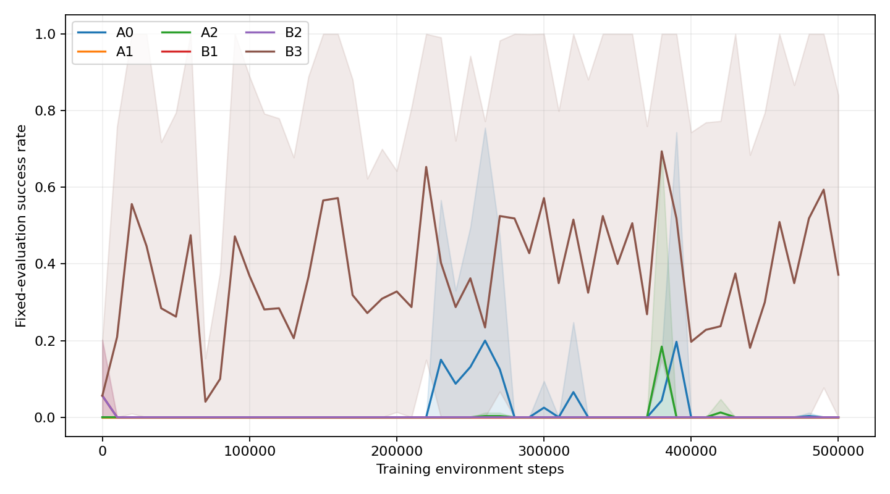
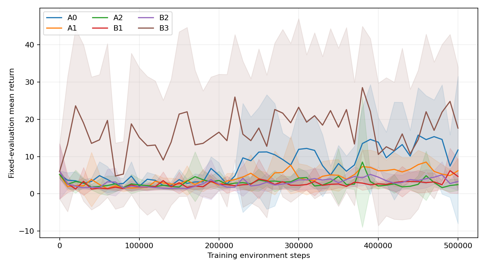

# Phase 6：专家经验能否稳定转化为 Door 在线策略提升

> 已完成 30 个 500k 训练运行、75 次 checkpoint 独立进程复测，以及 15 次不更新策略的动作噪声敏感性复测。所有结论限于不变的 Door 固定初态。

## 1. 固定环境与对照设计

任务保持 Panda Door Opening 的 Isaac Lab 环境、奖励、reset、机器人配置及原有 1,000 条成功专家轨迹。Phase 1–5 的模型、结果及 baseline 不修改。Phase 6 的 Actor 和 Critic 都只读 26 维 robot observation；11 维工装状态仅随 transition 保存用于审计，不作为策略或 Q 的输入。

服务器运行环境为 Isaac Sim 5.1、`isaaclab` 0.47.2、8 × NVIDIA B300。固定输入的 SHA-256：专家 HDF5 `a17c857eb760517bd0d59e266c4f008c5fcf980faf8b8052d4343b57c7b069a8`，Door 任务 `b9e710e6195d5cfba46fffc23afd8896871e2b70a6c1ae6d8185625dbe68fb69`，环境适配 `d5efaf1041361547bc6e865ffebca801556eebfcf4306b1bcb3001aad3b80fa6`。

每个独立实验臂使用种子 0–4、32 个并行环境、500k 训练交互、每 10k 训练步由独立仿真进程在固定 reset 上测 64 回合并保存 checkpoint。训练交互与评估交互分开计数。

只读 reset 审计发现：32 个并行环境的初始 robot/tool state 在 1e-5 精度下各只有 **1 种**，训练曲线选择种子 50000 与复测种子 90000 的初态也相同。门角均为 0。任务 reset 按要求未修改。因此 64 回合评估是**同一标称工位状态的重复执行**，不能视为 64 个独立任务配置；复测采用独立进程和另一随机种子，但不是对新初始位姿的泛化检验。这一限制会放大近阈值策略的成功率跳变。

| 实验臂 | 专家 transition 占 SAC minibatch | BC 初始化 | 在线学习率 | 在线 BC loss 权重 |
|---|---:|---|---:|---:|
| A0 | 0% | 无 | 3e-4 | 0 |
| A1 | 70% | 无 | 3e-4 | 0 |
| A2 = B0 | 50% | 无 | 3e-4 | 0 |
| B1 | 50% | 3,000 次 BC 更新 | 3e-4 | 0 |
| B2 | 50% | 同 B1 | 1e-4 | 0 |
| B3 | 50% | 同 B1 | 3e-4 | 10 |

A0–A2 只改变回放比例，隔离“专家经验是否被 SAC 有效利用”。A2/B0–B3 再隔离 BC 初始化和在线更新约束。B0 与 A2 完全相同，复用同一组运行，不重复消耗 2.5M 环境交互。所有组的 Critic 都随机初始化，离线 Critic 预热为 0；所以 A0 为真正的纯在线 SAC。其余配置相同：每个 32 环境向量步进行 4 次 SAC 更新，batch 256，统一数据与评估种子。

B1/B2/B3 的 BC 训练结束后重建 Actor Adam 优化器，清除 BC 动量，再开始在线更新；这样与随机初始化组相比，差别集中于 Actor 参数，而非遗留优化器状态。

主要终点为固定评估成功率曲线 AUC（0–500k，按训练交互数归一化），次要终点为最终成功率、最佳 checkpoint 独立进程复测成功率和最佳至最终的退化。比较采用按相同种子配对差值、跨 5 种子的双侧 t 95% CI 与 32 种符号翻转精确双侧检验；统计独立单元是**训练种子**，不是 64 个相同初态的评估 episode。5 种子时该检验最小双侧 p 为 0.0625，因此不能仅凭同向五个种子声称 p<0.05 显著性。

## 2. 专家数据的离线能力

原始 HDF5 经只读审计：**1,000/1,000 条成功专家轨迹，271,562 个 transition**；每个 transition 有 observation(26)、state(11)、action(7)、reward、next observation/state 与 done。按轨迹随机固定分割 800 条训练、200 条留出；5 个 BC 随机种子各训练 3,000 次，完全不进行在线交互。

| 种子 | 随机 Actor 留出动作 MSE | BC 训练动作 MSE | BC 留出动作 MSE |
|---:|---:|---:|---:|
| 0 | 0.28107 | 0.00315 | 0.00309 |
| 1 | 0.26791 | 0.00324 | 0.00320 |
| 2 | 0.26974 | 0.00303 | 0.00299 |
| 3 | 0.22618 | 0.00314 | 0.00308 |
| 4 | 0.22900 | 0.00307 | 0.00304 |

这说明机器人观测能拟合未见专家轨迹的动作，**并不能单独证明闭环开门成功**。B1 在线更新前的 step-0 BC Actor 另用独立仿真 reset 测试 64 回合，以验证实际控制能力。IQL/CQL 为可选项，本阶段把资源优先用于 BC、随机初始化和回放比例的直接机制对照。

## 3. 在线对照与退化诊断

30 个独立运行均完成 500k 训练交互，且没有训练进程报错。固定评估为每点 64 回合；以下为五训练种子均值及跨种子 95% t 区间（比例端点裁剪到 [0,1]）。

| 组 | 0–500k 成功率 AUC [95% CI] | 最佳固定评估成功率 | 500k 固定评估成功率 |
|---|---:|---:|---:|
| A0 纯在线 SAC | 0.0206 [0, 0.0774] | 0.203 | 0 |
| A1 70% 专家回放 | 0 [0, 0] | 0 | 0 |
| A2 = B0，50% 专家回放 | 0.0041 [0, 0.0141] | 0.200 | 0 |
| B1 BC 初始化 + 普通 SAC | 0.0006 [0, 0.0020] | 0.056 | 0 |
| B2 BC 初始化 + 低学习率 | 0.0006 [0, 0.0020] | 0.056 | 0 |
| **B3 BC 初始化 + 在线 BC 约束** | **0.3760 [0.1398, 0.6121]** | **1.000** | **0.372** |

A1 − A0 配对 AUC 差为 −0.0206 [−0.0774, +0.0363]，精确双侧 p=0.5；A2 − A0 为 −0.0165 [−0.0761, +0.0431]，p=0.875。**专家 transition 仅进入 SAC replay，没有提升此配方的在线学习效率**。A0 的一个种子短暂成功，A2 的一个种子出现成功峰值，但三组五种子最终成功率均为 0。

B1 的 step-0 BC 平均成功率为 0.056，平均接触率为 0.297；首次约 10k 步评估，两者均降到 0。B2 降低 Actor/Critic/温度在线学习率后，AUC 与 B1 完全相同，未防止早期能力丢失。结合离线 BC 小动作误差，这说明**动作拟合良好、上线后的无约束 SAC 更新、以及稳定闭环开门是三件不同的事**。

B3 相对 B1 的配对 AUC 差为 **+0.3754 [0.1400, 0.6108]**，五个种子均为正；32 种符号翻转精确双侧 p=0.0625（五种子该检验可能达到的最小 p）。相对纯在线 A0 的配对 AUC 差为 +0.3554 [0.081, 0.630]，p=0.0625。B3 五种子的曲线最佳点均达到 1.0，但最终平均仅 0.372，最佳到最终平均回落 0.628。五种子中四个在最后 checkpoint 较各自最佳点明显下降，**B3 带来了可重复的阶段性进步，尚未解决长期遗忘**。

每 10k 步保存固定专家 batch 上的 Q 均值、方差、双 Q 分歧、Critic/Actor loss、policy entropy、相对初始策略的动作 MSE、相对专家动作的 MSE，以及随机在线轨迹成功率。以 seed 0 的 70k 为例，B1/B3 固定专家 batch Q 均值分别约 5.16/5.00、Critic loss 约 0.035/0.031，但策略动作漂移 MSE 为 **0.131/0.0011**。这支持“在线 BC 约束主要通过限制 Actor 漂移改变早期表现”，不能仅凭此例证明 Q 稳定性不重要。B3 在很小的专家状态动作漂移下，固定评估仍频繁在接近 0 与接近 1 间跳变，说明闭环对小动作差异、接触过程或未观测动态敏感；现有实验无法分离各项因果贡献。

随机在线训练轨迹累计成功数：A0 81、A1 0、A2 47、B1 0、B2 2、**B3 13**。B3 约 4,163 条已完成随机在线 episode 中仅约 0.31% 成功，尽管确定性固定评估 AUC 为 0.376。这是 Phase 5 高质量轨迹排序无法自然转为在线策略提升的关键分布差距：排序器或 SAC 只能从实际采到的轨迹学习，训练时探索行为几乎没有产生成功经验。下文对相同最佳 checkpoint 的确定性/随机动作复测进一步检验了这一解释。

持续退化的审计定义为：选出的曲线最佳点之后，连续两个评估点比最佳成功率低至少 0.25。`degradation_diagnostics.csv` 列出该区间前后的 Q 均值、方差和策略漂移。B3 五种子均经历此类中途跌落；其中一个到最终恢复至 1.0。跌落时 Q 均值和动作漂移并非一致方向变化：例如 seed 1 的 Q 均值 7.486→7.446、动作漂移 MSE 0.00131→0.00122，而成功率仍从峰值跌落。因此现有证据不支持“Q 数值爆炸”作为所有退化的单一原因。该诊断描述时间关联，不单凭 Q/策略漂移相关性推断因果。

## 4. 最佳/最终 checkpoint 与探索噪声的独立复测

每个运行从 64 回合固定评估曲线选择“最佳”，并与 500k 最终 Actor 在独立 Isaac 进程、另一个 RNG 种子、**同一标称初态**各复测 64 回合。结果不能外推到不同门/机器人初始位姿。

| 组 | 最佳复测成功率 [95% CI] | 最终复测成功率 [95% CI] | 最佳−最终 [95% CI] |
|---|---:|---:|---:|
| A0 | 0.203 [0, 0.756] | 0 | 0.203 [−0.350, 0.756] |
| A1 | 0 | 0 | 0 |
| A2 = B0 | 0.203 [0, 0.662] | 0 | 0.203 [−0.256, 0.662] |
| B1 | 0.059 [0, 0.185] | 0 | 0.059 [−0.067, 0.185] |
| B2 | 0.059 [0, 0.185] | 0 | 0.059 [−0.067, 0.185] |
| **B3** | **0.959 [0.847, 1.000]** | **0.319 [0, 0.807]** | **0.641 [0.148, 1.000]** |

B3 对 B1 的最佳复测配对差 +0.900 [0.761, 1.000]、精确 p=0.0625；最终复测差 +0.319 [−0.169, 0.807]、p=0.0625。选择最佳 checkpoint 在固定工位上保住了阶段性能力，**继续训练到最终仍明显退化**。最佳点来自同一训练曲线的多次选择，复测只验证固定状态重复执行，不消除选择偏差，也不证明多初态泛化。

针对每个 B3 最佳 Actor，在同一复测协议下分别执行确定性动作和 SAC 原始随机动作：五种子的确定性平均 **0.959 [0.847,1]**，原始随机动作 **0/320 回合**。B3 最佳 Actor 在 reset 的高斯动作标准差按种子为 0.912、1.144、0.170、0.967、1.239；BC 起点为 0.135。B1 最佳（多为 BC 起点）恰好相反，随机动作平均比确定性高 0.250；其确定性均值近于 0。这说明只对动作均值施加 BC loss，不能控制 SAC 在线采样分布。

为区分高方差和接触任务对小扰动的敏感性，对**相同的五个 B3 最佳 checkpoint**只在执行时限制 pre-tanh 高斯动作标准差，不更新 Actor/Critic、回放或环境：

| 执行方式 | 64 回合 × 5 种子成功率均值 [95% CI] | 相对原随机动作的配对差 [95% CI] |
|---|---:|---:|
| 确定性 | 0.959 [0.847, 1.000] | — |
| 原随机动作 | 0 [0, 0] | — |
| 标准差上限 0.135 | 0.109 [0, 0.247] | +0.109 [−0.028, 0.247] |
| 上限 0.05 | 0.456 [0.046, 0.866] | +0.456 [0.046, 0.866] |
| 上限 0.01 | **0.963 [0.887, 1.000]** | **+0.963 [0.887, 1.000]** |

0.05/0.01 的配对精确双侧 p 都为 0.0625，0.135 为 0.125。清晰的剂量关系支持**过强探索噪声与窄接触成功区域共同造成在线经验稀缺**；这属于固定 checkpoint 的执行干预，**不是**“限噪声训练已提升在线 AUC”的证据。遵循本阶段不再扩大 RL 规模的要求，没有为该执行参数追加训练矩阵。

## 5. 五个问题的回答与下一阶段门槛

1. **Expert replay 是否提升在线 RL？** 在随机初始化 SAC 中，没有。70% 专家回放 A1 的 AUC 为 0，50% A2 为 0.004，均未超过纯在线 A0 的 0.021；所有组最终为 0。故 Phase 5 的质量排序未转化为策略收益，问题不能仅归咎于轨迹质量打分。
2. **SAC 是否破坏已有专家能力？** 是，在所测无约束配方下。BC 起点有少量开门和平均 0.297 接触率，约 10k SAC 更新后 B1/B2 接触率和成功率均为 0，500k 最终也为 0。独立的专家动作留出 MSE 约 0.003，说明损失发生在闭环部署和在线更新，不是简单的离线动作回归失败。
3. **BC 初始化是否稳定？** 单独初始化不稳定；降低 LR 也没有改善。B3 在在线 Actor loss 中持续加入专家动作约束，五种子 AUC 都改善且最佳 Actor 可在固定工位稳定开门，但最终平均仅 0.319（独立复测），存在明显回落。
4. **最佳稳定在线 RL 方案是什么？** 现有结果支持的**候选**是 B3 + 按固定评估选最佳 checkpoint，并对真实执行/未来在线采样设置保守动作噪声上限。B3 的 500k 持续训练仍不稳定，限噪声训练尚未验证，不能称为已建立可靠闭环；不应只发布最终权重。下一项最小控制实验应在同样 1,000 条专家、相同 reset/奖励/种子下，仅改变在线执行动作标准差上限，预先固定预算与门槛，检查真实在线成功轨迹数、AUC 和最终稳定性。
5. **为什么还不能进入 LWD/DIVL？** B3 最佳确定性复测平均成功率约 0.959，原随机执行为 0；最佳/最终能力差也很大。质量模型能排序旧轨迹，却无法从几乎没有成功正例、分布失配的在线 buffer 稳定改进策略。先把探索、BC 约束和 checkpoint 稳定性闭环做实，再考虑质量筛选与 LWD/DIVL；本阶段没有实现 LWD、DIVL、QAM 或 VLA。

这套 Phase 6 框架已将专家与在线回放、BC 正则、策略/Q 漂移、固定评估、复测和执行噪声干预分成可替换模块。迁移真实工装时，工装 GT 可继续标记成功与接触，并作为质量审计；Actor/本阶段 Critic 仍只用可部署的机器人观测。真实在线试验必须同时记录执行噪声、每次自动 reset、在线成功正例和评估交互开销。

下一项受控验证建议：固定 B3 的数据、网络、BC 权重、5 种子与 Door 配置，只把在线 rollout 的 pre-tanh 动作标准差限制在 0.05（并保留原随机动作作为配对对照）；先做不超过 100k 步的小预算门槛试验，统计随机在线成功数、确定性与随机复测 AUC、最佳至最终退化及全部评估交互。0.01 在执行复测中几乎等于确定性策略，可作为低探索诊断臂，但是否利于在线学习尚不清楚。只有在在线成功正例稳定出现、配对 AUC 改善且最终策略不再系统性回落时，才考虑同配方扩至原定 500k；随后再验证质量回放。此建议未在 Phase 6 追加训练，不能视为已证实方案。

成本：30 × 500k = **15.000M 训练交互**；训练中的 51 点固定评估另用 **58.081M 仿真交互**，约为训练量的 3.87 倍，尚不含 checkpoint 复测与噪声敏感性复测。把此频率直接搬到真实工装会严重低估总交互成本，应在建立稳定方案后减少评估频率或采用顺序置信门槛。

复现入口：`experiments/phase6_stable_online_rl/README.md`；统计、诊断 CSV、checkpoint、TensorBoard 分别保存在 Phase 6 专用的 `results/`、`checkpoints/`、`logs/` 子目录。
