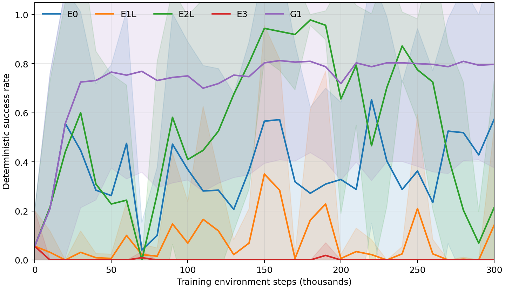
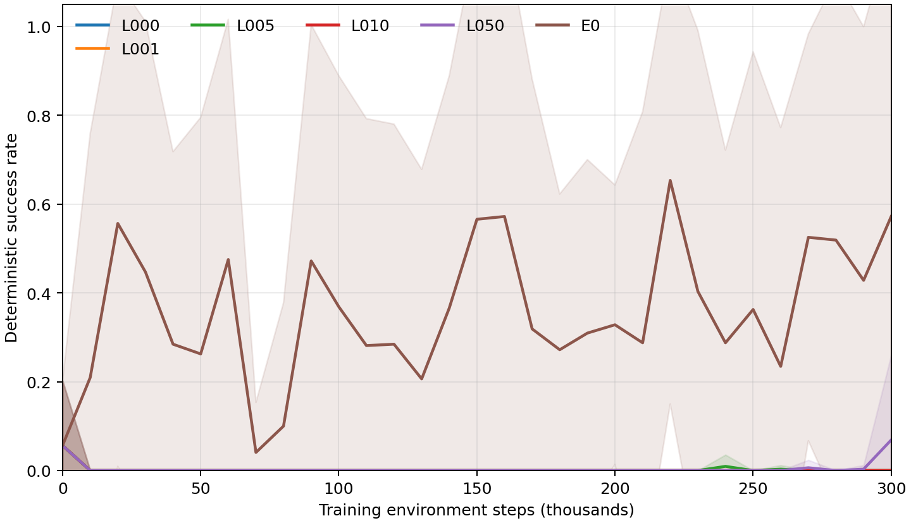
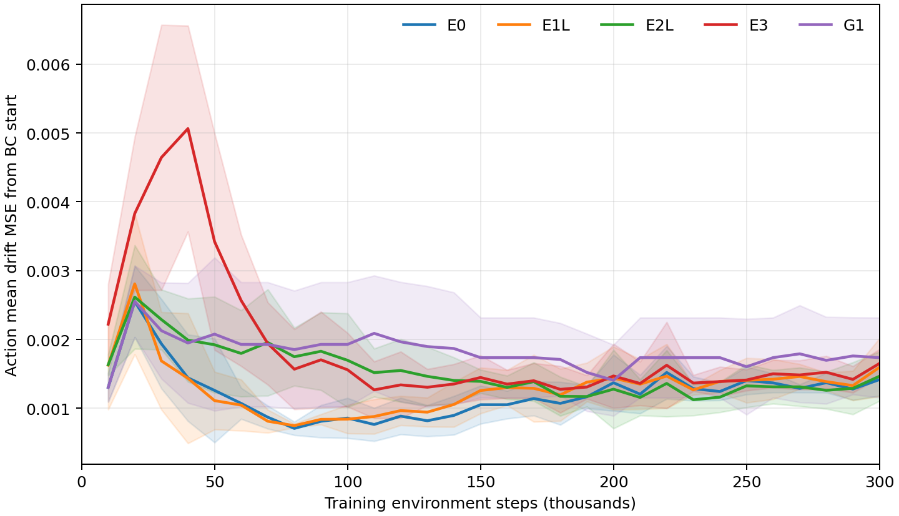
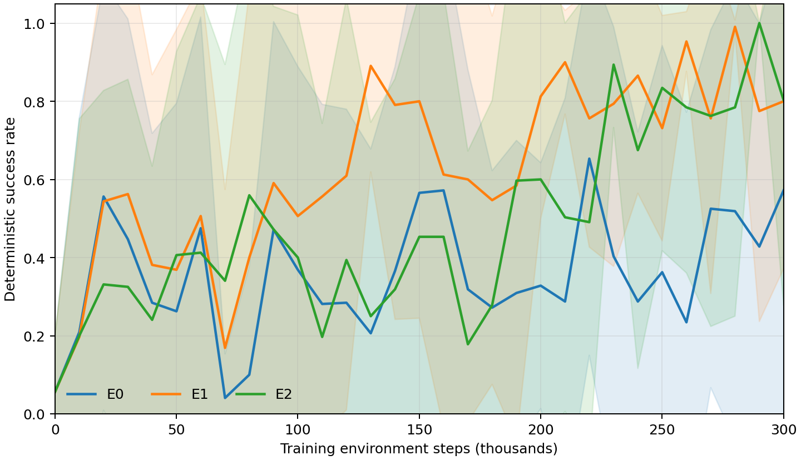
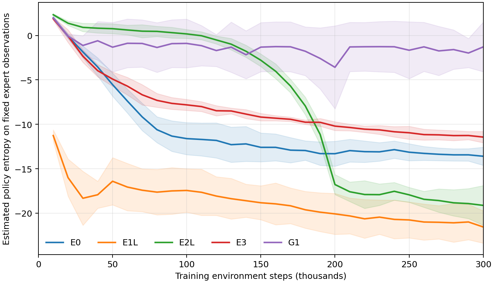
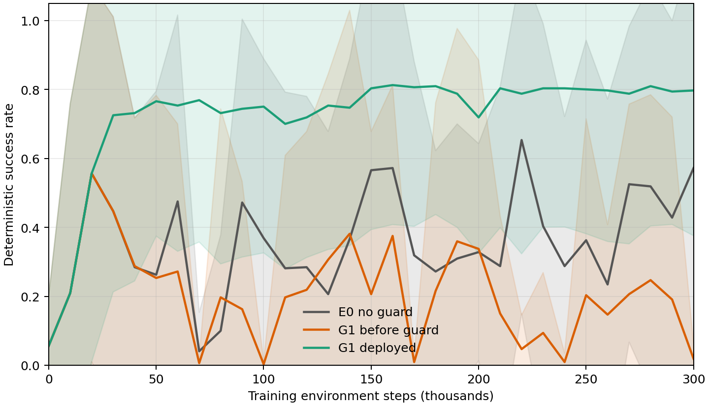
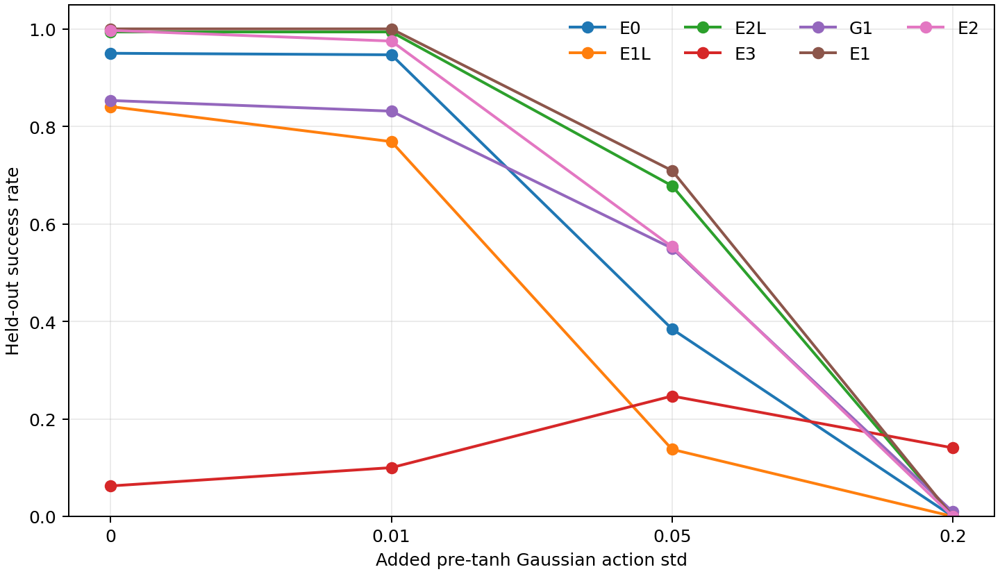
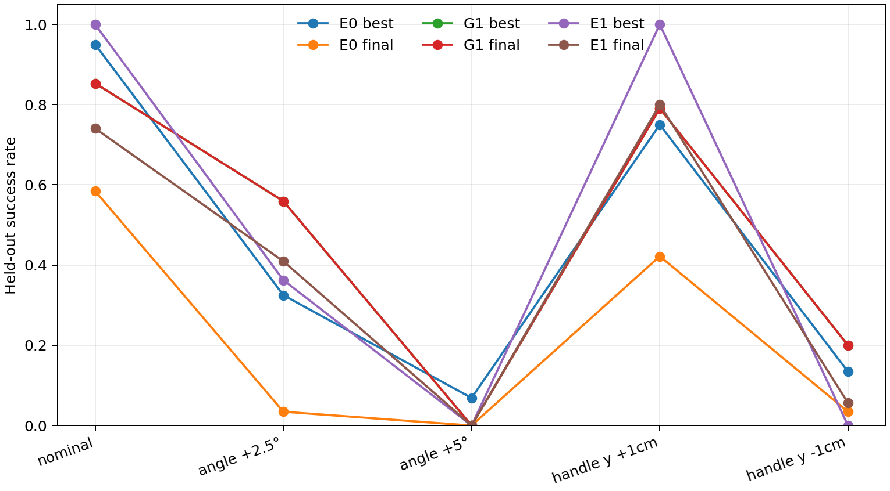

# Phase 7：Panda Door 在线策略稳定性验证

## 范围与可比性

本阶段只使用既有 Isaac Lab Panda Door Opening 环境、机器人配置、奖励、自动 reset 和 1,000 条专家轨迹。训练 Actor 和 Critic 都只使用 26 维机器人观测；工装 GT 保留为监测与成功判定，不输入部署策略。Phase 1–6 代码与 baseline 结果未覆盖。所有新训练使用 32 并行环境、相同专家 HDF5、种子 0–4、每组 300,000 次**训练环境交互**，每 10,000 次由独立 Isaac 进程在固定标称初态重复测试 64 回合。评估交互单独计数。

复用 Phase 6 B3 的 0–300k 曲线作为 E0：BC 初始化 3,000 更新、50% 专家回放、Actor loss 中持续 raw λ=10 的 BC MSE、普通自动温度 SAC。复用 Phase 6 B1 的同段曲线作为 λ=0。复用只读 checkpoint，不重新训练或改写旧结果。所有对照仍采用相同 BC 初始化、回放比例、优化频率、batch、网络、种子与评估协议。

| 组别 | 单独改变的训练因素 |
|---|---|
| E0 | Phase 6 B3 原始配方，自动温度 |
| E1L | 固定 SAC 温度 α=0.001 |
| E2L | α 从 0.05 线性降到 0.001（0–200k），其后固定 |
| E3 | 仅在线数据采集时限制 pre-tanh 动作标准差 ≤0.05 |
| L000 | Phase 6 B1，在线 BC λ=0 |
| L001/L005/L010/L050 | 在线 BC 原始损失权重 λ=0.01/0.05/0.1/0.5 |
| G1 | E0 配方，每 10k 评估；当前成功率低于历史最佳 0.25 即恢复整套模型与优化器状态 |

E1L/E2L 关闭自动温度调节，仅对温度系数做明确干预；其他 SAC 更新保持一致。最初 E1/E2 把目标熵绝对值调小，方向与“降低熵”假设相反；其结果单列为**探索性提高目标熵**对照，不冒充 E1L/E2L，也接受同样的独立噪声复测。E3 仅限制训练 rollout 动作，不改变 Actor loss 或确定性评估方式。G1 在每次回退前、回退后分别记录成功率；其回退后的曲线代表受保护的可部署 checkpoint，不能等同于未经保护的学习动态。

## 统计与独立复测

主要终点为 0–300k 固定评估成功率曲线 AUC；同时报告最佳、最终、最佳−最终 gap、训练中随机执行成功轨迹数、跨 seed 标准差与 t 分布 95% CI。所有与 E0 的比较以同号 seed 作配对差，采用 32 种符号翻转精确双侧检验。5 seed 下最小可得双侧 p=0.0625，因此不以 p<0.05 单独宣称统计显著。64 回合是固定工位重复执行，**不是 64 个独立任务配置**。

固定评估的仿真交互不计入训练 AUC 的横轴，但完整记录其累计环境步数。每 10k 测 64 回合在真实机器人上成本很高；checkpoint 保护的可迁移性必须同时审计这部分工装交互开销，不能只报告 300k 训练步。

独立复测使用另一进程和 seed：E0/E1L/E2L/E3/G1 及探索性 E1/E2 的最佳策略在标称初态分别执行确定性动作，以及 pre-tanh 高斯噪声标准差 0.01、0.05、0.2；再对 E0/G1/E1 的最佳和最终 checkpoint 分别设置门初角 +2.5°、+5°，或将整个 cabinet（含把手）沿 y 轴移动 −1 cm、+1 cm。E1 是根据训练曲线选择的探索性泛化对象，不作为预注册主结论。关节范围为 0–1.570 rad，标称关闭角在下限 0，故用户提出的 −5° 会被 Isaac 拒绝，无法作为物理合法初态。扰动只写入评估环境配置，不改变训练环境或原有 task 文件。独立评估记录实际初始化门角和把手坐标，验证干预确实生效。

Actor 的 26 维输入仅有机器人关节、末端位姿与 episode 进度；没有 RGB、门角或把手位姿。初始把手平移对 Actor 在接触前不可见，因此位姿扰动测试测的是这套机器人本体观测策略的鲁棒性上限；失败不能单独归因于训练过拟合，也提示真实工装部署前需要可部署的环境感知输入。

## 结果

全部有效新训练均已完成五个 seed × 300k；旧 E0/L000 在相同步数截断。表中为跨训练 seed 的均值和 95% t 区间，比例区间显示时裁剪到 [0,1]。AUC 按训练环境步数积分并除以 300k。最佳点取每条曲线的最早最高值，gap 为该 seed 的最佳减最终后再跨 seed 平均。

| 组 | AUC [95% CI] | 最佳 [95% CI] | 300k 最终 [95% CI] | 最佳−最终 [95% CI] | 最终 seed SD |
|---|---:|---:|---:|---:|---:|
| E0：Phase 6 B3 | 0.358 [0.183,0.533] | 0.994 [0.976,1] | 0.572 [0,1] | 0.422 [0,1] | 0.523 |
| E1L：固定 α=0.001 | 0.075 [0.035,0.116] | 0.866 [0.699,1] | 0.141 [0,0.531] | 0.725 [0.397,1] | 0.314 |
| E2L：α 退火 | 0.543 [0.426,0.660] | 1.000 [1,1] | 0.213 [0,0.730] | 0.788 [0.270,1] | 0.417 |
| E3：仅 rollout std≤0.05 | 0.002 [0,0.006] | 0.066 [0,0.206] | 0 | 0.066 [0,0.206] | 0 |
| L000：BC λ=0 | 0.001 [0,0.003] | 0.056 [0,0.202] | 0 | 0.056 [0,0.202] | 0 |
| L001：BC λ=0.01 | 0.001 [0,0.003] | 0.056 [0,0.202] | 0 | 0.056 [0,0.202] | 0 |
| L005：BC λ=0.05 | 0.001 [0,0.004] | 0.066 [0,0.206] | 0 | 0.066 [0,0.206] | 0 |
| L010：BC λ=0.1 | 0.001 [0,0.003] | 0.056 [0,0.202] | 0 | 0.056 [0,0.202] | 0 |
| L050：BC λ=0.5 | 0.002 [0,0.006] | 0.128 [0,0.331] | 0.069 [0,0.260] | 0.059 [0,0.203] | 0.154 |
| G1：完整 checkpoint 回退 | 0.733 [0.336,1] | 0.825 [0.443,1] | 0.797 [0.376,1] | 0.028 [0,0.076] | 0.339 |

相同 seed 配对：E2L−E0 的 AUC 差 +0.185 [0.018,0.353]，精确双侧 p=0.0625，但最终成功率差 −0.359 [−0.962,+0.243]、p=0.25，说明中途学习更快却没有留住能力。G1−E0 的受保护 AUC 差 +0.376 [0.030,0.722]、p=0.125，最终差 +0.225 [−0.334,+0.784]、p=0.3125。五 seed 与多臂探索下不据此声称总体显著性。

### BC 权重与动作漂移

L000 到 L050 五组的 AUC 全部不超过 0.0024；相较 λ=10 的 E0，raw λ≤0.5 仍过弱。300k 固定专家 batch 上的 Actor 均值动作漂移 MSE：L000 0.164、L001 0.131、L005 0.062、L010 0.034、L050 0.013、E0 0.0014。权重增加确实限制了漂移，但所测最高 λ=0.5 仍无法稳定开门。这个剂量关系支持“约束强度重要”，不能外推为所有 BC 正则都无效。E0 五 seed 的随机在线训练成功正例仍为 0。

### 训练探索与部署执行要分开看

E3 只限制收集在线数据时的 pre-tanh std≤0.05，不改 SAC loss 中的采样分布。它在五 seed 的 300k 确定性最终成功率均为 0，AUC 仅 0.0019；随机训练轨迹虽合计出现约 4 次成功（每 seed 平均 0.8），未转成可重复的策略收益。这不能否定 Phase 6 对**固定最佳策略在测试时**限噪声有效的结果；训练初期的动作分布干预改变了后续回放和梯度路径。

固定低温度 E1L 的 AUC 0.075，最终均值 0.141；E2L 前期保留 α=0.05、到 200k 降至 0.001，AUC 升到 0.543，但五 seed 的最佳都达到 1.0，最终均值仅 0.213，平均回落 0.788。E2L 的 seed 0 在 280k 为 0.953、300k 为 0.109；seed 3 在 190k 为 0.984、270k 为 0。降温并未阻断后期接触技能崩塌。E2L 的五 seed 在线训练成功正例同样为 0。

最初方向相反的目标熵组保留为探索性结果：E1 的 AUC 0.633 [0.377,0.888]、最终 0.800 [0.372,1]、gap 0.200；E2 分别为 0.485 [0.238,0.733]、0.803 [0.278,1]、0.197。E1−E0 配对 AUC +0.275 [0.094,0.455]，精确 p=0.0625；E2−E0 +0.128 [−0.074,0.330]，p=0.1875。E1/E2 的目标熵绝对值更小，连续策略实际熵更高：300k 固定专家观测上的熵估计 E0 为 −13.60、E1 为 −6.74、E2 为 −6.64；固定低 α 的 E1L 为 −21.56。连续密度的微分熵可以为负，因此**数值较大（更接近零）代表更高熵**。这挑战“训练探索越少越稳”的简单解释，但 E1/E2 五 seed 在线随机成功正例仍为 0，其高确定性分数还要接受独立噪声/初态复测。

### Checkpoint 保护的是输出，不是更新本身

G1 对完整 Actor、双 Q、目标 Q、优化器和 α 状态执行回退。五 seed 平均 23.6 次回退；受保护 AUC 0.733、最终 0.797、gap 0.028。然而**同一步回退前**的 AUC 仅 0.211、最终成功率 0.019，低于 E0 的 0.358/0.572。G1 在固定评估上避免部署退化，原 SAC 更新依然频繁越过接触成功区域；seed 1 的历史最佳仅 0.281、最终受保护 0.203，说明早期安全锚点也可能锁住较差能力。G1 五 seed 在线随机成功正例为 0。

固定评估本身的累计环境交互平均：E0 约 1.14M，G1 因回退复测增至 **1.93M**，约为每 seed 300k 训练交互的 **6.4 倍**；每 10k×64 回合策略监测尚不能直接搬到真实机器人。这项开销不在训练 AUC 横轴内，必须与 sample efficiency 一起报告。

Q 诊断没有显示各组每次退化都由 Q 数值爆炸解释：首次成功率大幅下跌时，E0/E1L/E2L 的平均 Q 值变化分别约 +0.60/+0.23/+0.42，Q 方差变化方向不一；固定专家动作均值漂移也可能略降而成功率突降。策略在窄接触轨迹上的小变化、训练采样分布与机器人本体观测下的部分可观测性都可能参与退化；现有诊断不能把单一因素定为唯一因果来源。

### 独立动作噪声与初态扰动

275 项独立复测全部完成，每项 64 回合，共 17,600 回合。以下区间衡量五个训练 seed 的均值不确定性；全 seed 分数相同导致的 [1,1] 或 [0,0] 不代表所有未见工况的真实成功概率已被精确确定。表中噪声为归一化动作经过 tanh 前的高斯标准差，不是关节角度或厘米单位。

| 最佳 checkpoint | 确定性 [95% CI] | 噪声 0.01 [95% CI] | 噪声 0.05 [95% CI] | 噪声 0.2 [95% CI] |
|---|---:|---:|---:|---:|
| E0 | 0.950 [0.841,1] | 0.947 [0.874,1] | 0.384 [0,0.862] | 0 |
| E1L | 0.841 [0.637,1] | 0.769 [0.554,0.984] | 0.138 [0,0.309] | 0 |
| E2L | 0.994 [0.976,1] | 0.994 [0.983,1] | 0.678 [0.406,0.950] | 0 |
| E3 | 0.062 [0,0.186] | 0.100 [0,0.295] | 0.247 [0,0.572] | 0.141 [0.033,0.249] |
| G1 | 0.853 [0.477,1] | 0.831 [0.438,1] | 0.550 [0.048,1] | 0.009 [0,0.035] |
| E1，探索性提高目标熵 | 1.000 [1,1] | 1.000 [1,1] | 0.709 [0.517,0.902] | 0 |
| E2，探索性提高目标熵 | 0.997 [0.988,1] | 0.975 [0.937,1] | 0.553 [0.164,0.942] | 0 |

固定最佳策略在标称工位对 0.01 小噪声有容忍度：E0 相对确定性配对差 −0.003 [−0.055,+0.049]、p=1；E2L 差 0 [−0.014,+0.014]、p=1。加大到 0.05 时，E0 差 −0.566 [−0.989,−0.142]、E2L 差 −0.316 [−0.588,−0.043]，精确 p 均为 0.0625；到 0.2 时这两组均为 0/320。探索性 E1 最佳策略在 0.01 为 320/320，在 0.2 为 0/320。E3 的小幅加噪改善只出现在整体能力很低的策略，不能视为稳定完成任务。

Phase 6 的最佳 checkpoint 在 500k 范围内选取，原始 SAC 随机采样为 0/320、测试时限制标准差到 0.01 为 0.963；这里 E0 使用 0–300k 选出的 checkpoint，并使用固定幅度附加噪声，所以 0.947 与先前 0.963 不应混作同一复测。两个协议都支持“成功均值动作周围只有较窄的执行容忍区间”，并不证明“从训练开始降低探索就能稳定 SAC”。

| 组/检查点 | 标称 [95% CI] | 门 +2.5° [95% CI] | 门 +5° [95% CI] | 把手 y −1cm [95% CI] | 把手 y +1cm [95% CI] |
|---|---:|---:|---:|---:|---:|
| E0/最佳 | 0.950 [0.841,1] | 0.325 [0,0.754] | 0.069 [0,0.260] | 0.134 [0,0.507] | 0.750 [0.227,1] |
| E0/最终 | 0.584 [0,1] | 0.034 [0,0.130] | 0 | 0.034 [0,0.130] | 0.422 [0,0.923] |
| G1/最佳 | 0.853 [0.477,1] | 0.559 [0.123,0.996] | 0 | 0.200 [0,0.755] | 0.791 [0.469,1] |
| G1/最终 | 0.853 [0.477,1] | 0.559 [0.123,0.996] | 0 | 0.200 [0,0.755] | 0.791 [0.469,1] |
| E1/最佳 | 1.000 [1,1] | 0.362 [0,0.776] | 0 | 0 | 1.000 [1,1] |
| E1/最终 | 0.741 [0.257,1] | 0.409 [0.028,0.791] | 0 | 0.056 [0,0.212] | 0.800 [0.245,1] |

G1 最佳与最终在独立测试下得分相同，与末尾恢复已保存策略相符；它保留了标称能力，也保留了原策略的泛化缺陷。门 +5° 时 G1/E1 均为 0/320；E0 最佳仅 0.069，配对下降 −0.881 [−1.179,−0.583]、p=0.0625。把手 y −1cm 时，E1 最佳为 0/320；相反 +1cm 为 320/320，呈明显方向不对称。G1 在 +2.5° 时较标称下降 −0.294 [−0.514,−0.073]、p=0.0625。固定工位的成功并未转化成这组小范围初态变化下的稳定能力。

原始数据为 `results/phase7_stable_policy/eval_P7*_seed*.csv`、`diagnostics_P7*_seed*.csv`、`phase7_per_seed.csv`、`phase7_summary.json`、`robustness/*.csv` 与 `robustness_summary.json`。完整配对统计保存在 JSON，可用 `experiments/phase7_stable_policy/report_tables.py` 重建表格。检查点保存在 `checkpoints/phase7_stable_policy/P7*_seed*/`，TensorBoard 记录保存在 `logs/phase7_stable_policy/P7*_seed*/`。Phase 6 复用对照仍保留在原目录。

### 数据完整性审计

完成验证共包含 50 次新训练（每次 300k）及 10 条只读复用对照曲线；275 项独立复测均正常退出。`experiments/phase7_stable_policy/validate_results.py` 检查正式训练曲线单调且达到预算、最佳/最终检查点、完整复测分组和报告占位内容，并确认专家 HDF5、`door_env/door.py`、`door_env/isaac_env.py` 与既有 SHA256 一致。机器可读记录保存在 `results/phase7_stable_policy/completion_manifest.json`。

G1 seed 1/2 原训练尚在进行时，批次调度器曾误启动同名运行。后启动进程已停止，原训练独立跑到 300k；重复进程写入的非单调早期 CSV 行已备份到 `results/phase7_stable_policy/duplicate_launch_audit/` 后从正式 CSV 排除，相应 TensorBoard 文件亦隔离。按最早最高成功率选出的最佳 checkpoint 分别位于 50,016、30,016 步，均晚于重复进程的 0–20k 写入；`best.pt` 已从这两个未受影响的 checkpoint 重建。正式统计须先通过该审计；两个 seed 在 0–20k 的早期 checkpoint 标记为可疑，不作为最佳或最终结论依据。原始启动状态、被排除的 CSV 行与可疑早期 checkpoint 均保留在审计目录。

## 机制分析与结论

**策略漂移的原因已缩小，但还没有唯一因果解释。** 持续 BC 约束能保住阶段性均值动作能力，未经保护的 SAC 更新仍可能把它推离窄接触轨迹。固定专家 batch 的动作 MSE 很小或平均 Q 未爆炸，也不能保证闭环成功；它们没有覆盖策略偏离后遇到的全部状态。历史 Q 质量排序不可靠与本阶段更新退化一致，但仅凭 Q 的均值和方差不能证明所有失败来自 critic。需要在成功 rollout 的实际访问状态上检验动作变化、Q 对候选动作的排序及 Actor 的更新方向。

**探索噪声足以造成执行失败，却不足以解释全部训练退化。** 冻结成功策略的限噪声测试提供了较直接的干预证据：0.01 可容忍，0.05 已明显损害，0.2 几乎清空成功。训练温度、训练数据采集与部署动作噪声属于三个不同干预；E1L、E2L、E3 表明简单降温或从头限噪声并未解决后期问题。探索性提高目标熵反而改善确定性训练曲线，更不能把“低熵”作为已验证的稳定方案。

**BC 能限制均值漂移，但目前没有同时稳定整个动作分布。** 所测 raw λ=0–0.5 基本失败，λ=10 的原配方已有阶段性成功且动作漂移更小，最终仍退化。raw λ 的数值受 BC MSE 归约、动作归一化和 RL loss 尺度影响，不可直接移植到其他代码。只约束动作均值不会限制 std，也不会自动约束策略在专家数据覆盖之外的行为。本阶段支持保留强 BC 锚点，并进一步诊断实际成功状态上的分布与更新幅度；尚未确定最优 λ 或证明 BC 足以单独维持能力。

**当前可用的保护方案是强 BC 锚点、固定工位验证与完整 checkpoint 回退，更新本身仍不稳定。** G1 将受保护 best−final gap 从 E0 的 0.422 降至 0.028，最终固定评估均值 0.797；独立最终复测为 0.853。但五 seed 最终 SD 仍为 0.339，平均回退 23.6 次、回退前最终成功率仅 0.019，监测交互约 1.93M/seed。它适合保存和执行当前已验证能力，不能据此声称 SAC 能稳定持续改进。E1 的高确定性得分是值得保留的探索性候选；没有测试 E1 与 G1 的组合，不能假定二者收益可叠加。

| 本阶段成功条件 | 判定与证据 |
|---|---|
| final 接近 best | G1 的受保护曲线满足，gap 0.028；其他有效高分组仍有回落 |
| 继续更新不明显破坏策略 | 不满足；G1 回退前仍持续退化，低 α/退火也失败 |
| 多 seed 稳定 | 不满足；G1 最终 SD 0.339，存在低能力锚点；五 seed 配对证据有限 |
| 轻微动作噪声仍成功 | 部分满足；部分最佳策略在标称工位对 0.01 有容忍度，对更大扰动脆弱 |
| 小范围初态变化有效 | 不满足；+5° 或单方向 1cm 偏移足以大量失败 |

**尚未满足进入 LWD/DIVL 的条件。** E0、E2L、G1 与探索性 E1/E2 的随机在线采集均没有成功正例；质量模型即使能排序旧轨迹，也不能替代有效的在线采样和稳定策略更新。GT 辅助表示的既有早期收益仍有价值，本阶段使用的是无 GT 辅助的 B3 稳定性底座，尚未证明把二者组合就能解决后期退化。本阶段实验和诊断交付完成，稳定在线学习目标未达成。

建议下一项工作限定在现有数据和少量验证：冻结已独立复测的成功 Actor，比较成功状态上的候选更新、动作均值/std/KL 与真实任务回报，确定失败发生在接近、抓取还是转门；随后测试以成功策略为锚的受限更新，并将数据采集与 SAC loss 中的动作分布做一致性审计。使用已完成的噪声剂量结果设执行容忍区间，使用初态复测作为验证门槛，并把评估交互列入总成本。只有稳定更新能产生并持续利用在线成功经验，才进入 Phase 8 的 quality replay/expert mixing；Phase 9 的 LWD/DIVL 继续暂缓。
