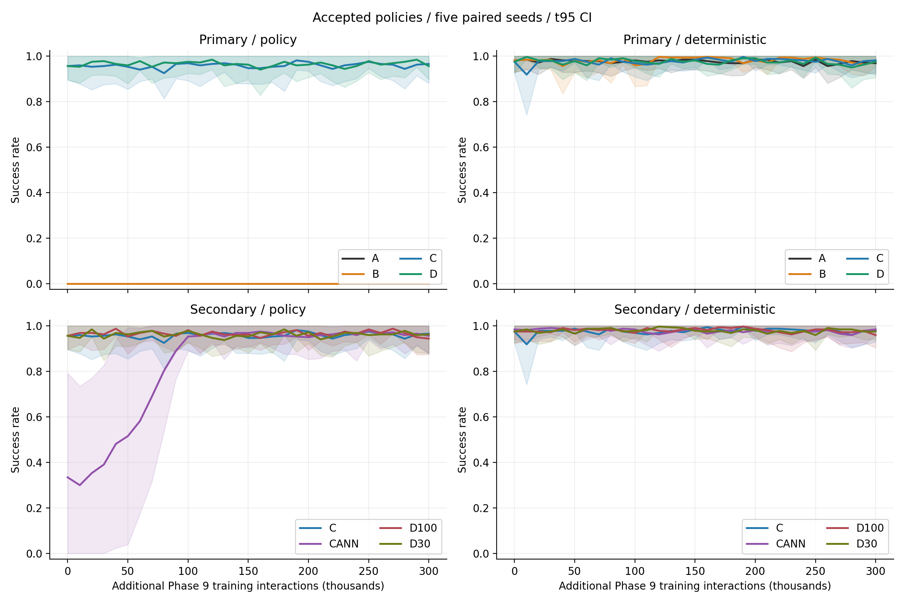
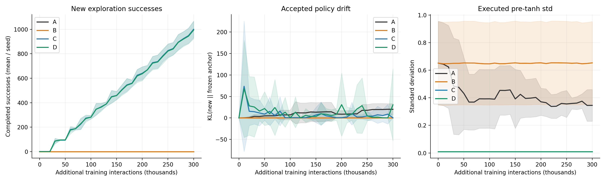
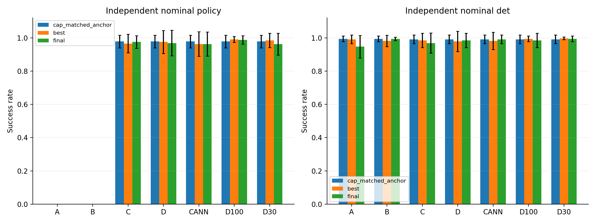
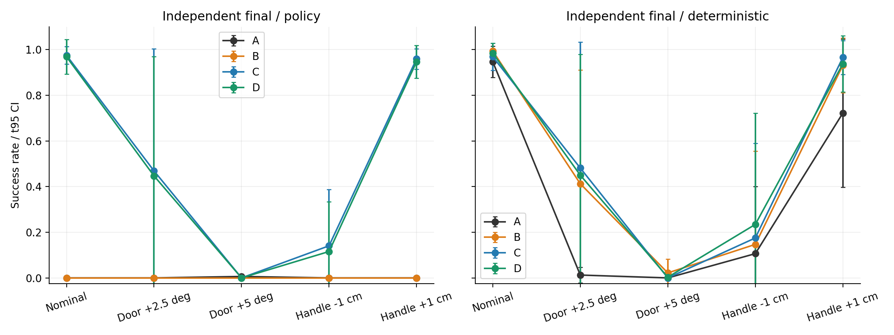

# Phase 9：稳定在线改进验证报告

## 1. 完成范围与结论边界

完成 7 组 × 5 seeds × 300,000 条新增训练交互。A–D 为主要对照，CANN/D100/D30 为标准差与 replay 比例补充消融。所有运行从同 seed 的 Phase 8 B 最佳完整 SAC checkpoint 继续，没有重新 BC、增加新任务或实现 LWD/DIVL/QAM。

当前独立随机执行终点最高的主要组为 **C**：0.975 [0.937, 1.013]。这属于本次数据上的探索性方案选择。

高成功率、产生在线成功轨迹、以及真正通过在线更新提高策略是三个不同指标。本报告用相同 std 上限的冻结锚点作为额外反事实，避免把降低执行噪声的效果归因于 RL 学习。

历史BC起点补充：Phase6的纯BC完成、尚未SAC更新时，独立确定性复测为19/320（5.94%），5个seed各64次。逐seed成功率为6.25%, 0.00%, 23.44%, 0.00%, 0.00%。此前约95.9%是持续BC约束配合SAC后的最佳checkpoint，最终仅31.9%；普通SAC接续的最终成功率为0。本阶段从Phase8 B已训练策略继续，未重新训练BC。来源：results/phase6_stable_online_rl/heldout_P6B1_seed{0..4}_initial.csv。

Phase8另一个口径：纯BC起点固定评测为5.62%；A（原奖励baseline）最终独立确定性复测为80.00%，B（Progress Reward）为95.94%。这里的baseline已包含持续BC约束、50%专家replay和checkpoint保护，因此此前“baseline 80%”与“纯BC约6%”对应不同训练时点。Phase8随机在线成功仍为0；不得将确定性80%表述为随机探索成功率。来源：results/phase8_progress_rl/eval_P8A_seed{0..4}.csv、heldout_summary.json。

纯BC只有3,000次更新，而Phase6 B3的在线阶段还持续做专家BC更新。现有实验没有相同总更新量的纯BC对照，因此无法把6%到95.9%的变化归因于SAC的净贡献。专家动作MSE约0.003也不等同于闭环成功；低BC成功的具体原因（训练量、关键接触动作误差、状态覆盖/可观测性）尚未由干预实验分离。Phase9各组BC约束相同，可比较anchor/std/replay组合；与冻结锚点的比较检验的是整个更新配方，不单独隔离RL与继续BC。

## 2. 固定环境与可迁移边界

- b300-2，8 × NVIDIA B300；Isaac Sim 5.1.0.0，Isaac Lab 源码 v2.3.0（commit 3c6e67bb5c7ada942a6d1884ab69338f57596f77，安装元数据 0.47.2）。
- GPU型号NVIDIA B300 SXM6 AC，每卡275,040 MiB，driver580.82.07，PyTorch CUDA12.8。运行环境与完整依赖快照：results/phase9_safe_online/environment_snapshot.json、environment_pip_freeze.txt。
- Python 3.11.15，PyTorch 2.7.0+cu128，NumPy 1.26.0，h5py 3.16。
- Panda Door，60 Hz 控制，最长 600 步/10 秒；成功条件门角度 >1 rad。原 reset、机器人、摩擦材料与 Phase 8 B signed progress reward 全部保留。
- Actor/Critic 都仅接收既有 26 维机器人观察；门角度、把手、接触等 GT 用于既有 reward、评价和更新验收，没有直接输入 Actor/Critic。
- 既有26维观察具体为9维joint position、9维joint velocity、3维末端位置、4维末端四元数、1维episode归一化时钟。没有视觉；固定初态下成功可能包含按时序重复执行的成分。本阶段未新增或修改这些输入。
- 原专家集 1,000 条成功轨迹 / 271,562 transitions，文件 door_dataset/door_expert_1000.h5。额外冻结锚点数据各 seed 64 条确定性轨迹，只将成功轨迹预载。
- 真实设备对应接口：机器人观察 → 控制动作；工装进度 → reward/更新验收；自动 reset → 再采集。仿真成功率不等同于硬件安全认证。

历史文件保护核验：32,599 个已有科学产物的大小/修改时间及小型源码哈希均保持不变；详情 results/phase9_safe_online/baseline_preservation.json。

## 3. 实验设计

| 组 | KL 权重 | 执行/训练 std | Critic replay: expert / anchor success / fresh online |
|---|---:|---|---|
| A | 0 | 原始学习分布 | 50 / 0 / 50% |
| B | 1 | 原始学习分布 | 50 / 0 / 50% |
| C | 1 | pre-tanh std ≤0.01 | 50 / 0 / 50% |
| D | 1 | pre-tanh std ≤0.01 | 50 / 25 / 25% |
| CANN | 1 | 前 100k 从 0.1 线性降到 0.01，每 10k 调整 | 50 / 0 / 50% |
| D100 / R1 | 1 | std ≤0.01 | 100 / 0 / 0% |
| D30 / R3 | 1 | std ≤0.01 | 约30 / 35 / 35% |

D 对应 R2。非专家份额中，冻结锚点成功与新在线探索各占一半；因此 R2/R3 的“online”池不是全部由新探索产生。所有来源分别计数，预载与评价成功永远不计入 online_successes。每 batch=256，D30 实际数量为 77/89/90。所有组另有同样的专家 BC regularization，λ=10。

### 更新、分布与验收

- 每运行 96 个训练环境，12 次SAC更新/向量步，batch 256，lr 3e-4。每条训练交互0.125次SAC更新与Phase8相同；每seed精确37,500次SAC更新（各含critic/actor/temperature一步）。并行环境数不同，不能把本阶段continuation AUC与Phase8从零训练AUC当作同一个实验。
- KL(new||anchor) 使用 pre-tanh Gaussian 的解析 KL；同一个当前 std 上限同时作用于 candidate 和冻结 anchor。锚点权重永久冻结。另记录未加 cap 的 raw KL。
- 当双方std都被cap为0.01时，KL的均值项为sum((mu_new-mu_anchor)^2)/(2*0.01^2)。与原始std约0.6相比，相同KL系数下均值偏移惩罚约强3600倍。因此C-B还包含KL度量收紧，不能当作单因素sigma消融；稳定性可能来自强守成。需要结合cap-matched冻结锚点对照判断是否真正改进。
- std 上限同时作用于在线采集、actor loss 与 target-Q action，避免只在评测时减少噪声。std=0.01 是 pre-tanh 无量纲标准差，不是关节角单位。末端位移 action 原 scale=0.05m，旋转=0.3rad，夹爪按符号控制。
- cap是显式控制，不是证明raw std head自主学会了收缩；导出和部署必须保留这一执行分布定义。
- A/B 保留 entropy target=-7；std 受限组使用固定专家参考集上、加 cap 的 anchor squashed entropy 减 1 nat（确定性 Gauss–Hermite 积分）。所以 C-B 是 std 控制及相容熵目标的组合干预，不能单独归因于 σ。raw network std 仍可能很大，实际执行 std 与 raw head 输出分别报告。
- 采集策略在每个候选区间冻结。candidate 可以训练，但只有固定 GT 评价通过才替换采集策略；失败恢复区间前完整模型、target critic、optimizer 与温度。replay 和累计交互数不回退。
- 主要组均使用同样的进度门控，所以 A–D 隔离的是 anchor/std/replay，不能据此声称门控本身的因果收益。区间内保存 raw candidate 与 accepted checkpoint，二者可审计；没有以 Q 选择策略。
- 每 10k 新交互验收：固定 32 episodes，确定性与真实采样策略均测。成功/最大角/最终角/归一化 progress 下降 >0.10，或 regression rate 增加 >0.10 则拒绝。门控比较上一接受策略，仍允许小退化累积。另用不同固定 seed 做 64 episodes/模式的正式曲线。
- 1k 区间 A/C/D pilot 各 10,080 步已保留。它们没有完整在线 episode（仅105物理时间步），仅验证更新/replay/恢复接口。1k 门控评价成本很高，正式组统一固定为10k；没有按组更改预算或只减少某组评价。
- best 按真实采样 success 优先、随后确定性 success/progress 排序；final 为300k接受策略。best 可能就是 step0锚点，因此“最佳结果”不能默认是新学习产生。

### 独立评价与统计

新进程、heldout seed=190000+seed，best/final 各64 episodes/条件/模式。主要组测 nominal 确定性、真实采样、独立 pre-tanh .01 噪声；同时测门初角 +2.5°/+5° 与工装横向 ±1cm（等效把手位移）。负初角会违反原铰链0..1.57rad限制，因此不测试 −5°。扰动仅修改独立评价器的 reset 默认状态，并保存实际初角/把手位姿校验。补充组只测 nominal。冻结 anchor 的 cap-matched counterfactual 使用相同 seed 的 step0独立测试。

统计单位是5个训练 seed，不把episode当作独立训练样本。95% CI 为 t(4) 区间，未人为裁剪统计值；曲线概率阴影仅在图中裁剪到[0,1]。paired test 为32种符号翻转的精确双侧检验。5对样本最小非零双侧p值为0.0625，不能据此宣称p<0.05；多组对照探索性报告，不挑选单seed证明提升。

## 4. 多 seed 主要结果

所有区间为均值 [95% CI]。AUC 为新增0–300k accepted-policy success曲线的归一化积分。best/final/gap来自独立复测；负gap表示独立复测final稍高，不代表曲线排序错误。

| 组 | 随机策略 AUC | 独立 Best | 独立 Final | Best−Final | 新在线成功条数 | 拒绝次数 |
|---|---|---|---|---|---|---|
| A | 0.000 [0.000, 0.000] | 0.000 [0.000, 0.000] | 0.000 [0.000, 0.000] | 0.000 [0.000, 0.000] | 0.000 [0.000, 0.000] | 23.000 [18.438, 27.562] |
| B | 0.000 [0.000, 0.000] | 0.000 [0.000, 0.000] | 0.000 [0.000, 0.000] | 0.000 [0.000, 0.000] | 0.000 [0.000, 0.000] | 18.400 [7.661, 29.139] |
| C | 0.958 [0.892, 1.025] | 0.966 [0.910, 1.021] | 0.975 [0.937, 1.013] | -0.009 [-0.031, 0.013] | 1000.200 [932.263, 1068.137] | 2.400 [-1.774, 6.574] |
| D | 0.966 [0.907, 1.024] | 0.975 [0.906, 1.044] | 0.969 [0.892, 1.045] | 0.006 [-0.004, 0.017] | 994.400 [922.418, 1066.382] | 4.200 [-0.641, 9.041] |
| CANN | 0.830 [0.675, 0.986] | 0.963 [0.889, 1.036] | 0.963 [0.890, 1.035] | 0.000 [-0.024, 0.024] | 766.600 [593.764, 939.436] | 4.400 [-0.457, 9.257] |
| D100 | 0.967 [0.924, 1.009] | 0.991 [0.973, 1.008] | 0.988 [0.962, 1.013] | 0.003 [-0.013, 0.019] | 990.000 [907.436, 1072.564] | 1.800 [-1.292, 4.892] |
| D30 | 0.962 [0.906, 1.019] | 0.984 [0.941, 1.028] | 0.963 [0.897, 1.028] | 0.022 [-0.008, 0.051] | 991.600 [923.108, 1060.092] | 3.600 [-1.855, 9.055] |

| 组 | 确定性 AUC | 独立确定性 Final | 新在线成功比例 | 独立轻噪声 Final |
|---|---|---|---|---|
| A | 0.976 [0.936, 1.016] | 0.947 [0.879, 1.015] | 0.000 [0.000, 0.000] | 0.850 [0.678, 1.022] |
| B | 0.982 [0.947, 1.018] | 0.994 [0.983, 1.004] | 0.000 [0.000, 0.000] | 0.972 [0.940, 1.004] |
| C | 0.977 [0.948, 1.005] | 0.969 [0.909, 1.029] | 0.991 [0.970, 1.013] | 0.978 [0.928, 1.029] |
| D | 0.976 [0.942, 1.009] | 0.984 [0.941, 1.028] | 0.990 [0.965, 1.015] | 0.984 [0.941, 1.028] |
| CANN | 0.977 [0.941, 1.012] | 0.991 [0.965, 1.017] | 0.864 [0.755, 0.974] | 0.975 [0.906, 1.044] |
| D100 | 0.980 [0.949, 1.012] | 0.984 [0.941, 1.028] | 0.989 [0.969, 1.010] | 0.984 [0.957, 1.012] |
| D30 | 0.979 [0.947, 1.012] | 0.994 [0.976, 1.011] | 0.987 [0.959, 1.015] | 0.975 [0.916, 1.034] |

| 组 | Final有效std | Final raw std | Final有效KL | 拒绝比例 | Final跨seed SD |
|---|---|---|---|---|---|
| A | 0.345 [0.230, 0.460] | 0.345 [0.230, 0.460] | 20.074 [7.079, 33.069] | 0.767 [0.615, 0.919] | 0.0000 |
| B | 0.653 [0.354, 0.953] | 0.653 [0.354, 0.953] | 0.004 [0.001, 0.006] | 0.613 [0.255, 0.971] | 0.0000 |
| C | 0.010 [0.010, 0.010] | 0.332 [0.269, 0.395] | 0.278 [0.016, 0.540] | 0.080 [-0.059, 0.219] | 0.0305 |
| D | 0.010 [0.010, 0.010] | 0.350 [0.305, 0.394] | 30.461 [-53.271, 114.194] | 0.140 [-0.021, 0.301] | 0.0615 |
| CANN | 0.010 [0.010, 0.010] | 0.359 [0.318, 0.399] | 0.201 [0.066, 0.336] | 0.147 [-0.015, 0.309] | 0.0580 |
| D100 | 0.010 [0.010, 0.010] | 0.326 [0.291, 0.361] | 294.056 [-215.734, 803.847] | 0.060 [-0.043, 0.163] | 0.0204 |
| D30 | 0.010 [0.010, 0.010] | 0.342 [0.278, 0.405] | 0.790 [-0.233, 1.813] | 0.120 [-0.062, 0.302] | 0.0525 |

### 验收前candidate诊断

raw candidate指标来自32-episode验收集，accepted曲线来自不同seed的64-episode正式集。raw曲线是各区间候选的诊断，拒绝后下一候选从上一接受状态继续，不能把它当作一条从未保护的连续训练分支。

| 组 | Raw确定性candidate AUC | Accepted确定性AUC | Raw随机candidate AUC | Accepted随机AUC |
|---|---|---|---|---|
| A | 0.422 [0.162, 0.683] | 0.976 [0.936, 1.016] | 0.000 [0.000, 0.000] | 0.000 [0.000, 0.000] |
| B | 0.561 [0.257, 0.865] | 0.982 [0.947, 1.018] | 0.000 [0.000, 0.000] | 0.000 [0.000, 0.000] |
| C | 0.975 [0.937, 1.014] | 0.977 [0.948, 1.005] | 0.943 [0.882, 1.005] | 0.958 [0.892, 1.025] |
| D | 0.973 [0.928, 1.018] | 0.976 [0.942, 1.009] | 0.941 [0.878, 1.003] | 0.966 [0.907, 1.024] |
| CANN | 0.966 [0.931, 1.001] | 0.977 [0.941, 1.012] | 0.807 [0.670, 0.945] | 0.830 [0.675, 0.986] |
| D100 | 0.977 [0.944, 1.010] | 0.980 [0.949, 1.012] | 0.953 [0.917, 0.988] | 0.967 [0.924, 1.009] |
| D30 | 0.974 [0.929, 1.019] | 0.979 [0.947, 1.012] | 0.941 [0.871, 1.011] | 0.962 [0.906, 1.019] |

逐seed全部值、方差、首次成功时间、成功时间窗、原始/有效std、KL与replay来源见 per_seed.csv、summary.json、episodes_*.csv、updates_*.csv、online_windows_*.json。在线episode可能跨多个接受策略版本，记录first/last版本；评价episode为固定checkpoint执行。

### 配对结果

| 比较 | 随机 AUC 差 [95% CI] | Final 差 [95% CI] | Final 双侧 p |
|---|---|---|---|
| B-A | 0.000 [0.000, 0.000] | 0.000 [0.000, 0.000] | 1.0000 |
| C-B | 0.958 [0.892, 1.025] | 0.975 [0.937, 1.013] | 0.0625 |
| C-A | 0.958 [0.892, 1.025] | 0.975 [0.937, 1.013] | 0.0625 |
| D-C | 0.007 [-0.001, 0.016] | -0.006 [-0.046, 0.034] | 1.0000 |
| CANN-C | -0.128 [-0.231, -0.025] | -0.013 [-0.047, 0.022] | 1.0000 |
| D100-D | 0.001 [-0.027, 0.029] | 0.019 [-0.035, 0.073] | 0.7500 |
| D30-D | -0.004 [-0.013, 0.006] | -0.006 [-0.028, 0.016] | 0.7500 |

### 更新是否优于仅控制 std 的冻结锚点

| 组 | 相同 cap 冻结锚点 | Final−冻结锚点 [95% CI] | 配对 p |
|---|---|---|---|
| A | 0.000 [0.000, 0.000] | 0.000 [0.000, 0.000] | 1.0000 |
| B | 0.000 [0.000, 0.000] | 0.000 [0.000, 0.000] | 1.0000 |
| C | 0.978 [0.940, 1.016] | -0.003 [-0.028, 0.022] | 1.0000 |
| D | 0.978 [0.940, 1.016] | -0.009 [-0.060, 0.041] | 1.0000 |
| CANN | 0.978 [0.940, 1.016] | -0.016 [-0.065, 0.034] | 0.6250 |
| D100 | 0.978 [0.940, 1.016] | 0.009 [-0.020, 0.039] | 0.7500 |
| D30 | 0.978 [0.940, 1.016] | -0.016 [-0.049, 0.018] | 0.5000 |

### 相同cap冻结锚点的其他指标对照

以下均为真实采样策略的独立nominal复测。episode时长包含失败的600步timeout，时长下降可能来自成功率变化，不能直接当作成功episode执行速度提高。reward/progress/时长是补充分析；“未显示额外成功率提高”不等于所有指标均无改善。

| 组 | Final mean episode steps | 时长差 Final−Anchor | Final mean reward return | Return差 Final−Anchor | Progress差 |
|---|---|---|---|---|---|
| A | 600.000 [600.000, 600.000] | 0.000 [0.000, 0.000] | 1.074 [0.756, 1.391] | -0.819 [-1.566, -0.071] | 0.000 [-0.002, 0.003] |
| B | 600.000 [600.000, 600.000] | 0.000 [0.000, 0.000] | 1.880 [1.242, 2.518] | -0.013 [-0.081, 0.056] | -0.000 [-0.001, 0.001] |
| C | 289.587 [277.390, 301.785] | -0.825 [-9.205, 7.555] | 35.093 [33.510, 36.675] | -0.148 [-0.993, 0.696] | -0.003 [-0.029, 0.022] |
| D | 292.663 [270.987, 314.338] | 2.250 [-15.318, 19.818] | 34.883 [32.072, 37.694] | -0.358 [-2.069, 1.353] | -0.009 [-0.060, 0.041] |
| CANN | 295.456 [274.803, 316.110] | 5.044 [-13.298, 23.385] | 34.655 [31.948, 37.361] | -0.586 [-2.236, 1.063] | -0.016 [-0.066, 0.034] |
| D100 | 287.097 [271.992, 302.202] | -3.316 [-12.517, 5.885] | 35.552 [34.374, 36.729] | 0.311 [-0.679, 1.300] | 0.009 [-0.020, 0.038] |
| D30 | 294.556 [275.453, 313.660] | 4.144 [-7.461, 15.749] | 34.653 [32.160, 37.145] | -0.588 [-1.748, 0.571] | -0.016 [-0.050, 0.018] |

### 成功episode的条件完成时间（探索性补充）

由总体mean episode steps与成功比例重建：(mean_steps−600*(1−success))/success。原任务只有成功和600步timeout终止，全部训练失败episode已验证为600步。p=0的组无法估计。单位为60Hz控制步；不作为额外推进门槛，也不能把条件完成速度当作RL交互样本效率。

| 组 | Frozen anchor成功完成步数 | Final成功完成步数 | 配对差 Final−Anchor [95% CI] |
|---|---|---|---|
| A | N/A | N/A | N/A（至少一seed无成功） |
| B | N/A | N/A | N/A（至少一seed无成功） |
| C | 283.267 [264.276, 302.259] | 281.372 [263.819, 298.926] | -1.895 [-3.370, -0.420] |
| D | 283.267 [264.276, 302.259] | 282.359 [264.708, 300.010] | -0.908 [-2.615, 0.798] |
| CANN | 283.267 [264.276, 302.259] | 283.137 [262.863, 303.412] | -0.130 [-3.641, 3.381] |
| D100 | 283.267 [264.276, 302.259] | 282.981 [264.175, 301.787] | -0.286 [-2.666, 2.094] |
| D30 | 283.267 [264.276, 302.259] | 282.266 [262.879, 301.652] | -1.002 [-2.689, 0.686] |

## 5. 小扰动与稳定性门槛

| 组 | 工程门槛 | 未通过项 | 显示优于冻结锚点 |
|---|---|---|---|
| A | False | online_success_all_seeds, online_success_in_multiple_windows, final_stochastic_mean_ge_90, rejections_each_le_20pct, light_noise_mean_ge_90, perturbation_each_condition_mean_ge_80 | False |
| B | False | online_success_all_seeds, online_success_in_multiple_windows, final_stochastic_mean_ge_90, rejections_each_le_20pct, perturbation_each_condition_mean_ge_80 | False |
| C | False | rejections_each_le_20pct, perturbation_each_condition_mean_ge_80 | False |
| D | False | rejections_each_le_20pct, perturbation_each_condition_mean_ge_80 | False |

操作性门槛于正式终点前固定：所有seed持续产生成功（至少3个10k窗口），随机final均值≥90%，mean best-final gap≤5pp/每seed≤10pp，每seed拒绝≤20%，轻噪声均值≥90%，各扰动条件/模式均值≥80%。它们用于项目推进决策，不能当作安全保证。

| 组 | 条件 | Best随机 [95% CI] | Final随机 [95% CI] | Best确定性 [95% CI] | Final确定性 [95% CI] |
|---|---|---|---|---|---|
| A | nominal | 0.000 [0.000, 0.000] | 0.000 [0.000, 0.000] | 0.991 [0.965, 1.017] | 0.947 [0.879, 1.015] |
| A | angle_2p5 | 0.000 [0.000, 0.000] | 0.000 [0.000, 0.000] | 0.197 [-0.100, 0.494] | 0.013 [-0.022, 0.047] |
| A | angle_5 | 0.000 [0.000, 0.000] | 0.006 [-0.004, 0.017] | 0.000 [0.000, 0.000] | 0.000 [0.000, 0.000] |
| A | handle_y_minus_1cm | 0.000 [0.000, 0.000] | 0.000 [0.000, 0.000] | 0.000 [0.000, 0.000] | 0.106 [-0.189, 0.401] |
| A | handle_y_plus_1cm | 0.000 [0.000, 0.000] | 0.000 [0.000, 0.000] | 0.956 [0.855, 1.057] | 0.722 [0.397, 1.047] |
| B | nominal | 0.000 [0.000, 0.000] | 0.000 [0.000, 0.000] | 0.981 [0.947, 1.016] | 0.994 [0.983, 1.004] |
| B | angle_2p5 | 0.000 [0.000, 0.000] | 0.000 [0.000, 0.000] | 0.175 [-0.059, 0.409] | 0.412 [-0.086, 0.911] |
| B | angle_5 | 0.000 [0.000, 0.000] | 0.000 [0.000, 0.000] | 0.000 [0.000, 0.000] | 0.022 [-0.039, 0.083] |
| B | handle_y_minus_1cm | 0.000 [0.000, 0.000] | 0.000 [0.000, 0.000] | 0.025 [-0.044, 0.094] | 0.147 [-0.261, 0.555] |
| B | handle_y_plus_1cm | 0.000 [0.000, 0.000] | 0.000 [0.000, 0.000] | 0.900 [0.729, 1.071] | 0.931 [0.811, 1.051] |
| C | nominal | 0.966 [0.910, 1.021] | 0.975 [0.937, 1.013] | 0.984 [0.941, 1.028] | 0.969 [0.909, 1.029] |
| C | angle_2p5 | 0.356 [-0.092, 0.804] | 0.469 [-0.067, 1.004] | 0.303 [-0.164, 0.770] | 0.481 [-0.070, 1.032] |
| C | angle_5 | 0.016 [-0.028, 0.059] | 0.000 [0.000, 0.000] | 0.025 [-0.044, 0.094] | 0.000 [0.000, 0.000] |
| C | handle_y_minus_1cm | 0.131 [-0.101, 0.363] | 0.141 [-0.106, 0.388] | 0.037 [-0.047, 0.122] | 0.175 [-0.239, 0.589] |
| C | handle_y_plus_1cm | 0.891 [0.741, 1.040] | 0.959 [0.915, 1.004] | 0.850 [0.554, 1.146] | 0.966 [0.891, 1.040] |
| D | nominal | 0.975 [0.906, 1.044] | 0.969 [0.892, 1.045] | 0.978 [0.917, 1.039] | 0.984 [0.941, 1.028] |
| D | angle_2p5 | 0.356 [-0.113, 0.826] | 0.447 [-0.076, 0.970] | 0.266 [-0.207, 0.738] | 0.450 [-0.080, 0.980] |
| D | angle_5 | 0.000 [0.000, 0.000] | 0.000 [0.000, 0.000] | 0.000 [0.000, 0.000] | 0.003 [-0.006, 0.012] |
| D | handle_y_minus_1cm | 0.134 [-0.111, 0.380] | 0.116 [-0.102, 0.333] | 0.156 [-0.188, 0.501] | 0.234 [-0.253, 0.722] |
| D | handle_y_plus_1cm | 0.938 [0.833, 1.042] | 0.947 [0.875, 1.019] | 0.906 [0.713, 1.100] | 0.938 [0.814, 1.061] |

## 6. 五个研究问题

### 1）为什么原 SAC 会破坏成功策略？

同一冻结锚点、没有任何训练更新的诊断中，原始随机分布为0/320成功，σ上限0.01后为90.6%–100%/seed。该对照直接支持执行分布过宽会破坏精细接触控制。在线SAC还会优化熵与Q驱动的动作分布，在专家支持范围外采样，再用失败经验更新。没有单独的critic因果干预，所以Q误差、可观测性和策略漂移只能列为共同机制假设；不能宣称Phase9证明了全部退化原因。

代码层面：现有BC regularization是MSE(tanh(mu), expert_action)，只约束动作均值，没有对log-std的直接监督。所以专家均值能力保持与随机执行失败可以同时存在。B把原始宽分布作为KL参考，也不能自动变为窄分布，缩小variance本身还会受到该参考的KL惩罚。C/D显式收缩reference与executed distribution，并与target-Q采样一致；这属于明确的算法干预，并不是证明SAC自行从成功经验学出了恰当的动作variance。

### 2）Anchor 是否解决策略漂移？

B−A 的独立随机final差为 0.000 [0.000, 0.000]；应结合det_final与拒绝率判断均值能力是否被保持。KL限制距离，不能把原本过宽的anchor动作分布自动变成成功探索。raw KL小也不能替代真实进度测试。

### 3）动作分布控制是否增加在线成功经验？

C 的新在线成功均值为 1000.200 [932.263, 1068.137]，D为 994.400 [922.418, 1066.382]；A为 0.000 [0.000, 0.000]，B为 0.000 [0.000, 0.000]。这些只来自训练采集，不含预载和评测。支持与否以五seed逐项结果为准，不能用0/0短测作为失败样本。

### 4）成功经验进入 buffer 后是否持续提升？

D−C 独立final差为 -0.006 [-0.046, 0.034]。D的anchor成功数据已进入critic replay；所有在线episode也进入在线池。D30/D100提供比例对照。若没有稳定正向差或没有优于cap-matched冻结锚点，只能说形成了成功采集与受保护更新，不能说成功经验已经带来持续策略增益。

冻结锚点在相同小std下本来就接近满分，留下的改进空间很小；同时有效KL较强。没有检测到增益不能直接推导“经验无效”，也可能是ceiling与更新约束共同限制。D100只训练专家replay却仍采集在线episode，能帮助区分产生成功与利用新经验；本实验没有无门控组或受限std但无anchor组，不能独立识别各保护组件的必要性。

### 5）能否进入 LWD/DIVL？

按用户稳定性与泛化标准，工程门槛通过组：无。单独显示优于cap-matched冻结锚点的成功率组：无。进入下一阶段按工程门槛判断，增量成功率证据独立报告，不因接近满分的ceiling额外增加用户未要求的阻断条件。

在通过条件前继续暂缓LWD/DIVL/QAM。下一步应围绕已经受控的探索分布做小规模确认：把保持能力与真实在线收益分开，验证接受更新率、cap-matched无更新对照、以及小扰动下观测是否足够。若主要障碍是初态泛化，固定机器人观察可能不足以定位变化的把手，需要独立论证可部署观测接口；本阶段没有改变环境或Actor输入。成功数据排序模块只有在更新收益可靠后再接入。

下一次严格控制的稳定性确认可单独检验KL度量：保持std上限与entropy target不变，比较uncapped-reference KL或按variance归一化后的anchor强度，检验是否保留能力同时允许有效改变均值。仅作为后续设计，本阶段没有增开训练或实施LWD/DIVL。

## 7. 交互成本与产物

- 正式新增训练交互：10,500,000。
- 固定门控与曲线评价交互：93,407,552。
- 独立评价：36,800 episodes / 18,094,464交互。
- Pilot：30,240训练 / 1,473,824评价交互。
- 独立扰动物理核查pilot评价交互：182,048，未进入正式推断。
- 锚点准备初次汇总序列化失败，但64轨迹/seed保存完整；恢复读取同一HDF5后完成原始/受限随机评测。恢复deterministic交互数是按轨迹顺序重建估计，无法严格还原，不混入上述精确成本。日志/失败输出保留。没有把额外评价交互隐藏在300k训练预算之外来宣称真实机器人sample efficiency。
- checkpoint：checkpoints/phase9_safe_online/P9{arm}_seed{seed}/；包含step0、10k节点、raw candidate、best、final和completed.json。采集replay在内存中运行，checkpoint不包含replay快照，不应当作可完整复现buffer的断点续训文件。
- TensorBoard：logs/phase9_safe_online/P9{arm}_seed{seed}/；CSV/独立评价/统计/源代码快照与哈希：results/phase9_safe_online/。
- 可部署策略导出：results/phase9_safe_online/deployment/。safe_online/deploy_policy.py 读取std_cap和26维机器人观察契约；确定性与采样推断已逐文件核对一致。导出包含是否仍为step0锚点，避免把未发生改进的策略标记成在线学习成果。仅导出产物，没有连接或执行真实机器人。
- 已有source checkpoint哈希、expert/环境哈希、旧产物清单与训练源码清单均保存，可核查对照污染。

## 8. 图表









## 9. 重现入口

```bash
cd /home/xiaolong/privileged_rl_validation
source configs/runtime_env.sh
.venv/bin/python experiments/phase9_safe_online/audit.py
# train.py creates unique directories; do not relaunch into completed runs
.venv/bin/python experiments/phase9_safe_online/analyze.py
.venv/bin/python experiments/phase9_safe_online/plot.py
.venv/bin/python experiments/phase9_safe_online/baseline_inventory.py --verify
.venv/bin/python experiments/phase9_safe_online/finalize_report.py
```
