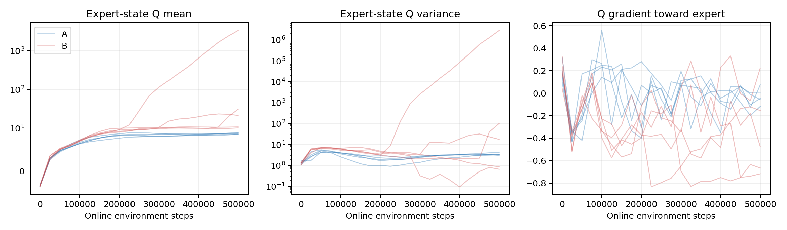
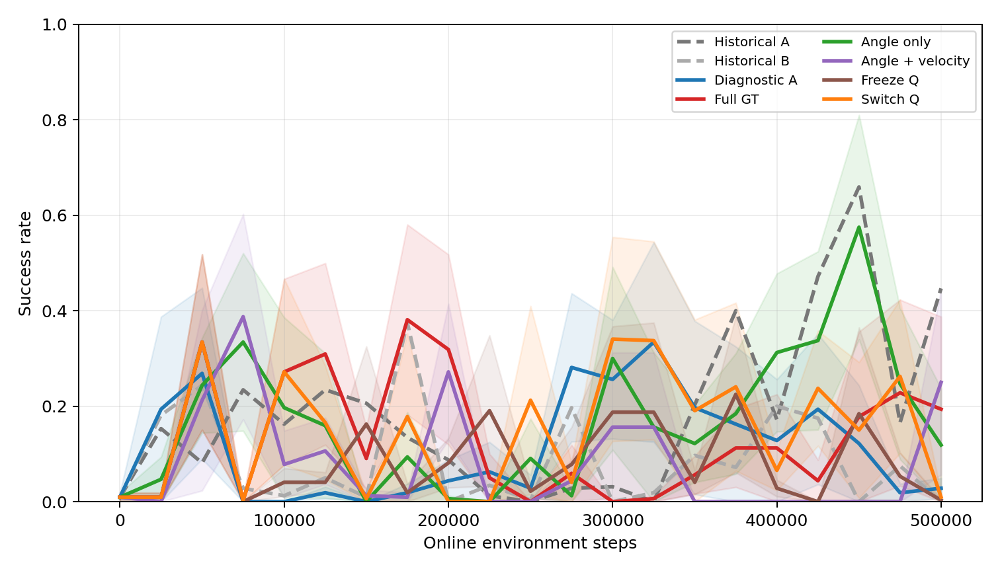
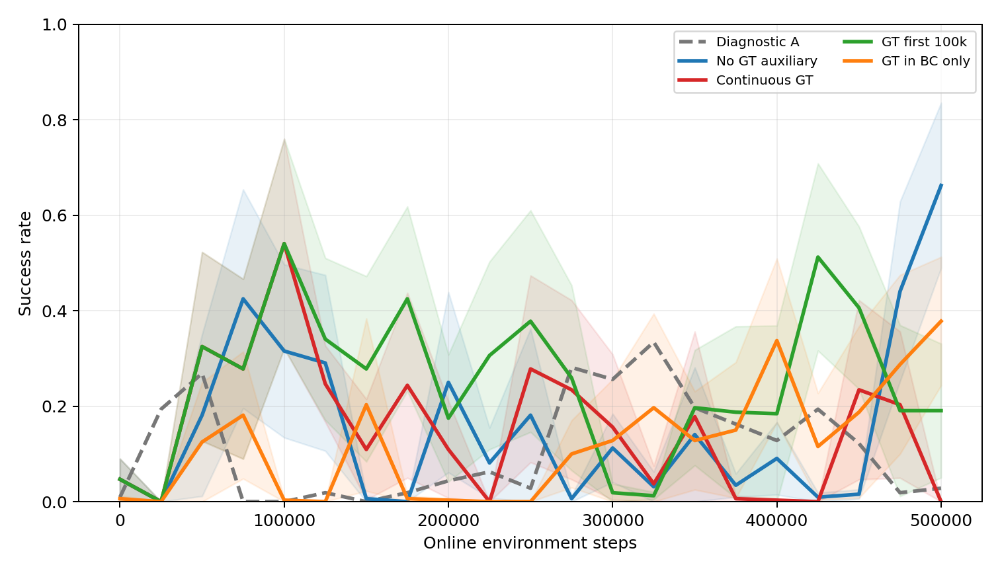
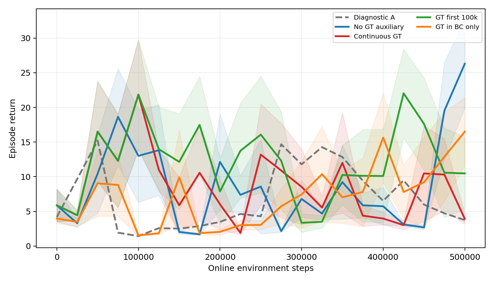

# Panda Door 第三阶段：Privileged Critic 退化诊断与消融

实验日期：2026-09-29。服务器：b300-2，8 × NVIDIA B300。项目：`/home/xiaolong/privileged_rl_validation`。

## 1. 实验边界与可复现性

沿用第二阶段的 Isaac Lab Panda Door 物理环境、柜体 USD、奖励、自动 reset、成功阈值 1.0 rad，以及同一份 1,000 条成功专家轨迹（271,562 条 transition）。每个新训练运行使用 32 个并行环境、BC 3,000 次更新、离线 Critic 1,000 次更新、在线 SAC 每向量步 4 次更新、batch 256、专家 replay 比例 25%、actor BC 权重 10。在线交互预算每个变体每个 seed 为 500,000 步，seed 为 0–4；每 25,000 步用 64 回合评估。原始 Drawer/Door baseline 文件与 checkpoint 均保留，`results/door/manifest_sha256.txt` 所列核心输入校验通过。

运行环境审计见 `results/door_privileged_ablation/verification.json`：Python 3.11.15、Isaac Lab 0.47.2、Isaac Lab Tasks 0.11.6、PyTorch 2.7.0+cu128、NumPy 1.26.0、h5py 3.16.0、8 × NVIDIA B300、驱动 580.82.07。审计逐一核验 50 个完整训练运行、每运行 62,500 次 SAC 更新、100 次独立 heldout checkpoint 回放与五个 GT-free Actor 导出，并保存关键输入和新代码的 SHA-256。Drawer 与 Door 的原有源码/数据清单复核均通过。

新训练器、配置及结果分别位于 `experiments/door_privileged_ablation/`、`configs/door_phase3.json`、`results/door_privileged_ablation/`，不写入第二阶段输出目录。训练成功率 AUC 定义为 0–500k 步成功率曲线的梯形积分除以 500k；横轴只统计在线训练交互，评估回合与共同专家采集成本另行记录。95% 区间在 **seed 层级**以 20,000 次 bootstrap 计算；配对差值同时报告精确双侧符号翻转检验。5 seed 的最小可能双侧精确 p 值为 0.0625，因此不以探索性区间单独宣称 5% 显著性。50%/80%/90% 达标步数分别记录首次达到与此后保持的步数，未达到视为删失，不补造数值。

| 标记 | Actor 输入 | Critic 输入 / 干预 |
|---|---|---|
| A（历史） | robot | robot |
| B（历史） | robot | robot + 全 11 维 GT |
| diag_A | robot | A 的新诊断运行 |
| diag_B = B3 = B4 | robot | 全 GT，新诊断运行；B3/B4 共用同一组 5 seed，不重复训练 |
| B1 | robot | robot + 门角度 |
| B2 | robot | robot + 门角度、角速度 |
| B5 | robot | 全 GT Critic 至约 50k；冻结 Q 后继续更新 actor 与温度 |
| B6 | robot | 全 GT Critic 至 100k；用已有 replay 额外蒸馏 1,000 minibatch 到 robot-only Q，继续 SAC |
| E0 | robot encoder | robot-only Critic；与 E1 相同的 encoder/policy/head 架构，辅助权重 0 |
| E1 | robot encoder | robot-only Critic；训练期共享 encoder 预测门角度与双指 contact，辅助权重 0.1 |
| E2（追加检验） | robot encoder | E1 的 GT 辅助损失仅在前 100k 步开启，此后关闭；测试能否保留早期表示收益并避免后期退化 |
| E3（追加检验） | robot encoder | 原有 3,000 次 BC 更新同时预测 GT；在线 500k 步只训练 robot-only SAC，检验 GT 是否更适合初始化表示 |

训练时只有 B 系列 Critic 读取 GT；所有部署 Actor 仅接收 robot observation。`route_validation.json` 验证了 B1/B2/B3 的 GT 列索引与 Actor 隔离，且 E0/E1 从完全相同的 BC 后 actor、离线 Critic 权重开始。E2 沿用这一初始化，并经核验其 100k checkpoint 与 E1 的 5 个对应 checkpoint 逐项相同；此后才关闭辅助梯度。E3 在原定 3,000 次 BC 内加入 GT 损失，因此初始化不同，是另一项明确标记的探索性检验。B5 的 50k 与 500k Critic 参数逐项相同；B6 的 Critic 输入宽度从 44（robot 26 + GT 11 + action 7）变为 33（robot 26 + action 7）。`diag_A/diag_B` 和历史 A/B 使用同一架构、超参数与 seed ID；每向量步的熵诊断多做一次随机动作采样，因此是独立随机重跑，不能视为位级相同轨迹。

## 2. 第二阶段失败位置：价值估计与动作指导

历史 Door A/B 的成功率 AUC 分别为 0.183 和 0.089；B 的 5 个最终 checkpoint 成功率均为 0。B 最优 checkpoint 的独立 heldout 成功率平均约 0.694，而最终 checkpoint 为 0，说明退化发生在在线微调过程中。先前 C（GT Actor 上限）AUC 为 0.148，D（Value Weighted Replay）AUC 为 0.049；经验加权在此前配方下也未改善。

为了排除在线 replay 分布漂移，将第二阶段 A/B 每 25k 保存的 checkpoint 全部在**同一组 256 个专家 transition**上重新测量。结果按 5 seed 求均值：

| 在线步数 | A: Q 均值 | A: Q 方差 | B: Q 均值 | B: Q 方差 | B: Expert Bellman 绝对残差 |
|---:|---:|---:|---:|---:|---:|
| 200k | 8.26 | 1.99 | 9.52 | 3.84 | 0.09 |
| 300k | 8.40 | 2.40 | 31.07 | 524.40 | 1.92 |
| 400k | 8.49 | 3.14 | 139.57 | 16,979.02 | 10.05 |
| 500k | 8.75 | 3.47 | 687.69 | 573,357.75 | 69.04 |

**不能把均值当作每个 seed 都发散。** B 的 500k 固定专家状态 Q 均值按 seed 为 3365.25、21.35、10.78、10.15、30.93；seed 0 出现灾难性过估计，而另外四个 seed 的数值没有同量级发散。专家轨迹的实际整回合回报中位数约 39.0、最大约 41.6；seed 0 的 Q 明显脱离真实回报尺度。更关键的是时序：seed 0 在 75k 已跌至 ≤10% 成功率，Q 方差超过对应 A 十倍是在 250k；seed 4 分别约为 450k 与 475k。因此价值发散在这些运行中发生于策略退化**之后**，更像放大因素，不能被当作唯一初因。

在专家状态上，取当前确定性 Actor 动作到记录专家动作的方向，并与 Critic 对动作的 Q 梯度比较。B 最终 5 seed 中 4 个余弦为负（−0.155、−0.665、+0.224、−0.476、−0.717）；A 的相应值更接近 0。B 对其策略动作的 Q 评分在若干 seed 高于专家动作，尽管真实评估已失败。这提示 Actor 可能沿着不可靠的 Critic 梯度偏离专家行为。该离线动作方向只是诊断代理，不是反事实真实回报，不能单独证明因果机制。

训练期每向量步记录 Critic loss、Q 均值/方差、双 Q 分歧、Actor loss、tanh 策略熵和最近 256 个完成回合的成功率。完整窗口表、单 seed 崩溃时序及固定探针数据见 `results/door_privileged_ablation/training_diagnosis.md` 和 `fixed_probe_phase2.csv`。

## 3. 第三阶段 5 seed 消融结果

历史 A/B 与第三阶段同步重跑的 diag_A/diag_B 不位级相同，应该分别解读。新消融共 10 个训练变体 × 5 seed × 500k 步，即 **2,500 万次新在线训练交互**；B3/B4 与 diag_B 同义，不重复消耗交互。下表的 AUC 与最后一次评估成功率均是五 seed 的均值；括号为 seed bootstrap 95% 区间。

| 变体 | 成功率 AUC [95% CI] | 500k 成功率 [95% CI] | 400k–500k 平均成功率 | 最佳→最终平均下降 |
|---|---:|---:|---:|---:|
| 历史 A | 0.183 [0.108, 0.258] | 0.447 [0.053, 0.841] | 0.383 | 0.450 |
| 历史 B | 0.089 [0.030, 0.155] | 0.000 [0, 0] | 0.090 | 0.656 |
| diag_A | 0.117 [0.055, 0.167] | 0.028 [0, 0.072] | 0.098 | 0.713 |
| diag_B = B3/B4 | 0.133 [0.074, 0.185] | 0.194 [0, 0.581] | 0.151 | 0.659 |
| B1 门角度 | 0.174 [0.128, 0.220] | 0.119 [0, 0.356] | 0.318 | 0.809 |
| B2 角度+角速度 | 0.078 [0.051, 0.103] | 0.250 [0, 0.650] | 0.050 | 0.519 |
| B5 冻结 Critic | 0.095 [0.022, 0.213] | 0.003 [0, 0.009] | 0.054 | 0.522 |
| B6 100k 切换 Critic | 0.153 [0.086, 0.231] | 0.009 [0, 0.028] | 0.145 | 0.972 |
| E0 同架构无 GT | 0.148 [0.104, 0.196] | 0.663 [0.319, 0.897] | 0.244 | 0.297 |
| E1 持续 GT 辅助 | 0.160 [0.090, 0.235] | 0.000 [0, 0] | 0.088 | 0.888 |
| **E2 前 100k GT 辅助** | **0.257 [0.184, 0.349]** | 0.191 [0.006, 0.478] | 0.297 | 0.778 |
| E3 BC 阶段 GT 辅助 | 0.117 [0.065, 0.201] | 0.378 [0.163, 0.619] | 0.261 | 0.459 |

主要配对结果：B1 − diag_A 的 AUC 为 **+0.0568**（bootstrap 95% CI [0.0296, 0.0859]；5/5 seed 为正；精确双侧 p = 0.0625）；E2 − E0 为 **+0.1084**（[0.0350, 0.1817]；p = 0.125）；E2 − E1 为 +0.0963（[−0.0187, 0.2093]；p = 0.25）。E1 − E0 只有 +0.0120，区间跨零，而最终成功率差为 −0.663。E3 − E0 的 AUC 为 −0.0311，区间跨零。所有这些都属探索性证据，**没有一项在五 seed 精确双侧检验达到 0.05**；追加的 E2/E3 是看到主消融结果后设计的，不能当作预注册验证。

首次达到 50%/80%/90% 的步数与覆盖 seed 数见 `thresholds.csv`。E2 在三档门槛均为 **5/5 seed 达到**，对应首次达到的中位在线步数为 100k、100k、约 125k；但三档均为 **0/5 seed 持续保持到 500k**。E0 的 50%/80% 为 5/5 seed 达到，90% 为 4/5 seed 达到；50% 有 3/5 seed、80% 有 1/5 seed 后续保持。E2 因而提高了整段 AUC 和高成功率覆盖率，却没有单靠关闭辅助损失解决持续训练退化。

三个直接 GT Critic 的信息量与表现**不单调**：B1 的 AUC 为 0.174，B2 降至 0.078，全 GT 的 diag_B 为 0.133。因此“GT 维度太多”不是充分解释；角速度这一额外字段在当前配方下也可能改变价值拟合与策略梯度。B1 相对同批 diag_A 的配对 AUC 提升是本组最一致的直接 Critic 收益，但最终 heldout 仍低。B5 的 Q 参数经过冻结确实未再改变，仍退化；B6 蒸馏到无 GT Critic 后固定专家状态上的 Q 较稳定，最终成功率也接近零。这两项干预都没有解决持续在线更新的策略问题。

E0/E1 的 BC 后 Actor 和离线 Critic 权重完全相同；E1 能学到 GT，但在线持续加监督的最终五 seed 全部失败。E1/E2 在 **100k 步时**五个对应 Actor/Critic checkpoint 逐项相同，之后只改变是否继续施加 GT 辅助梯度。E2 AUC 明显高于 E0/E1，但最终仍低于 E0。E3 把辅助任务移到同样 3,000 次 BC 初始化内，在线不再训练 GT head，没有取得 E2 的 AUC 收益。辅助监督的**时机**比“是否能预测 GT”更影响结果。

## 4. 独立 heldout 与表示检验

每个变体与 seed 分别选择训练曲线的最佳、最终 checkpoint，用未参与 checkpoint 选择的 `90000 + seed` reset 序列各评估 64 回合。报告成功率、回报、contact 与最终门角度。对 E0/E1 还在相同架构下比较 GT 预测误差。

另以历史 A 的一个最佳策略在 reset seed 190000 收集一次公共诊断轨迹；仅将这些 heldout 状态用于测量，不加入训练 replay。其门角度覆盖约 0–1 rad，双指 contact 比例约 56%。分别冻结 E0/E1/E2/E3 在 BC 后与 500k 步的 Actor encoder，在环境实例 0–15 的状态上拟合线性探针，并在实例 16–31 上测门角度 MAE/R² 与 contact Brier 分数。这样比较的是 encoder 携带 GT 的能力，而不只是某个变体有受监督 head。

| 变体 | 最佳 checkpoint heldout 成功率 [95% CI] | 最终 checkpoint heldout 成功率 [95% CI] | 最佳 checkpoint 的接触率 | 最终平均门角度 rad |
|---|---:|---:|---:|---:|
| diag_A | 0.719 [0.353, 0.953] | 0.038 [0, 0.081] | 0.759 | 0.038 |
| diag_B | 0.800 [0.472, 0.988] | 0.181 [0, 0.544] | 0.872 | 0.182 |
| B1 | 0.856 [0.691, 0.981] | 0.091 [0, 0.272] | 0.888 | 0.091 |
| B2 | 0.791 [0.556, 0.963] | 0.244 [0, 0.644] | 0.866 | 0.263 |
| B5 | 0.563 [0.263, 0.866] | 0.000 [0, 0] | 0.809 | 0.000 |
| B6 | 0.969 [0.944, 0.991] | 0.028 [0, 0.084] | 0.984 | 0.028 |
| E0 | 0.956 [0.906, 0.994] | 0.644 [0.306, 0.909] | 0.978 | 0.646 |
| E1 | 0.875 [0.625, 1.000] | 0.000 [0, 0] | 0.881 | 0.001 |
| **E2** | **0.981 [0.959, 0.997]** | 0.213 [0, 0.525] | 0.984 | 0.213 |
| E3 | 0.794 [0.588, 0.953] | 0.388 [0.147, 0.628] | 0.831 | 0.389 |

E2 的最佳 checkpoint 在五 seed 的独立 heldout 成功率分别为 **1.000、0.984、1.000、0.938、0.984**；对应训练步数为 100k、150k、75k、125k、400k，中位约 125k。E0 的最佳 checkpoint 中位约 200k，heldout 平均 0.956；E2 − E0 的最佳 heldout 成功率配对差仅 +0.025（95% CI [−0.0219, 0.0875]，精确 p = 0.6875），不能声称 E2 的最佳策略质量显著更高。E2 的 **500k 最终** heldout 只有 0.213，证明需要依据工装 GT 评估保留早期优良 Actor，不能把训练终点直接交付部署。

线性探针使用标准化的 256 维 frozen encoder 特征与 ridge 正则，在与训练轨迹不同的环境实例上测试。下表为五 seed 的均值，角度 MAE 越低越好；原始 robot 特征的常数预测基准 MAE 为 0.265 rad。E0/E1/E2 的 BC 后特征完全相同，E3 在 BC 中额外训练 GT。

| 变体 | BC 后角度 MAE rad | 500k 角度 MAE rad | BC 后 contact Brier | 500k contact Brier |
|---|---:|---:|---:|---:|
| E0 | 0.044 | 0.021 | 0.013 | 0.0069 |
| E1 | 0.044 | 0.017 | 0.013 | 0.0065 |
| E2 | 0.044 | **0.016** | 0.013 | **0.0064** |
| E3 | 0.045 | 0.017 | 0.012 | 0.0075 |

这支持“E1/E2 的 GT 监督提高了隐藏状态的可解码性”，尤其 E2 最终角度 MAE 比 E0 低约 0.005 rad；**不能由此推断控制性能随之提高**，因为 E1 的 GT 表示也更好而最终成功率为零。E3 没有在 BC 后改善门角度线性可解码性。固定专家 minibatch 的一阶梯度诊断中，E1 到 100k 时的辅助损失及其相对策略/BC 梯度已经很小，不能把后期退化简单归因于持续辅助梯度“过强”；在线状态分布上的梯度仍需单独检验。

## 5. 对四个问题的回答

**问题 1：Privileged Critic 为什么退化？** 历史 B 的失败至少有两种表现。seed 0/4 在策略成功率下降**之后**才出现 Q 方差大幅上升，说明 Q 爆炸是部分运行的放大因素而非共同初因；其他 seed 的 Q 量级正常仍失败。固定专家状态上，B 最终五 seed 有四个 Q 动作梯度与专家动作方向相反，且若干失败 Actor 被 Critic 评为高于专家动作。这与部分可观测 Actor 受状态丰富的、离线分布外 Critic 错误动作排序误导相符；诊断不能证明因果。普通 A/E0 也有波动，说明 BC + SAC 配方自身不完全稳定。冻结 Q、后期改回普通 Q 均未治好持续训练，不能将问题化约为“Critic 太强”或“GT 维度太多”。

**问题 2：GT 真正帮助了表示学习吗？** 帮助了 GT 的可预测性：E1/E2 的最终 frozen encoder 在公共 heldout 状态上的角度 MAE 低于 E0，E1 直接预测头在独立 rollout 上的角度误差也远低于未训练的 E0 头。但更可预测的表示**不等于**更可靠的控制；E1 的最终成功率为零。早期辅助、之后关闭的 E2 在在线 AUC 上最有希望，但 500k 终点仍退化。

**问题 3：GT 应如何进入 RL？** 全量直接进入 Critic 的 B/B3 会给出不可靠动作梯度；只输入门角度的 B1 有一致的 AUC 数值收益，但不能维持成功。持续进入 Actor encoder 辅助损失的 E1 提升预测、损害最终策略；只在前 100k 使用的 E2 AUC 最高，配合 GT 成功率评估筛选 checkpoint 才能形成可靠的**交付策略**。在 BC 阶段加入 GT 的 E3 未超过 E0。历史 D 的 Q 值加权经验重放没有改善；在 Q 校准与排序仍有问题时，不应直接用它筛选数据。工装 GT 当前最稳妥的角色是**早期辅助监督 + 独立成功率验证/回退门槛**，部署 Actor 始终 robot-only。

**问题 4：哪条路线适合作为 LWD/DIVL 基础？** 用 E2 的 Actor-only checkpoint 及其工装 GT 验证门槛作为候选起点，同时保留 E0 作为不使用 GT 的稳定对照。E2 的 AUC 相对 E0 增加 +0.108（bootstrap 区间 [0.035, 0.182]，精确 p = 0.125），这是探索性样本效率信号；最佳 heldout 平均 0.981，但持续训练到 500k 不稳定。下一阶段必须先解决价值校准、分布外动作评分与自动回退，再评估 DIVL 或经验选择是否带来额外收益。

## 6. 后续 LWD/DIVL 接入建议

1. **将工装 GT 用于闭环验证与回退。** 以门角度 >1 rad、接触与 reset 状态自动形成 episode 标签；每 25k 在线步保留 Actor checkpoint，使用固定 64 回合验证曲线选最佳，再用独立 reset 序列复核。`evaluation/select_door_actor.py` 已按 E2 最佳 checkpoint 导出 **5/5 个通过 ≥80% 独立 heldout 门槛**的 Actor-only 文件，选择清单在 `checkpoints/door_privileged_ablation/selected/E2/selection_manifest.json`。`evaluation/validate_actor_export.py` 确认导出权重与源 checkpoint 一致、仅接收 26 维 robot observation、输出 7 维动作，不含 Critic 或 GT 输入。此步骤证明可交付早期高成功率策略；它**没有**证明持续在线更新不会崩溃。真实工装应在成功率下降时回退到已验证 Actor，而非继续部署最新权重。
2. **先修价值估计，再进行价值筛选。** 固定专家探针与在线数据同时监测 Q 均值、方差、双 Q 分歧、Bellman 残差和动作梯度方向；给出超出真实回报尺度的 Q 报警与独立 validation gate。对 GT 筛选先用物理可解释的门角度增量、接触、失败恢复标签，避免直接以未校准 Q 权重重放。保持同样的 5 seed/500k 与 heldout 协议比较任何新价值算法。
3. **分阶段借鉴 LWD。** [Learning While Deploying](https://arxiv.org/abs/2605.00416) 将部署经验反馈、DIVL 的稳健价值估计及面向 flow-based VLA 的 QAM 结合。本项目目前是 Panda SAC 而非 VLA，因此下一阶段先研究 DIVL 所需的价值校准与工装标注经验；只有稳健价值估计经本任务验证后再测试 value-based selection。QAM、完整 LWD 与新任务都不属于本阶段实现范围。

## 7. 局限与文件索引

GT 表示从 robot proprioception 学习，未加入 RGB；机器人是否足以从自身状态推断门角度取决于接触与运动历史。E0/E1 是同架构控制，但仍只测试一个辅助权重 0.1。B6 的 1,000 次离线蒸馏增加了优化计算，不增加在线交互；若 B6 获益，不能将其全部归因于切换时刻。独立 heldout 仅覆盖该仿真环境的随机 reset 分布；真实工装迁移仍需传感噪声、延迟与安全边界验证。本阶段没有实现完整 LWD、QAM 或 VLA。

关键文件：`experiments/door_privileged_ablation/train.py`、`experiments/door_privileged_ablation/analyze.py`、`diagnostics/critic_analysis.py`、`diagnostics/q_value_analysis.py`、`diagnostics/representation_probe.py`、`evaluation/select_door_actor.py`、`results/door_privileged_ablation/summary.json`、`results/door_privileged_ablation/paired_effects.csv`、`results/door_privileged_ablation/heldout_aggregate.csv`、`results/door_privileged_ablation/representation_probe.csv`、`results/door_privileged_ablation/verification.json`。原始结果仍在 `results/door/`。
