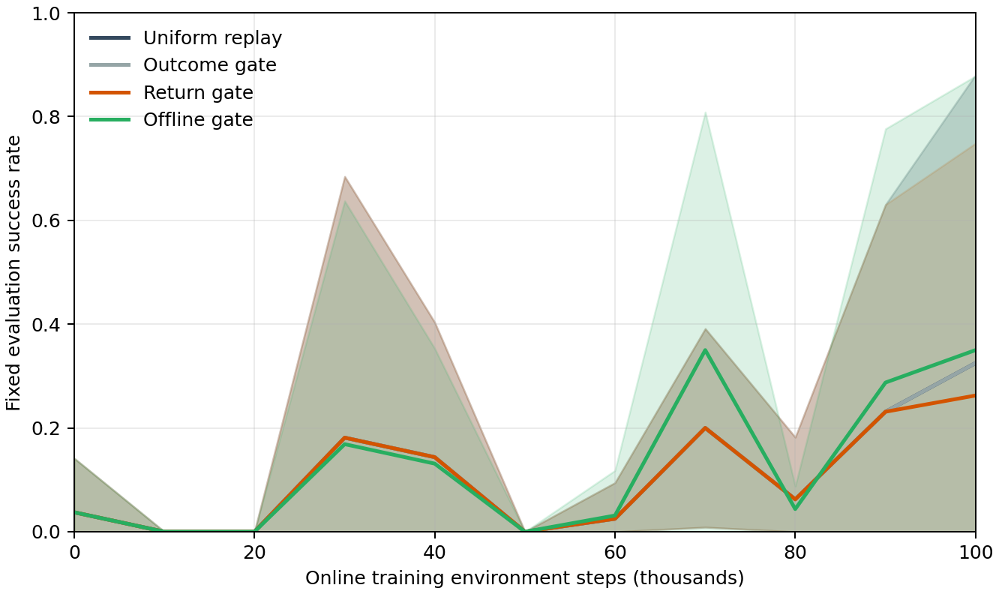
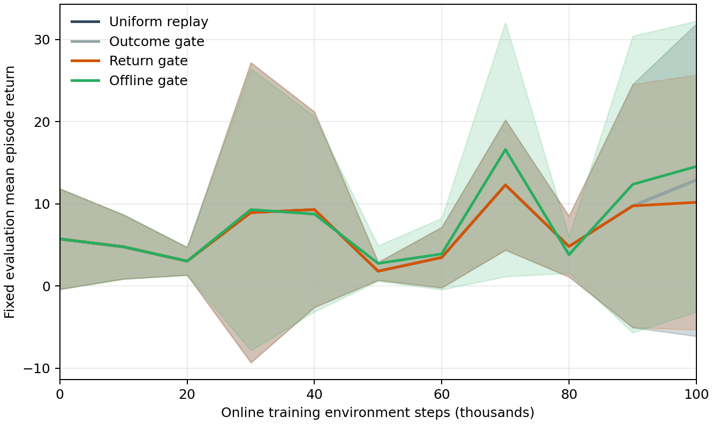

# Panda Door 第五阶段报告：价值校准与质量回放

## 结论摘要

**现阶段没有证据证明工装 GT 已提高在线 RL 样本效率。** 直接或共享编码器的 SAC Q 对未见轨迹排序不可靠。用 GT 导出的成功/回报监督训练的**固定前 100 步**轨迹质量模型，在两套独立冻结策略预留集上能更好地排序成功轨迹；但把它用于有界在线回放后，5 种子 100k 步学习曲线 AUC 只比 uniform 高 **0.018**，配对 95% CI **[−0.060, 0.096]**、精确双侧符号翻转 **p=0.5625**。独立复测的最终成功率差 **+0.053 [−0.046, 0.153]，p=0.5**。因此“离线经验排序有效”与“在线策略学得更快”必须分开判断。

Door 环境、奖励、自动 reset、机器人配置、1,000 条原专家 HDF5 与既有 Drawer/Door baseline 均未更改。所有部署 Actor 和在线 Critic 仅使用 26 维 robot observation；GT 只在质量标签/既有辅助监督中用于训练或审计。没有实现完整 LWD、DIVL、QAM 或 VLA。

## 1. 轨迹数据与泄漏审计

Phase 4 在线 Q 回放各约 832 条完整 episode，却仅有 6 条不同成功轨迹，无法构成 1,000 条的成败排序测试。因此只运行已有 Door checkpoint 的**冻结策略**采集新数据，策略优化器更新次数为 0：8 个策略/保存点 × 5 个种子 × 125 条 = **5,000 条**，共 **2,092,562 次**冻结仿真交互。40 个 HDF5 保存 robot observation、11 维 GT state、action、reward、next observation/state、done、逐步 MC 回报、真实成功与最终门角。原专家集仍用于 BC 与 SAC 的 25% offline minibatch；它没有并入此模型测试集。

按冻结策略种子隔离：种子 1–2 为训练 2,000 条，种子 3 为验证 1,000 条，种子 4 为主测试 1,000 条（717 成功），种子 0 为压力测试 1,000 条（542 成功、同一来源内成败更混合）。完整序列与固定前 50/100 步序列在 train/validation 与两测试集间**无精确哈希重合**；两测试集中没有在第 100 步前结束的 episode。初始 robot home observation 可重复，不能仅凭它判断样本独立。

曾尝试按**最终 episode 长度**截取前 25%/50%，这泄露了未来终止时间；相关近满分探索结果单独保存在 `results/value_calibration/invalid_fraction_prefix/`，不参与任何正式统计或决策。有效的早期质量模型只看 reset 后固定 50/100 个环境步。审计详情见 `docs/value_diagnosis.md`、`source_outcome_audit.csv`、`split_overlap.csv`。

## 2. Q、MC 和质量估计的离线诊断

在相同 1,000 条测试轨迹上，将已有 E0/E2/B1/B2/完整 GT/Q0/QGT Critic 的 `min(Q1,Q2)` 作用于起始状态/动作；不重新拟合旧 Q。另各用 5 个模型种子训练独立 MC 回报预测、离线 SARSA TD、TD+MC，以及只读 robot+action 序列的质量模型。质量模型目标为 GT 生成的成功标签和回报辅助目标；**固定前 50/100 步模型的输入不含 GT、reward、done 或第 50/100 步之后的轨迹**。完整轨迹模型只作事后上限。

| 模型 | 主测试成功排序 AUC | 压力测试成功排序 AUC | 压力测试同来源 AUC | 压力测试 Top 20% 成功率 |
|---|---:|---:|---:|---:|
| E2 SAC Q，最佳 checkpoint | 0.489 | 0.417 | 0.571 | 0.500 |
| Q0 robot-only 共享 Q，最佳 | 0.505 | 0.643 | 0.485 | 0.798 |
| QGT 辅助共享 Q，最佳 | 0.464 | 0.650 | 0.486 | 0.850 |
| 独立 MC 回报预测 | 0.720 | 0.338 | 0.548 | 0.583 |
| 离线 TD0 | 0.709 | 0.480 | 0.561 | 0.475 |
| TD+MC | 0.562 | 0.383 | 0.564 | 0.570 |
| 固定前 50 步质量模型 | 0.976 | 0.793 | 0.808 | 0.791 |
| **固定前 100 步质量模型** | **1.000** | **0.888** | **0.878** | **0.936** |
| 完整轨迹事后模型 | 1.000 | 1.000 | 1.000 | 1.000 |

压力测试整体成功率为 **0.542**。固定前 100 步模型的压力测试成功排序 AUC 的五模型种子 95% CI 为 **[0.860, 0.916]**，同来源 AUC **[0.834, 0.922]**，Top 20% 成功率 **[0.898, 0.974]**，折扣回报 Spearman **0.678 [0.653, 0.703]**。相对 E2 Q 的同轨迹、按种子配对 AUC 差为 **+0.472 [0.357, 0.586]**；精确 p=0.0625。五种子的精确双侧检验最小可能 p 就是 0.0625，不能按 p<0.05 宣称统计显著。

完整轨迹模型容易从实际机器人运动与终止时长恢复结果；完成轨迹已经有工装真实成功/回报，故其满分不意味着应额外部署该模型。相反，固定前 100 步模型在两个测试集的 episode 终止前打分，更接近在线经验筛选需要的预测条件。它仍只在**旧冻结策略家族**上验证，在线探索轨迹是新的分布。

Q 失效的可观测原因是：原 Q 训练回放成功正样本极少，Q 的数值稳定性没有带来可靠回报排序，且跨冻结策略的起始 Q 属于分布转移。MC 与 TD+MC 在主测试和压力测试间明显失稳，说明单靠 MC 标签或把 MC 加到 bootstrap Q 上不够。现有数据不能区分稀少成功经验、bootstrapping、部分可观测性和分布转移各自的因果份额。

## 3. 离线回放抽样代理

`replay/quality_weighted_replay.py` 定义 `{state, action, reward, next_state, return, value, success, quality_score}` 轨迹接口。权重按来源策略/采集窗口内部的分数百分位排序，限制在有界范围后归一化；各来源策略的总抽样质量保持相同。这避免通过多抽原本成功的策略来源伪造筛选收益。除均匀 replay，接口支持 Q 加权、质量加权和后续的 value-based 选择。

在压力测试 1,000 条轨迹上，固定前 100 步分数使**按 episode 抽样**的预期成功占比提高 **+0.051 [0.044, 0.058]**；按轨迹长度换算成更接近 SAC 的**按 transition 抽样**，提高 **+0.048 [0.041, 0.056]**。E2 Q 的 transition 富集仅 **+0.0067 [0.0008, 0.0125]**。主测试的质量分数 transition 富集 **+0.023 [0.0228, 0.0233]**；质量加权的 episode 有效样本数约 **891/1,000**，没有让少数轨迹独占回放。这些均是**固定数据上的抽样分布**指标，不是训练出的新策略收益。两套测试和五个模型种子通过预先固定的 AUC/同来源 AUC/Top 20% 门槛，才启动短程在线 pilot；门槛文件为 `online_pilot/offline_gate_passed.json`。

## 4. 严格配对的短程在线验证

同一 BC+SAC E100 配方：32 并行环境、100k **训练**交互、每 10k 用独立 Isaac 进程固定评估 32 回合、相同专家集/seed/超参数。五个 seed 的 step-0 Actor/Critic 权重逐 tensor 完全一致。仅在线 buffer 的抽样门槛改变；所有在线 Actor/Critic 保持 robot-only。协议验证文件确认 20 个完整运行，所有训练结果写在 Phase 5 专用路径。各组每 seed 约 160 条完整**随机动作**在线训练轨迹，实际成功均为 **0**；确定性验证策略有时能成功。该探索分布偏移是本阶段的关键限制。

| Replay 组 | 权重启用的评估区间比例 | 0–100k 训练成功率 AUC | 对 uniform 的配对 AUC 差 [95% CI] | 100k 固定评估成功率 |
|---|---:|---:|---:|---:|
| Uniform | 0 | 0.102 | — | 0.325 |
| 成功率在线门槛 | 0 | 0.102 | 0.000 [0, 0] | 0.325 |
| 回报在线门槛，事后探索 | 0.14 | 0.099 | −0.003 [−0.012, 0.006] | 0.263 |
| **离线门槛直接加权，事后探索** | **0.90** | **0.121** | **+0.018 [−0.060, 0.096]** | **0.350** |

成功率门槛组因在线成功经验为 0 从未加权，其曲线与 uniform 完全相同，**不能当作质量回放效果为零**。看到这一点后追加回报相关门槛：最近在线分数/实际折扣回报 Spearman≥0.2 才加权；五个种子中四个直到 100k 终点才触发、没有后续训练暴露，另一个在 80k 触发。最后用已通过**冻结策略独立测试**的模型，在形成 32 条完整在线轨迹后直接施加有界权重；五种子全部约从 20k 起启用，才形成真正的机制对照。这两组均是有目的的**事后探索**，不作为确证性试验。离线门槛组相对 uniform 的 AUC 精确配对 p=0.5625；100k 固定成功率差 +0.025 [−0.063, 0.113]，p=0.75。seed 0/2/3 的 AUC 有上升，seed 1/4 有下降，方向不稳定。

### 最佳与最终 checkpoint 的独立复测

训练曲线选出最佳 checkpoint 后，最佳与 100k 最终 Actor 各在新的固定 reset 上独立复测 64 回合；这个 reset 不参与训练中的 32 回合选择。

| 组 | 最佳 heldout 成功率 [95% CI] | 最终 heldout 成功率 [95% CI] | 最佳−最终 heldout 均值 |
|---|---:|---:|---:|
| Uniform | 0.666 [0.365, 0.966] | 0.334 [0, 0.903] | 0.331 |
| 成功率在线门槛 | 0.666 [0.365, 0.966] | 0.334 [0, 0.903] | 0.331 |
| 回报在线门槛 | 0.563 [0.207, 0.918] | 0.244 [0, 0.713] | 0.319 |
| **离线门槛直接加权** | **0.666 [0.289, 1.000]** | **0.388 [0, 0.973]** | **0.278** |

离线门槛组对 uniform 的最佳 heldout 差 **0.000 [−0.219, 0.219]，p=1**；最终 heldout 差 **+0.053 [−0.046, 0.153]，p=0.5**；“最佳−最终”差 **−0.053 [−0.253, 0.146]，p=0.5625**。没有证据说明质量回放已防止后期退化。最佳 checkpoint 是从噪声较大的 32 回合曲线选择的，heldout 的“最佳−最终”甚至可为负，不能把它当作无偏的遗忘量估计。

20 个运行共 **2.000M 次训练交互**；固定验证另用 **4.224M** 次，最佳/最终 heldout 再用 **1.536M** 次；冻结轨迹采集另用 **2.093M** 次。100k 训练步 AUC 是训练预算口径，真实工装若照搬每 10k 的评估，评估交互开销会超过训练开销。图中的阴影为跨五 seed 的 95% t 区间，比例指标截断到 [0,1]；配对差用同 seed 差值和精确符号翻转检验。

## 5. 对 GT、价值筛选和 LWD/DIVL 的判断

1. **GT 进入 RL 的位置**：直接给 Critic 额外 GT、或让 Q 在共享编码器上学习，并没有形成可用于经验筛选的稳健 Q 排序。GT 作为**成功/回报标签**监督一个 robot/action 早期轨迹表示，在旧策略轨迹上表现更可靠。GT 不应进入部署 Actor；本阶段也没有证据要求部署时必须读取 GT。
2. **为什么离线排序未转成在线收益**：验证轨迹由冻结、确定性 Actor 产生；100k 在线训练使用带探索噪声的 Actor，五种子每组在线完整轨迹均无成功。质量模型在这种分布上给出接近 0 的分数，虽能部分排序密集回报，但其加权梯度没有稳定提升控制策略。成功率门槛因缺乏正样本无法校准；直接离线门槛可能在质量/回报相关为负的窗口仍加权。以上是观测机制和合理解释，尚未被单独因果消融。
3. **适合下一阶段的基础**：保留工装 GT 作为训练标签与独立审计标准，保留 bounded/source-normalized trajectory replay API；在混合分布的**新近在线**轨迹上持续测分数–实际回报及成败排序。先改善有成功正样本的在线探索、减少高成本固定评估，并验证质量模型随策略更新的校准，再试经验选择。若仍有后期退化，沿用 Phase 4 最佳 checkpoint/回退思路，但必须单独核算评估与 reset 成本。
4. **LWD/DIVL 接口建议**：未来选择器读取 `{state, action, reward, next_state, return, value, success, quality_score}`；`value` 应注明模型与估计时间，未校准则不参与选择。优先使用独立审计通过的早期质量分数并设置在线分布门槛，保留 uniform 与 GT 真值上界对照。只有在多 seed 在线 AUC/heldout 获得稳健收益后再实现 value-based data selection 或 DIVL 更新。本阶段未实现完整 LWD/QAM。

复算入口：`experiments/value_calibration/README.md`。关键源数据和统计位于 `results/value_calibration/`，包括 `offline_model_metrics.csv`、`offline_model_aggregate.csv`、`q_baseline_metrics.csv`、`offline_paired_comparisons.csv`、`offline_replay_aggregate.csv`、`online_pilot/pilot_per_seed.csv`、`pilot_aggregate.csv`、`heldout_per_seed.csv`、`heldout_aggregate.csv`、`protocol_verification.json`。全部历史结果保留在原目录；Phase 4 完整统计另见 `docs/phase4_final_report.md`。
